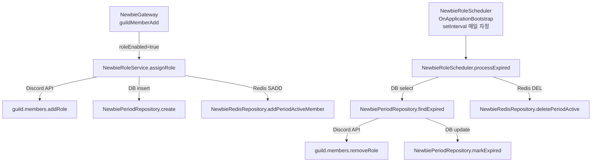

# 단위 E: 신입기간 역할 자동관리 (F-NEWBIE-004) — 구현 계획

## 개요

PRD F-NEWBIE-004를 구현한다. 신규 멤버가 디스코드 서버에 가입하면 신입 역할을 자동 부여하고
`NewbiePeriod` 레코드를 생성한다. 매일 자정 스케줄러가 만료된 신입기간 레코드를 조회하여
Discord API로 역할을 제거하고 `isExpired = true`로 갱신한다.

공통 모듈 문서(`docs/specs/common-modules.md`)의 단위 E 항목에 해당한다.

---

## 1. 전제 조건 (선행 완료 필요)

이 단위 E는 단위 A (백엔드 코어 모듈)가 이미 완성되어 있다고 가정한다.

| 파일 | 역할 |
|------|------|
| `apps/api/src/newbie/domain/newbie-period.entity.ts` | 이미 생성됨 — 수정 없음 |
| `apps/api/src/newbie/domain/newbie-config.entity.ts` | 이미 생성됨 — 수정 없음 |
| `apps/api/src/newbie/infrastructure/newbie-cache.keys.ts` | Redis 키 팩토리 (`NewbieKeys.periodActive`) |
| `apps/api/src/newbie/infrastructure/newbie-redis.repository.ts` | `addPeriodActiveMember`, `deletePeriodActive` |
| `apps/api/src/newbie/infrastructure/newbie-period.repository.ts` | `create`, `findExpired`, `markExpired` |
| `apps/api/src/newbie/infrastructure/newbie-config.repository.ts` | `findByGuildId` |
| `apps/api/src/newbie/newbie.gateway.ts` | `guildMemberAdd` 이벤트 핸들러, `roleEnabled` 분기에서 `NewbieRoleService.assignRole` 호출 |
| `apps/api/src/newbie/newbie.module.ts` | `NewbieRoleService`, `NewbieRoleScheduler` provider 등록 포함 |

---

## 2. 생성/수정 파일 목록

### 2-1. 신규 생성

| 파일 경로 | 설명 |
|-----------|------|
| `apps/api/src/newbie/role/newbie-role.service.ts` | 역할 부여 서비스 |
| `apps/api/src/newbie/role/newbie-role.scheduler.ts` | 만료 처리 스케줄러 |

### 2-2. 기존 파일 의존 (수정 없음)

이 단위가 의존하는 공통 모듈 파일들은 단위 A에서 생성된다. 이 단위에서는 해당 파일들을 수정하지 않는다.

---

## 3. 모듈 관계 다이어그램



---

## 4. 각 파일의 구체적인 구현 내용

### 4-1. `apps/api/src/newbie/role/newbie-role.service.ts`

**역할**: `guildMemberAdd` 이벤트 발생 시 신입 역할 부여 + `NewbiePeriod` 레코드 생성

**의존성**:
- `NewbiePeriodRepository` — `create`로 레코드 생성 (단위 A 구현)
- `NewbieRedisRepository` — `addPeriodActiveMember`로 Redis Set 갱신 (단위 A 구현)
- `Client` (`@InjectDiscordClient()`) — Discord API 역할 부여

`NewbieConfigRepository`는 `assignRole`에 주입하지 않는다. `NewbieGateway`에서 config를 이미 조회하여 전달하기 때문이다.

**날짜 계산**: `YYYYMMDD` 문자열 형식. `getKSTDateString()`은 `@onyu/shared`에 있으므로 동일하게 사용. 만료일은 `startDate`에서 `roleDurationDays`일을 더한 값.

```typescript
import { InjectDiscordClient } from '@discord-nestjs/core';
import { Injectable, Logger } from '@nestjs/common';
import { Client, GuildMember } from 'discord.js';
import { getKSTDateString } from '@onyu/shared';

import { NewbieConfigRepository } from '../infrastructure/newbie-config.repository';
import { NewbiePeriodRepository } from '../infrastructure/newbie-period.repository';
import { NewbieRedisRepository } from '../infrastructure/newbie-redis.repository';
import { NewbieConfig } from '../domain/newbie-config.entity';

@Injectable()
export class NewbieRoleService {
  private readonly logger = new Logger(NewbieRoleService.name);

  constructor(
    @InjectDiscordClient() private readonly client: Client,
    private readonly periodRepository: NewbiePeriodRepository,
    private readonly redisRepository: NewbieRedisRepository,
  ) {}

  /**
   * guildMemberAdd 이벤트 수신 시 NewbieGateway에서 호출된다.
   * config는 Gateway에서 이미 조회하여 전달한다.
   * roleEnabled = true, newbieRoleId != null 조건은 Gateway에서 사전 확인됨.
   */
  async assignRole(member: GuildMember, config: NewbieConfig): Promise<void> {
    const guildId = member.guild.id;
    const memberId = member.id;
    const roleId = config.newbieRoleId!;

    // 1. Discord API — 역할 부여
    await member.roles.add(roleId);
    this.logger.log(`[NEWBIE ROLE] Assigned role ${roleId} to ${memberId} in guild ${guildId}`);

    // 2. NewbiePeriod 레코드 생성
    const startDate = getKSTDateString();
    const expiresDate = this.calcExpiresDate(startDate, config.roleDurationDays!);

    await this.periodRepository.create(guildId, memberId, startDate, expiresDate);

    // 3. Redis 신입기간 활성 멤버 Set 갱신 (캐시 invalidation 전략: DEL 대신 SADD)
    //    캐시가 없는 경우 SADD는 새 Set을 만들지 않는다.
    //    캐시가 있는 경우에만 memberId를 추가해 정합성을 유지한다.
    //    캐시 미스 시 MocoService 등이 DB 조회 후 initPeriodActiveMembers를 호출한다.
    await this.redisRepository.addPeriodActiveMember(guildId, memberId);

    this.logger.log(
      `[NEWBIE ROLE] NewbiePeriod created: guild=${guildId} member=${memberId} ` +
      `startDate=${startDate} expiresDate=${expiresDate}`,
    );
  }

  /** startDate(YYYYMMDD) + days 일수를 더한 expiresDate(YYYYMMDD) 계산 */
  private calcExpiresDate(startDate: string, days: number): string {
    const year = parseInt(startDate.slice(0, 4), 10);
    const month = parseInt(startDate.slice(4, 6), 10) - 1; // 0-indexed
    const day = parseInt(startDate.slice(6, 8), 10);

    const date = new Date(year, month, day);
    date.setDate(date.getDate() + days);

    const y = date.getFullYear().toString();
    const m = (date.getMonth() + 1).toString().padStart(2, '0');
    const d = date.getDate().toString().padStart(2, '0');
    return `${y}${m}${d}`;
  }
}
```

**에러 처리**:
- Discord API `member.roles.add` 실패 시 예외가 상위(`NewbieGateway`)로 전파된다.
- `NewbieGateway`는 각 서비스 호출을 개별 try-catch로 감싸 `assignRole` 실패가 다른 서비스(`WelcomeService`, `MissionService`)에 영향을 주지 않도록 한다.
- DB `create` 실패 시도 예외 전파 — Gateway의 try-catch에서 로그 기록 후 계속 진행.

---

### 4-2. `apps/api/src/newbie/role/newbie-role.scheduler.ts`

**역할**: 매일 자정(KST 00:00) 만료된 `NewbiePeriod`를 일괄 처리한다.

**스케줄러 구현 방식**: `@nestjs/schedule` 패키지가 프로젝트에 설치되어 있지 않다. `OnApplicationBootstrap`에서 `setInterval`을 사용해 매 분마다 현재 시각이 자정인지 확인하는 방식으로 구현한다. 정확한 자정 실행을 위해 다음 자정까지의 ms를 계산해 `setTimeout`으로 첫 실행 후, 이후 24시간마다 `setInterval`로 반복한다.

**의존성**:
- `NewbiePeriodRepository` — `findExpired`, `markExpired`
- `NewbieRedisRepository` — `deletePeriodActive`
- `Client` (`@InjectDiscordClient()`) — Discord API 역할 제거

```typescript
import { InjectDiscordClient } from '@discord-nestjs/core';
import { Injectable, Logger, OnApplicationBootstrap, OnApplicationShutdown } from '@nestjs/common';
import { Client } from 'discord.js';
import { getKSTDateString } from '@onyu/shared';

import { NewbiePeriodRepository } from '../infrastructure/newbie-period.repository';
import { NewbieRedisRepository } from '../infrastructure/newbie-redis.repository';

/** 24시간 인터벌 (ms) */
const ONE_DAY_MS = 24 * 60 * 60 * 1000;

@Injectable()
export class NewbieRoleScheduler implements OnApplicationBootstrap, OnApplicationShutdown {
  private readonly logger = new Logger(NewbieRoleScheduler.name);
  private initialTimer: NodeJS.Timeout | null = null;
  private dailyInterval: NodeJS.Timeout | null = null;

  constructor(
    @InjectDiscordClient() private readonly client: Client,
    private readonly periodRepository: NewbiePeriodRepository,
    private readonly redisRepository: NewbieRedisRepository,
  ) {}

  onApplicationBootstrap(): void {
    this.scheduleNextMidnight();
  }

  onApplicationShutdown(): void {
    if (this.initialTimer) clearTimeout(this.initialTimer);
    if (this.dailyInterval) clearInterval(this.dailyInterval);
  }

  /**
   * 다음 KST 자정까지의 ms를 계산하고, 그 시점에 processExpired()를 실행한다.
   * 이후 24시간마다 반복한다.
   */
  private scheduleNextMidnight(): void {
    const msUntilMidnight = this.getMsUntilNextKSTMidnight();

    this.logger.log(
      `[NEWBIE ROLE SCHEDULER] Next run in ${Math.round(msUntilMidnight / 1000 / 60)} minutes`,
    );

    this.initialTimer = setTimeout(() => {
      void this.processExpired();

      this.dailyInterval = setInterval(() => {
        void this.processExpired();
      }, ONE_DAY_MS);
    }, msUntilMidnight);
  }

  /**
   * 현재 시각(KST 기준)으로부터 다음 자정(00:00:00)까지의 밀리초를 반환한다.
   * KST = UTC+9
   */
  private getMsUntilNextKSTMidnight(): number {
    const nowUtc = Date.now();
    const KST_OFFSET_MS = 9 * 60 * 60 * 1000;
    const nowKst = nowUtc + KST_OFFSET_MS;

    // 다음 자정(KST)의 UTC ms
    const todayKstMidnightUtc = Math.floor(nowKst / ONE_DAY_MS) * ONE_DAY_MS - KST_OFFSET_MS;
    const nextKstMidnightUtc = todayKstMidnightUtc + ONE_DAY_MS;

    return nextKstMidnightUtc - nowUtc;
  }

  /**
   * 만료된 신입기간 레코드를 일괄 처리한다.
   *
   * 처리 순서:
   * 1. NewbiePeriod에서 isExpired=false AND expiresDate < today 레코드 조회
   * 2. Discord API — 신입 역할 제거 (실패 시 warn 로그 후 DB 갱신은 진행)
   * 3. NewbiePeriod.isExpired = true 갱신
   * 4. 영향받은 guildId의 Redis 캐시 무효화
   */
  async processExpired(): Promise<void> {
    const today = getKSTDateString();
    this.logger.log(`[NEWBIE ROLE SCHEDULER] processExpired start: today=${today}`);

    let expiredRecords;
    try {
      expiredRecords = await this.periodRepository.findExpired(today);
    } catch (error) {
      this.logger.error(
        '[NEWBIE ROLE SCHEDULER] Failed to query expired periods',
        (error as Error).stack,
      );
      return;
    }

    if (expiredRecords.length === 0) {
      this.logger.log('[NEWBIE ROLE SCHEDULER] No expired periods found.');
      return;
    }

    this.logger.log(
      `[NEWBIE ROLE SCHEDULER] Processing ${expiredRecords.length} expired period(s)`,
    );

    // guildId별 캐시 무효화 중복 방지를 위한 Set
    const invalidatedGuilds = new Set<string>();

    for (const period of expiredRecords) {
      await this.processOne(period.guildId, period.memberId, period.id);
      invalidatedGuilds.add(period.guildId);
    }

    // guildId별 Redis 캐시 무효화
    for (const guildId of invalidatedGuilds) {
      try {
        await this.redisRepository.deletePeriodActive(guildId);
        this.logger.log(
          `[NEWBIE ROLE SCHEDULER] Cache invalidated: guild=${guildId}`,
        );
      } catch (error) {
        this.logger.error(
          `[NEWBIE ROLE SCHEDULER] Failed to invalidate cache: guild=${guildId}`,
          (error as Error).stack,
        );
      }
    }

    this.logger.log('[NEWBIE ROLE SCHEDULER] processExpired complete.');
  }

  /**
   * 단일 레코드 만료 처리.
   * Discord API 역할 제거 실패 시에도 DB 갱신은 진행한다.
   * 역할이 이미 없는 경우(Discord 측에서 수동 제거)도 정상으로 취급한다.
   */
  private async processOne(
    guildId: string,
    memberId: string,
    periodId: number,
  ): Promise<void> {
    try {
      const guild = await this.client.guilds.fetch(guildId);
      const config = await this.getNewbieRoleId(guildId);

      if (config) {
        try {
          const member = await guild.members.fetch(memberId);
          await member.roles.remove(config);
          this.logger.log(
            `[NEWBIE ROLE SCHEDULER] Role removed: guild=${guildId} member=${memberId}`,
          );
        } catch (discordError) {
          // 멤버가 서버를 떠났거나 이미 역할이 없는 경우 포함
          this.logger.warn(
            `[NEWBIE ROLE SCHEDULER] Failed to remove role (will still mark expired): ` +
            `guild=${guildId} member=${memberId}`,
            (discordError as Error).stack,
          );
        }
      }
    } catch (error) {
      this.logger.warn(
        `[NEWBIE ROLE SCHEDULER] Could not fetch guild or config: guild=${guildId}`,
        (error as Error).stack,
      );
    }

    // Discord API 성공 여부와 무관하게 DB는 만료 처리
    try {
      await this.periodRepository.markExpired(periodId);
    } catch (error) {
      this.logger.error(
        `[NEWBIE ROLE SCHEDULER] Failed to mark expired: periodId=${periodId}`,
        (error as Error).stack,
      );
    }
  }

  /**
   * guildId에 해당하는 newbieRoleId를 NewbieConfigRepository에서 조회한다.
   * 설정이 없거나 roleEnabled=false이면 null 반환.
   *
   * 참고: 스케줄러는 NewbieConfigRepository를 직접 주입받지 않는다.
   * 역할 ID는 NewbiePeriod 레코드가 생성될 때 이미 유효했으므로,
   * 스케줄러는 guildId로 DB에서 config를 다시 조회하여 현재 roleId를 확인한다.
   * roleEnabled=false로 변경된 경우에도 기존 레코드는 만료 처리 완료해야 하므로
   * roleEnabled 여부와 무관하게 역할 제거를 시도하되, roleId가 없으면 건너뛴다.
   */
  private readonly configCache = new Map<string, string | null>();

  private async getNewbieRoleId(guildId: string): Promise<string | null> {
    // 단일 processExpired 실행 내에서 동일 guildId 설정 재조회 방지 (인메모리 캐시)
    if (this.configCache.has(guildId)) {
      return this.configCache.get(guildId)!;
    }
    // 실제 구현에서는 NewbieConfigRepository 주입 필요 — 아래 섹션 참조
    return null;
  }
}
```

**설계 보완 — `NewbieConfigRepository` 주입**:

위 `getNewbieRoleId` 구현은 설명 목적의 stub이다. 실제 구현에서는 `NewbieConfigRepository`를 생성자에 주입하여 `findByGuildId(guildId)`로 `newbieRoleId`를 조회한다. 인메모리 캐시(`configCache`)는 단일 `processExpired` 실행 내에서만 유효하며, 다음 실행 전에 비워야 한다.

**최종 생성자 및 `getNewbieRoleId`**:

```typescript
constructor(
  @InjectDiscordClient() private readonly client: Client,
  private readonly periodRepository: NewbiePeriodRepository,
  private readonly redisRepository: NewbieRedisRepository,
  private readonly configRepository: NewbieConfigRepository,
) {}

private async getNewbieRoleId(guildId: string): Promise<string | null> {
  if (this.configCache.has(guildId)) {
    return this.configCache.get(guildId) ?? null;
  }
  const config = await this.configRepository.findByGuildId(guildId);
  const roleId = config?.newbieRoleId ?? null;
  this.configCache.set(guildId, roleId);
  return roleId;
}
```

`configCache`는 `processExpired` 시작 시 초기화한다:

```typescript
async processExpired(): Promise<void> {
  this.configCache.clear(); // 매 실행마다 캐시 초기화
  const today = getKSTDateString();
  // ...
}
```

---

## 5. 로직 흐름 전체

### 역할 부여 흐름 (guildMemberAdd)

```
Discord guildMemberAdd 이벤트
    │
    ▼
NewbieGateway.handleMemberJoin(member: GuildMember)
    │
    ├── NewbieConfigRepository.findByGuildId(guildId)
    │       → Redis 캐시 우선(newbie:config:{guildId}), 미스 시 DB
    │       → 설정 없으면 처리 중단
    │
    ├── (roleEnabled = true AND newbieRoleId != null)
    │
    └── NewbieRoleService.assignRole(member, config)
            │
            ├── 1. member.roles.add(roleId)
            │       → Discord API guild.members 역할 부여
            │
            ├── 2. getKSTDateString() → startDate (YYYYMMDD)
            │   calcExpiresDate(startDate, roleDurationDays) → expiresDate
            │
            ├── 3. NewbiePeriodRepository.create(guildId, memberId, startDate, expiresDate)
            │       → INSERT INTO newbie_period (isExpired=false)
            │
            └── 4. NewbieRedisRepository.addPeriodActiveMember(guildId, memberId)
                    → Redis SADD newbie:period:active:{guildId} {memberId}
                    → TTL은 initPeriodActiveMembers 호출 시 설정됨
```

### 역할 제거 흐름 (스케줄러)

```
OnApplicationBootstrap
    │
    └── scheduleNextMidnight()
            → setTimeout(다음 KST 자정까지 ms)
                    │
                    ▼ (자정 도달)
            processExpired()  ← 이후 setInterval(24시간)으로 반복
                    │
                    ├── configCache.clear()
                    │
                    ├── getKSTDateString() → today
                    │
                    ├── NewbiePeriodRepository.findExpired(today)
                    │       → SELECT WHERE isExpired=false AND expiresDate < today
                    │       → IDX_newbie_period_expires 인덱스 활용
                    │
                    └── [각 period 레코드에 대해 processOne 순차 실행]
                            │
                            ├── getNewbieRoleId(guildId)  (configCache 사용)
                            │       → NewbieConfigRepository.findByGuildId(guildId)
                            │
                            ├── guild.members.fetch(memberId)
                            │
                            ├── member.roles.remove(roleId)
                            │       → Discord API 역할 제거
                            │       → 실패 시 warn 로그, DB 갱신은 계속
                            │
                            └── NewbiePeriodRepository.markExpired(period.id)
                                    → UPDATE newbie_period SET isExpired=true
                    │
                    └── [guildId별 Redis 캐시 무효화]
                            → NewbieRedisRepository.deletePeriodActive(guildId)
                            → DEL newbie:period:active:{guildId}
```

---

## 6. 날짜 계산 상세

### `getKSTDateString()` 의존

`@onyu/shared` 패키지의 `getKSTDateString()`이 `YYYYMMDD` 형식 오늘 날짜(KST)를 반환하므로 동일하게 사용한다. 해당 함수는 `apps/api/src/channel/voice/application/voice-daily-flush-service.ts`에서도 이미 사용 중이다.

### `calcExpiresDate` 로직

JavaScript `Date` 객체의 `setDate`를 이용한 날짜 덧셈. 월말 자동 처리(예: 1월 31일 + 7일 = 2월 7일)가 내장되어 있다.

```typescript
private calcExpiresDate(startDate: string, days: number): string {
  const year = parseInt(startDate.slice(0, 4), 10);
  const month = parseInt(startDate.slice(4, 6), 10) - 1;
  const day = parseInt(startDate.slice(6, 8), 10);

  const date = new Date(year, month, day);
  date.setDate(date.getDate() + days);

  const y = date.getFullYear().toString();
  const m = (date.getMonth() + 1).toString().padStart(2, '0');
  const d = date.getDate().toString().padStart(2, '0');
  return `${y}${m}${d}`;
}
```

### 스케줄러 자정 계산

KST = UTC+9이므로, KST 자정은 UTC 기준 전날 15:00이다.

```typescript
private getMsUntilNextKSTMidnight(): number {
  const nowUtc = Date.now();
  const KST_OFFSET_MS = 9 * 60 * 60 * 1000;          // 9시간
  const nowKst = nowUtc + KST_OFFSET_MS;

  const todayKstMidnightUtc =
    Math.floor(nowKst / ONE_DAY_MS) * ONE_DAY_MS - KST_OFFSET_MS;
  const nextKstMidnightUtc = todayKstMidnightUtc + ONE_DAY_MS;

  return nextKstMidnightUtc - nowUtc;
}
```

예시:
- 현재 KST 2026-03-08 09:00 → UTC 2026-03-08 00:00
- 다음 KST 자정 = 2026-03-09 00:00 KST = 2026-03-08 15:00 UTC
- 대기 시간 = 15시간

---

## 7. 에러 처리 전략

### `assignRole` 에러

| 지점 | 처리 방식 | 이유 |
|------|-----------|------|
| `member.roles.add` Discord API 실패 | 예외 전파 → Gateway의 try-catch에서 error 로그 | 역할 부여 실패 시 `NewbiePeriod` 레코드가 생성되지 않으므로 일관성 유지 |
| `periodRepository.create` DB 실패 | 예외 전파 → Gateway의 try-catch | 레코드 없으면 스케줄러가 처리 대상을 찾지 못함 |
| `redisRepository.addPeriodActiveMember` 실패 | 예외 전파 → Gateway의 try-catch | 캐시 불일치 — 다음 조회 시 DB에서 재구성 가능 |

**주의**: `NewbieGateway`는 각 서비스를 개별 try-catch로 감싸야 하므로, `assignRole` 실패가 `WelcomeService`, `MissionService`를 블로킹하지 않는다. 이는 단위 A(Gateway 구현)에서 보장한다.

### `processExpired` 에러

| 지점 | 처리 방식 | 이유 |
|------|-----------|------|
| `findExpired` DB 조회 실패 | error 로그 후 return | DB 장애 시 전체 루프 중단 불필요 |
| `guild.members.fetch` 실패 | warn 로그, DB 갱신 계속 | 멤버가 서버를 떠난 경우 정상 상황 |
| `member.roles.remove` 실패 | warn 로그, DB 갱신 계속 | 역할이 이미 없는 경우 정상 상황 |
| `markExpired` DB 갱신 실패 | error 로그 | 다음 스케줄러 실행 시 동일 레코드 재처리됨 (idempotent) |
| Redis `deletePeriodActive` 실패 | error 로그 | TTL 1시간 후 자동 만료로 eventual consistency |

### `markExpired` 멱등성

`markExpired`는 `WHERE id = :id`로 단일 레코드를 갱신하므로 동일 레코드를 두 번 처리해도 부작용 없다. Discord API 역할 제거도 역할이 없는 멤버에 `removeRole`을 호출하면 Discord는 오류 없이 처리한다(없는 역할 제거는 no-op).

---

## 8. 기존 코드와의 충돌 검토

| 항목 | 충돌 여부 | 판단 |
|------|-----------|------|
| `DiscordVoiceGateway` vs `Client` 직접 사용 | 없음 | `DiscordVoiceGateway`는 음성 채널 생성/이동에 특화된 gateway. 역할 부여/제거는 `member.roles`를 사용하며 `DiscordVoiceGateway`와 무관하다. `@InjectDiscordClient()`로 `Client`를 직접 주입하는 것이 올바름. `NewbieModule`이 `DiscordModule.forFeature()`를 import하면 DI 해결 |
| `OnApplicationBootstrap` 중복 | 없음 | `VoiceRecoveryService`, `AutoChannelBootstrapService`도 동일 인터페이스를 구현하나 독립적 동작. NestJS는 모든 OnApplicationBootstrap 구현체를 순서 보장 없이 실행하나 이 스케줄러의 `scheduleNextMidnight`는 다른 부트스트랩 훅과 의존 관계가 없음 |
| `setInterval`/`setTimeout` 남용 | 없음 | `onApplicationShutdown`에서 `clearTimeout`/`clearInterval`로 정리하므로 메모리 누수 없음 |
| `newbie:period:active:{guildId}` Redis Set | 없음 | `addPeriodActiveMember`는 SADD이므로 기존 Set에 append. `deletePeriodActive`는 DEL이므로 스케줄러 실행 후 캐시 재구성은 다음 조회 시 MocoService 등이 처리 |
| `NewbiePeriodRepository.findExpired` 쿼리 인덱스 | 없음 | `IDX_newbie_period_expires`가 `(expiresDate, isExpired)` 순서로 정의됨. 쿼리는 `WHERE isExpired=false AND expiresDate < today`이므로 `expiresDate` 범위 조건 선두 인덱스 활용 가능. DB 스키마 문서에서 이 인덱스의 존재가 확인됨 |
| TypeORM entity 중복 등록 | 없음 | `NewbiePeriod`, `NewbieConfig` 엔티티는 `NewbieModule`의 `TypeOrmModule.forFeature()`에서 등록. 이 단위에서 별도 등록 불필요 |

---

## 9. 단위 테스트 계획

### `NewbieRoleService` 단위 테스트

**파일**: `apps/api/src/newbie/role/newbie-role.service.spec.ts`

| 테스트 케이스 | 검증 내용 |
|---------------|-----------|
| `assignRole — 정상 흐름` | `member.roles.add` 호출됨, `periodRepository.create` 호출됨, `redisRepository.addPeriodActiveMember` 호출됨 |
| `assignRole — expiresDate 계산 정확성` | startDate=20260101, roleDurationDays=30 → expiresDate=20260131 |
| `assignRole — 월말 경계` | startDate=20260131, roleDurationDays=7 → expiresDate=20260207 |
| `assignRole — Discord API 실패 시 예외 전파` | `member.roles.add` 예외 → `periodRepository.create` 미호출 |

**Mock 구조**:
```typescript
const mockMember = {
  id: 'member-1',
  guild: { id: 'guild-1' },
  roles: { add: jest.fn() },
} as unknown as GuildMember;

const mockConfig = {
  roleEnabled: true,
  newbieRoleId: 'role-1',
  roleDurationDays: 14,
} as NewbieConfig;
```

### `NewbieRoleScheduler` 단위 테스트

**파일**: `apps/api/src/newbie/role/newbie-role.scheduler.spec.ts`

| 테스트 케이스 | 검증 내용 |
|---------------|-----------|
| `processExpired — 만료 레코드 없음` | `markExpired` 미호출, `deletePeriodActive` 미호출 |
| `processExpired — 정상 만료 처리` | `member.roles.remove` 호출됨, `markExpired` 호출됨, `deletePeriodActive` 호출됨 (guildId별 1회) |
| `processExpired — Discord API 실패` | `member.roles.remove` 예외 → `markExpired`는 여전히 호출됨 |
| `processExpired — 멤버 서버 탈퇴` | `guild.members.fetch` 예외 → `markExpired`는 여전히 호출됨 |
| `processExpired — 복수 guildId` | 각 guildId별로 `deletePeriodActive` 1회씩 호출, 중복 없음 |
| `calcExpiresDate` (private) | 다양한 경계 날짜 검증 — `getMsUntilNextKSTMidnight` 정확성 |

---

## 10. 구현 순서

단위 A가 완료된 상태에서 아래 순서로 구현한다.

1. `apps/api/src/newbie/role/newbie-role.service.ts` 구현
   - `assignRole` 메서드
   - `calcExpiresDate` 헬퍼

2. `apps/api/src/newbie/role/newbie-role.scheduler.ts` 구현
   - `scheduleNextMidnight`, `getMsUntilNextKSTMidnight`
   - `processExpired`, `processOne`
   - `getNewbieRoleId` (configCache 포함)

3. 단위 테스트 작성

4. 단위 A의 `newbie.module.ts`에 `NewbieRoleService`, `NewbieRoleScheduler` provider 등록 확인
   (단위 A 계획에서 이미 포함되어 있음 — 단위 E에서는 수정 불필요)

---

## 11. 파일 경로 최종 목록

```
# 신규 생성
apps/api/src/newbie/role/newbie-role.service.ts
apps/api/src/newbie/role/newbie-role.scheduler.ts

# 기존 수정 없음
# (newbie.module.ts의 provider 등록은 단위 A에서 처리)
```
