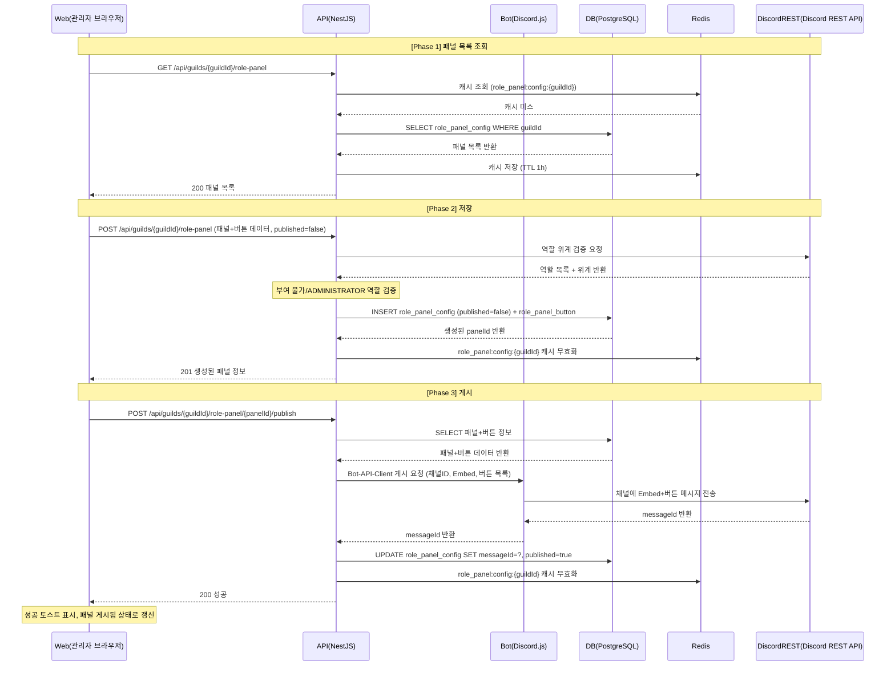

# 유스케이스 ID: UC-01

### 제목
패널 생성 및 Discord 게시

---

## 1. 개요

### 1.1 목적

관리자가 웹 대시보드에서 역할 패널을 생성(설정 저장)하고 Discord 채널에 게시하는 end-to-end 흐름을 정의한다.
저장과 게시를 두 단계로 분리하여 초안 상태 유지를 지원하고, 생성부터 Discord 메시지 전송까지 apps/web → apps/api → apps/bot → Discord REST API 의 전 구간 동작을 명세한다.

### 1.2 범위

- apps/web: 역할 패널 설정 UI (`/settings/guild/[guildId]/role-panel`)
- apps/api: 패널 CRUD 및 게시 오케스트레이션 엔드포인트
- apps/bot: Discord 채널 메시지 전송 (RolePanelBotService)
- libs/bot-api-client: 봇→API 내부 HTTP 클라이언트 SDK

**범위 외**: 버튼 클릭 인터랙션 처리(역할 부여/토글)는 UC-04·UC-05 에서 다룬다.

### 1.3 액터

| 구분 | 액터 | 설명 |
|------|------|------|
| 주 액터 | 길드 관리자 | 웹 대시보드에서 역할 패널을 생성하고 게시하는 운영진 |
| 부 액터 | Discord REST API | Discord 역할 위계 검증 및 메시지 전송 대상 |
| 부 액터 | Bot (RolePanelBotService) | apps/bot 내 Discord 메시지 전송 처리 컴포넌트 |
| 부 액터 | PostgreSQL | 패널 설정 및 버튼 영속성 저장소 |
| 부 액터 | Redis | 패널 설정 캐시 (TTL 1h) |

---

## 2. 선행 조건

1. 관리자가 웹 대시보드에 로그인되어 있다.
2. 관리자가 해당 길드의 운영진(관리자) 권한을 보유하고 있다.
3. 봇이 해당 Discord 서버에 초대되어 있다.
4. 봇이 대상 Discord 채널에 Send Messages 권한을 보유하고 있다 (게시 단계 한정).

---

## 3. 참여 컴포넌트

| 컴포넌트 | 위치 | 역할 |
|----------|------|------|
| 역할 패널 설정 페이지 | apps/web — `/settings/guild/[guildId]/role-panel` | 패널 목록 조회, 생성 폼, 게시 트리거 UI |
| 패널 목록 조회 엔드포인트 | apps/api — `GET /api/guilds/{guildId}/role-panel` | 길드의 패널 목록을 Redis 캐시 우선으로 반환 |
| 패널 생성 엔드포인트 | apps/api — `POST /api/guilds/{guildId}/role-panel` | 패널 설정 + 버튼 목록 저장 (published=false) |
| 패널 게시 엔드포인트 | apps/api — `POST /api/guilds/{guildId}/role-panel/{panelId}/publish` | Bot-API-Client 경유 봇 게시 요청 오케스트레이션 |
| RolePanelBotService | apps/bot | Discord REST API 를 통해 Embed + 버튼 메시지를 채널에 전송 |
| role_panel_config 테이블 | DB (PostgreSQL) | 패널 메타데이터 (이름, 채널, Embed, published, messageId) |
| role_panel_button 테이블 | DB (PostgreSQL) | 버튼별 역할 ID, 모드(GRANT/TOGGLE), 레이블 |
| Redis 캐시 | Redis | 키: `role_panel:config:{guildId}`, TTL 1h |

---

## 4. 기본 플로우 (Basic Flow)

### 4.1 단계별 흐름

**[Phase 1] 패널 목록 조회**

| 단계 | 주체 | 행동 |
|------|------|------|
| 1 | 관리자 | 웹 대시보드에서 `/settings/guild/{guildId}/role-panel` 페이지에 접근한다. |
| 2 | Web | `GET /api/guilds/{guildId}/role-panel` 을 호출하여 기존 패널 목록을 조회한다. 패널이 없으면 빈 상태 화면을 렌더링한다. |
| 3 | API | Redis `role_panel:config:{guildId}` 캐시를 조회한다. 캐시 미스 시 DB에서 패널 목록을 조회하고 캐시에 저장(TTL 1h)한다. |
| 4 | API | 패널 목록(200)을 Web에 반환한다. |

**[Phase 2] 패널 생성 (저장)**

| 단계 | 주체 | 행동 |
|------|------|------|
| 5 | 관리자 | "새 패널" 버튼을 클릭하여 패널 생성 폼으로 진입한다. 패널 이름, 대상 채널, Embed 제목/설명/색상, 버튼 목록(역할 선택, 모드, 레이블)을 입력한다. |
| 6 | Web | 버튼 역할 선택 드롭다운에서 부여 불가 역할(봇보다 위계가 높은 역할, managed/integration 역할, @everyone 역할)과 ADMINISTRATOR 권한 보유 역할을 비활성 처리하고 차단 사유를 표기한다. |
| 7 | 관리자 | "저장" 버튼을 클릭한다. |
| 8 | Web | `POST /api/guilds/{guildId}/role-panel` 을 호출하여 패널 설정과 버튼 목록을 전송한다 (published=false). |
| 9 | API | Discord REST API 를 통해 해당 길드의 역할 목록과 위계를 조회한다. 부여 불가 역할(봇보다 높은 위계, managed, @everyone) 또는 ADMINISTRATOR 권한 보유 역할이 버튼 목록에 포함되면 요청을 거부한다. |
| 10 | API | 검증 통과 시 DB에 role_panel_config(published=false)와 role_panel_button 레코드를 트랜잭션으로 저장한다. |
| 11 | API | Redis `role_panel:config:{guildId}` 캐시를 무효화한다. |
| 12 | API | 생성된 패널 정보(201)를 Web에 반환한다. |
| 13 | Web | 패널 목록에 새 패널을 미게시 상태로 추가한다. |

**[Phase 3] 패널 게시**

| 단계 | 주체 | 행동 |
|------|------|------|
| 14 | 관리자 | 패널 항목의 "게시" 버튼을 클릭한다. |
| 15 | Web | `POST /api/guilds/{guildId}/role-panel/{panelId}/publish` 를 호출한다. |
| 16 | API | DB에서 해당 패널 및 버튼 정보를 조회한다. |
| 17 | API | Bot-API-Client 를 경유하여 봇에 게시 요청을 전달한다 (채널 ID, Embed 정보, 버튼 목록 포함). |
| 18 | Bot | Discord REST API 를 통해 대상 채널에 Embed 메시지와 역할 선택 버튼(customId: `role_panel:{panelId}:{buttonId}` 형식)을 포함한 메시지를 전송한다. |
| 19 | Bot | Discord REST API 가 반환한 messageId 를 API 에 전달한다. |
| 20 | API | role_panel_config 의 messageId 와 published 필드를 갱신한다 (published=true). |
| 21 | API | Redis `role_panel:config:{guildId}` 캐시를 무효화한다. |
| 22 | API | 성공 응답(200)을 Web에 반환한다. |
| 23 | Web | 성공 토스트를 표시하고 패널을 게시됨 상태로 갱신한다. |

### 4.2 시퀀스 다이어그램

---

## 5. 대안 플로우 (Alternative Flows)

### AF-01: 기존 패널이 이미 존재하는 경우

- 트리거: Phase 1 에서 패널 목록 조회 결과가 비어 있지 않음
- 차이: 패널 목록 탭 옆의 "+" 버튼을 클릭하여 생성 폼으로 진입한다. 이후 Phase 2 ~ Phase 3 은 기본 플로우와 동일하다.

### AF-02: 채널을 나중에 지정하는 경우

- 트리거: 관리자가 channelId 없이 패널 이름과 Embed 설정만 입력하고 저장한다.
- 차이: API 저장 단계(Phase 2, 단계 10)에서 channelId 없이 role_panel_config 레코드를 생성한다. 이후 게시 시도 시 Phase 3 단계 16의 channelId 필수 검증에서 400 오류가 반환되며, 채널 선택 유도 메시지가 표시된다 (EX-05 참조).

---

## 6. 예외 플로우 (Exception Flows)

| 예외 ID | 발생 시점 | 원인 | Web 처리 | API 응답 |
|---------|-----------|------|----------|----------|
| EX-01 | Phase 2 단계 6, 단계 9 | 봇보다 위계가 높은 역할, managed/integration 역할, @everyone 역할을 버튼에 포함 | 웹 UI에서 비활성 처리로 선택 차단. 마우스 오버 시 차단 사유 툴팁 표시 | API 서버 측 재검증 통과 실패 시 400 반환 |
| EX-02 | Phase 2 단계 6, 단계 9 | ADMINISTRATOR 권한 보유 역할을 버튼에 포함 | 웹 UI에서 비활성 처리 및 차단 사유 표기 | API 서버 측 재검증 통과 실패 시 403 반환 |
| EX-03 | Phase 2 단계 7 | 버튼 목록이 비어 있음 (버튼 0개) | 클라이언트 측 유효성 검사로 저장 버튼 비활성 처리 | 요청이 도달한 경우 API 400 반환 |
| EX-04 | Phase 2 단계 7 | 버튼 25개 초과 (Discord ActionRow 5×5 한계) | 클라이언트 측에서 25개 초과 시 버튼 추가 차단 | 요청이 도달한 경우 API 400 반환 |
| EX-05 | Phase 3 단계 15 | channelId 없는 패널에 게시 시도 | 채널 선택 유도 메시지 토스트 표시 | API 400 반환 |
| EX-06 | Phase 3 단계 18 | 봇이 대상 채널의 Send Messages 권한을 보유하지 않음 | 권한 부족 오류 토스트 표시 | 봇이 오류를 API로 전달, API 503 반환 |
| EX-07 | Phase 3 단계 18 | 대상 채널이 삭제되어 존재하지 않음 | 채널 재선택 유도 토스트 표시 | 봇이 Unknown Channel 오류를 API로 전달, API 오류 반환 |
| EX-08 | Phase 2 단계 8, Phase 3 단계 15 | 비운영 길드 슈퍼관리자의 뮤테이션 요청 | 요청 실패 토스트 표시 | GuildMembershipGuard 에서 403 반환, 뮤테이션 차단 |

---

## 7. 후행 조건 (Post-conditions)

### 7.1 성공 시

| 대상 | 상태 |
|------|------|
| DB — role_panel_config | published=true, messageId 저장, channelId 저장 레코드 생성 완료 |
| DB — role_panel_button | 패널에 귀속된 버튼 레코드 생성 완료 |
| Redis | `role_panel:config:{guildId}` 캐시 무효화 (다음 조회 시 DB 에서 재로드) |
| Discord | 대상 채널에 Embed 와 역할 선택 버튼이 포함된 메시지 게시 완료 |
| Web | 패널이 게시됨 상태로 목록에 표시됨 |

### 7.2 실패 시

| 실패 단계 | 대상 | 상태 |
|-----------|------|------|
| Phase 2 저장 실패 | DB | 트랜잭션 롤백으로 role_panel_config / role_panel_button 레코드 미생성 |
| Phase 3 게시 실패 | DB | 저장된 레코드 유지 (published=false 상태 보존), messageId 미갱신 |
| Phase 3 게시 실패 | Discord | 메시지 미게시 |
| 모든 실패 공통 | Web | 오류 토스트 표시, 재시도 가능 상태 유지 |

---

## 8. 비기능 요구사항

### 8.1 성능

| 엔드포인트 | 목표 응답 시간 | 조건 |
|-----------|---------------|------|
| GET /api/guilds/{guildId}/role-panel | 200ms 이내 | Redis 캐시 히트 기준 |
| POST /api/guilds/{guildId}/role-panel | 2초 이내 | Discord REST API 역할 검증 포함 |
| POST /api/guilds/{guildId}/role-panel/{panelId}/publish | 5초 이내 | Discord REST API 메시지 전송 포함 |

### 8.2 보안

- 🔒 모든 웹→API 엔드포인트에 JwtAuthGuard 적용 필수
- 🔒 모든 웹→API 엔드포인트에 GuildMembershipGuard 적용 필수 (운영 길드 소속 여부 + 관리자 권한 검증)
- 🔒 Discord 역할 위계 검증을 API 서버 측에서 재검증: 봇보다 높은 위계의 역할, @everyone, managed/integration 역할, ADMINISTRATOR 권한 보유 역할 차단
- 🔒 비운영 길드 슈퍼관리자의 뮤테이션 요청을 API에서 403 으로 차단

### 8.3 가용성

- 봇 Discord 메시지 전송 실패(채널 없음, 권한 없음 등) 시 DB 의 role_panel_config 저장 상태(published=false)는 유지된다.
- 관리자는 채널 재선택 또는 봇 권한 부여 후 "재게시" 버튼으로 재시도할 수 있다.

---

## 9. UI/UX 요구사항

### 9.1 화면 구성

- **좌측 영역**: 길드 내 패널 탭 목록. 각 탭에 패널 이름과 게시 상태(게시됨 / 미게시) 배지 표시. 탭 목록 상단에 "+" 버튼으로 신규 패널 생성 진입.
- **우측 영역**: 패널 설정 폼
  - 패널 이름 입력 필드
  - 대상 채널 선택 드롭다운
  - Embed 설정 섹션: 제목, 설명, 색상(컬러 피커)
  - 버튼 목록 섹션: 버튼별 역할 선택 드롭다운, 모드(GRANT / TOGGLE) 선택, 레이블 입력, 순서 변경 핸들, 삭제 버튼
  - 하단 액션: "저장" 버튼, "게시" 버튼 (저장 완료 후 활성화)
- **역할 드롭다운 비활성 처리**: 부여 불가 역할은 회색/비활성으로 표시. 마우스 오버 시 차단 사유 툴팁 표시 (예: "봇보다 위계가 높은 역할", "ADMINISTRATOR 권한 보유 역할").

### 9.2 사용자 경험

- 저장과 게시를 분리하여 초안 상태 저장을 지원한다. 관리자는 채널 미선택 상태로 패널 설정을 먼저 저장할 수 있다.
- 게시 버튼은 패널 저장 완료 후 활성화된다 (미저장 상태에서는 비활성).
- 게시 중 로딩 인디케이터를 표시하여 처리 중임을 안내한다.
- 성공 시 성공 토스트 알림 표시, 패널 게시됨 상태로 즉시 갱신.
- 실패 시 실패 토스트 알림 표시, 원인에 따른 유도 메시지 포함 (예: 채널 재선택, 봇 권한 확인).

---

## 10. 테스트 시나리오

### 10.1 성공 케이스

| 번호 | 시나리오 | 입력 조건 | 기대 결과 |
|------|----------|-----------|-----------|
| S-01 | 일반 GRANT 버튼 패널 생성 및 게시 | 유효한 채널, 유효한 역할 2개, GRANT 모드 | 201 생성 → 200 게시, Discord 채널에 Embed + 버튼 메시지 게시됨 |
| S-02 | TOGGLE 버튼 포함 패널 생성 및 게시 | 유효한 채널, TOGGLE 모드 버튼 1개 포함 | 201 생성 → 200 게시, Discord 채널에 토글 버튼 포함 메시지 게시됨 |
| S-03 | 버튼 25개 최대 한도 패널 생성 | 버튼 25개 (ActionRow 5×5 최대 한계) | 201 생성 성공 |
| S-04 | 채널 미선택 초안 저장 후 채널 선택 → 게시 | channelId 없이 저장 후 채널 선택하여 게시 | 201 초안 생성 → channelId 갱신 후 200 게시 성공 |
| S-05 | 목록 조회 캐시 히트 | 동일 guildId 로 두 번째 조회 | Redis 캐시에서 200ms 이내 반환 |

### 10.2 실패 케이스

| 번호 | 시나리오 | 입력 조건 | 기대 결과 |
|------|----------|-----------|-----------|
| F-01 | 버튼 0개 패널 저장 시도 | 버튼 목록 비어 있음 | API 400 오류 반환, 저장 실패 |
| F-02 | 버튼 26개 초과 저장 시도 | 버튼 26개 | API 400 오류 반환 |
| F-03 | ADMINISTRATOR 역할 버튼 포함 저장 시도 | ADMINISTRATOR 권한 보유 역할을 버튼에 포함 | API 403 오류 반환, 저장 실패 |
| F-04 | 채널 미선택 상태 게시 시도 | channelId 없는 패널 게시 요청 | API 400 오류 반환, 게시 실패, 채널 선택 유도 메시지 표시 |
| F-05 | 봇 전송 권한 부족 채널에 게시 | 봇 Send Messages 권한 없는 채널 | API 503 반환, 권한 부족 토스트 표시 |
| F-06 | 삭제된 채널에 게시 시도 | 존재하지 않는 channelId | API 오류 반환, 채널 재선택 유도 토스트 표시 |
| F-07 | 비운영 길드 슈퍼관리자 저장 시도 | 운영 길드 소속이 아닌 슈퍼관리자 | API 403 반환, 뮤테이션 차단 |

---

## 11. 관련 유스케이스

| 유스케이스 ID | 제목 | 관계 |
|--------------|------|------|
| UC-02 | 패널 수정 및 Discord 메시지 재동기화 | 본 UC-01 의 후속 — 기존 published 패널을 수정하고 Discord 메시지를 edit 로 갱신 |
| UC-03 | 패널 삭제 | 본 UC-01 로 생성된 패널 및 Discord 메시지 삭제 |
| UC-04 | GRANT 모드 버튼 클릭 — 역할 부여 | 본 UC-01 로 게시된 패널의 GRANT 버튼 인터랙션 처리 |
| UC-05 | TOGGLE 모드 버튼 클릭 — 역할 토글 | 본 UC-01 로 게시된 패널의 TOGGLE 버튼 인터랙션 처리 |

---

## 12. 변경 이력

| 버전 | 날짜 | 작성자 | 변경 내용 |
|------|------|--------|-----------|
| 1.0 | 2026-06-19 | usecase-writer | 초기 작성 |

---

## 부록

### A. 용어 정의

| 용어 | 정의 |
|------|------|
| 역할 패널(Role Panel) | Discord 채널에 게시되는 Embed 메시지와 역할 선택 버튼의 조합. 관리자가 웹 대시보드에서 설정하고 봇이 Discord 에 게시한다. |
| Embed | Discord 메시지의 구조화된 블록. 제목, 설명, 색상 등을 포함한다. |
| customId | Discord 버튼의 고유 식별자. `role_panel:{panelId}:{buttonId}` 형식으로 봇 인터랙션 핸들러 분기에 사용된다. |
| GRANT 모드 | 버튼 클릭 시 역할을 부여만 하는 모드. 이미 보유한 역할이면 Discord API 호출 없이 안내 응답(멱등)을 반환한다. |
| TOGGLE 모드 | 버튼 클릭 시 역할을 보유 중이면 회수, 미보유이면 부여하는 양방향 모드. |
| messageId | Discord 채널에 게시된 패널 메시지의 고유 ID. 패널 수정 시 메시지 편집(edit)에 사용된다. |
| 멱등(Idempotent) | 동일한 요청을 여러 번 수행해도 결과가 동일한 성질. GRANT 모드에서 이미 역할을 보유한 경우 추가 부여 시도 없이 안내만 반환한다. |
| published | 패널의 Discord 게시 상태 플래그. true 이면 Discord 채널에 메시지가 게시된 상태. |
| Bot-API-Client | 봇(apps/bot)이 API(apps/api)를 호출할 때 사용하는 내부 HTTP 클라이언트 SDK. 봇 전용 인증을 사용한다 (libs/bot-api-client). |
| GuildMembershipGuard | 요청 사용자가 해당 길드의 운영진(관리자) 권한을 보유하는지 검증하는 API Guard. 비운영 길드 슈퍼관리자의 뮤테이션을 차단한다. |

### B. 참고 자료

| 문서 | 경로 |
|------|------|
| PRD | `docs/specs/prd/role-panel.md` |
| Userflow | `docs/specs/userflow/role-panel.md` (UF-ROLE-PANEL-001, UF-ROLE-PANEL-002, UF-ROLE-PANEL-003) |
| DB 스키마 | `docs/specs/database/_index.md` |
| 도메인 매니페스트 | `docs/specs/feature-manifest.json` |

---
