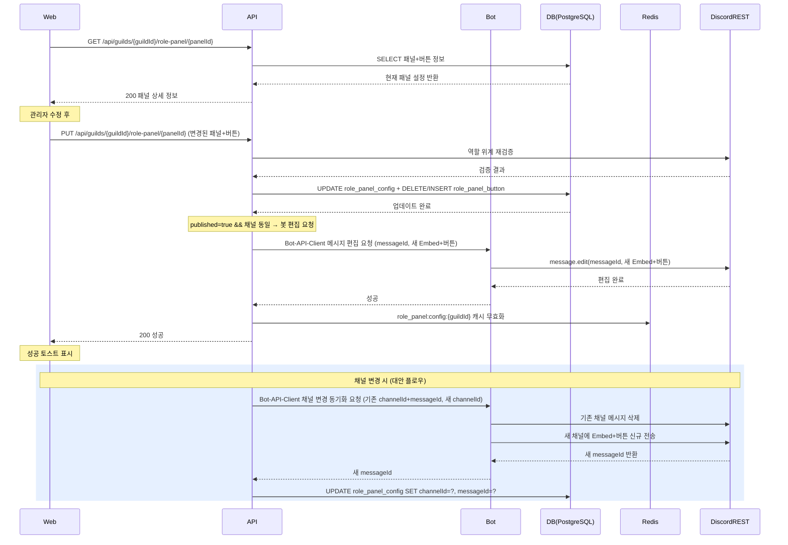

# 유스케이스 ID: UC-02

### 제목
패널 수정 및 Discord 메시지 재동기화

---

## 1. 개요

### 1.1 목적

이미 저장된(게시 여부 무관) 패널의 설정(채널, Embed, 버튼 목록)을 수정하고, 게시 중인 경우 Discord 채널 메시지를 동기화하는 흐름을 정의한다.

### 1.2 범위

apps/web(설정 수정 UI) + apps/api(수정 + 동기화 오케스트레이션) + apps/bot(Discord 메시지 편집 또는 재전송) 3앱 cross-app 유스케이스.

### 1.3 액터

| 구분 | 액터 | 설명 |
|------|------|------|
| 주 액터 | 길드 관리자 | 웹 대시보드에서 패널 설정을 수정하는 운영진 |
| 부 액터 | Discord REST API | 역할 위계 검증 및 메시지 편집/삭제/전송 처리 |
| 부 액터 | Bot (RolePanelBotService) | Discord 메시지 편집 또는 채널 변경 시 삭제+재전송 수행 |
| 부 액터 | PostgreSQL | 패널 설정 및 버튼 목록 영속 저장 |
| 부 액터 | Redis | 패널 설정 캐시 관리 (TTL 1h) |

---

## 2. 선행 조건

- 관리자가 웹 대시보드에 로그인되어 있음
- 해당 길드의 운영진(관리자) 권한을 보유하고 있음
- 수정할 패널이 DB에 존재함
- 봇이 해당 Discord 서버에 초대되어 있음

---

## 3. 참여 컴포넌트

| 앱 | 컴포넌트 | 역할 |
|----|----------|------|
| Web | `/settings/guild/[guildId]/role-panel` 설정 페이지 (패널 탭 선택 → 수정 폼) | 관리자 수정 UI 제공 |
| API | `GET /api/guilds/{guildId}/role-panel/{panelId}` | 현재 패널 설정 조회 |
| API | `PUT /api/guilds/{guildId}/role-panel/{panelId}` | 패널 수정 및 Discord 동기화 오케스트레이션 |
| Bot | RolePanelBotService | Discord 메시지 편집 또는 채널 변경 시 삭제+재전송 |
| DB | role_panel_config 테이블 | 패널 기본 설정 저장 (채널, Embed, published, messageId) |
| DB | role_panel_button 테이블 | 패널 버튼 목록 저장 (역할, 레이블, 순서, 모드) |
| Redis | `role_panel:config:{guildId}` | 패널 설정 캐시 (TTL 1h) |

---

## 4. 기본 플로우 (Basic Flow)

> 게시된 패널 수정 + 동일 채널 유지 시

### 4.1 단계별 흐름

| 단계 | 액터 | 행동 |
|------|------|------|
| 1 | 길드 관리자 | 웹 대시보드에서 패널 목록 탭 중 수정할 패널 탭을 선택한다. |
| 2 | Web → API | `GET /api/guilds/{guildId}/role-panel/{panelId}`를 호출하여 현재 패널 설정(Embed, 버튼 목록, 채널)을 로드하고 폼에 렌더링한다. |
| 3 | 길드 관리자 | Embed 제목/설명/색상 또는 버튼 목록(추가·삭제·순서 변경·레이블 수정)을 변경한다. |
| 4 | Web (클라이언트) | 버튼 역할 선택 시 부여 불가 역할과 ADMINISTRATOR 권한 보유 역할을 비활성 처리한다. |
| 5 | 길드 관리자 | "저장" 버튼을 클릭한다. 웹은 `PUT /api/guilds/{guildId}/role-panel/{panelId}`를 호출하여 변경된 패널 설정과 버튼 목록 전체를 전송한다. |
| 6 | API → Discord REST API | Discord REST API를 통해 역할 위계 + ADMINISTRATOR 재검증을 수행한다. |
| 7 | API → DB | 검증 통과 시 role_panel_config를 업데이트하고, role_panel_button 레코드를 전체 교체한다(기존 버튼 삭제 후 재삽입). |
| 8 | API → Bot | 패널이 `published=true` 상태이고 채널이 변경되지 않은 경우: Bot-API-Client를 경유하여 봇에 메시지 편집 요청을 전달한다. |
| 9 | Bot → Discord REST API | 봇이 기존 messageId로 Discord `message.edit()`를 호출하여 Embed와 버튼을 업데이트한다. 메시지 위치는 유지된다. |
| 10 | API → Redis | Redis 캐시(`role_panel:config:{guildId}`)를 무효화한다. |
| 11 | API → Web | 200 성공 응답을 반환한다. 웹은 성공 토스트를 표시한다. |

### 4.2 시퀀스 다이어그램

---

## 5. 대안 플로우 (Alternative Flows)

### AF-01: 채널 변경 시

8단계에서 channelId가 변경된 경우 아래 흐름으로 대체된다.

1. API가 Bot-API-Client를 경유하여 봇에 채널 변경 동기화 요청을 전달한다(기존 channelId+messageId, 새 channelId 포함).
2. 봇이 기존 채널의 기존 messageId 메시지를 삭제한다.
3. 봇이 새 채널에 Embed+버튼 메시지를 신규 전송한다.
4. Discord REST API가 반환한 새 messageId를 봇이 API로 반환한다.
5. API가 role_panel_config의 channelId와 messageId를 새 값으로 갱신한다.

### AF-02: 미게시(published=false) 패널 수정 시

7단계(DB 업데이트) 이후 봇 동기화 없이 바로 Redis 캐시 무효화 및 성공 응답을 반환한다. Discord 채널에 메시지 게시가 없으므로 봇 호출은 수행하지 않는다.

---

## 6. 예외 플로우 (Exception Flows)

| ID | 발생 시점 | 원인 | 처리 방식 | 사용자 피드백 |
|----|----------|------|----------|--------------|
| EX-01 | 6단계 (역할 위계 검증) | ADMINISTRATOR 권한 보유 역할 또는 역할 위계 위반 역할 포함 | API 400/403 반환. 수정 내용 미저장. | 웹에 오류 토스트 표시 |
| EX-02 | 9단계 (Discord 메시지 편집) | 기존 Discord 메시지가 수동으로 삭제된 상태에서 edit 시도 → Unknown Message 오류 | 봇이 동일 채널에 신규 전송으로 폴백. 새 messageId를 DB에 갱신. | 별도 오류 미노출 (투명 폴백) |
| EX-03 | AF-01 2단계 (기존 채널 메시지 삭제) | 이미 삭제되었거나 채널이 없음 | 내부 로그 기록 후 새 채널 신규 전송으로 계속 진행 | 사용자에게 별도 오류 미노출 |
| EX-04 | AF-01 3단계 (새 채널 메시지 전송) | 봇이 새 채널에 전송 권한 부족 | API 503 반환. 채널 변경 전 상태 복구 안내. | 웹에 권한 부족 토스트 표시 |
| EX-05 | 5단계 (저장 요청) | 버튼 수 25개 초과 | 클라이언트 차단, API 400 반환. DB 미갱신. | 웹에 버튼 수 초과 오류 표시 |
| EX-06 | 5단계 (저장 요청) | 비운영 길드 슈퍼관리자 수정 시도 | API 403 반환. 수정 차단. | 웹에 권한 없음 토스트 표시 |

---

## 7. 후행 조건 (Post-conditions)

### 7.1 성공 시

- **DB**: role_panel_config가 업데이트됨. role_panel_button이 전체 교체됨. 채널 변경 시 messageId가 새 값으로 갱신됨.
- **Redis**: `role_panel:config:{guildId}` 캐시 무효화됨.
- **Discord**: 게시된 패널인 경우 기존 messageId 메시지가 새 Embed+버튼으로 갱신됨. 채널 변경 시 기존 채널 메시지 삭제 + 새 채널에 신규 메시지 게시됨.
- **Web**: 수정된 설정이 폼에 반영됨. 성공 토스트 표시됨.

### 7.2 실패 시

- **DB**: 트랜잭션 롤백으로 기존 설정 유지됨.
- **Discord**: 메시지 미변경.
- **Web**: 오류 토스트 표시됨. 폼의 입력 값은 유지되어 재시도 가능.

---

## 8. 비기능 요구사항

### 8.1 성능

- 수정 API 응답 3초 이내 (Discord REST 편집 포함).
- 채널 변경 시 최대 5초 이내 (삭제+재전송 2회 Discord REST 호출).

### 8.2 보안

- 🔒 JwtAuthGuard + GuildMembershipGuard 적용 (PUT 엔드포인트).
- 🔒 역할 위계 재검증 필수 — 수정 시에도 API 서버 측에서 반드시 재검증 수행.
- 🔒 비운영 길드 슈퍼관리자 뮤테이션 차단 (API 403).

### 8.3 가용성

- Discord 메시지 편집/삭제 실패 시 폴백(신규 전송)으로 서비스 중단 최소화.
- DB 업데이트는 Discord 동기화와 별개로 진행하여 Discord 장애가 데이터 저장을 막지 않도록 한다.

---

## 9. UI/UX 요구사항

### 9.1 화면 구성

- 기존 패널 탭 선택 시 현재 설정이 폼에 미리 채워짐.
- 수정된 필드는 시각적으로 표시(변경 감지 인디케이터).
- 버튼 목록 순서 변경은 드래그앤드롭 지원.
- 버튼 역할 선택 드롭다운에서 부여 불가 역할 및 ADMINISTRATOR 보유 역할은 비활성 처리.

### 9.2 사용자 경험

- 저장 버튼 클릭 전 변경 사항 미저장 시 페이지 이탈 방지 경고 표시.
- 저장 중 로딩 인디케이터 표시.
- 성공 토스트: "패널이 수정되었습니다. Discord 메시지가 업데이트되었습니다."
- 채널 변경 시 토스트에 기존 채널 메시지 삭제 안내 포함.

---

## 10. 테스트 시나리오

### 10.1 성공 케이스

| 번호 | 시나리오 | 입력 조건 | 기대 결과 |
|------|----------|-----------|-----------|
| S-01 | 게시된 패널 Embed 내용 수정 (동일 채널) | published=true, 동일 channelId, Embed 제목 변경 | 200 성공, Discord 메시지 edit() 호출, messageId 유지 |
| S-02 | 게시된 패널 채널 변경 | published=true, 다른 channelId로 변경 | 기존 채널 메시지 삭제 + 새 채널 신규 전송, messageId 갱신 |
| S-03 | 미게시 패널 수정 | published=false | DB만 업데이트, Discord 봇 호출 없음 |

### 10.2 실패 케이스

| 번호 | 시나리오 | 입력 조건 | 기대 결과 |
|------|----------|-----------|-----------|
| F-01 | ADMINISTRATOR 역할 포함 버튼으로 수정 시도 | ADMINISTRATOR 역할 포함 | API 403 반환, DB 미갱신 |
| F-02 | 버튼 26개로 수정 시도 | 버튼 26개 | API 400 반환, DB 미갱신 |
| F-03 | 새 채널에 봇 전송 권한 없는 채널로 변경 | 채널 변경, 새 채널에 봇 권한 없음 | API 503 반환, 채널 변경 미반영 |
| F-04 | 비운영 길드 슈퍼관리자 수정 시도 | 비운영 길드 슈퍼관리자 | API 403 반환 |

---

## 11. 관련 유스케이스

| 유스케이스 ID | 제목 | 관계 |
|---------------|------|------|
| UC-01 | 패널 생성 및 Discord 게시 | 선행 유스케이스 — 패널이 먼저 생성되어야 수정 가능 |
| UC-03 | 패널 삭제 | 수정 대신 삭제를 선택하는 대안 흐름 |
| UC-04 | GRANT 모드 버튼 클릭 — 역할 부여 | 수정된 버튼 설정의 실제 사용 흐름 |
| UC-05 | TOGGLE 모드 버튼 클릭 — 역할 토글 | 수정된 버튼 설정의 실제 사용 흐름 |

---

## 12. 변경 이력

| 버전 | 날짜 | 작성자 | 변경 내용 |
|------|------|--------|----------|
| 1.0 | 2026-06-19 | usecase-writer | 초기 작성 |

---

## 부록

### A. 용어 정의

| 용어 | 정의 |
|------|------|
| 역할 패널(Role Panel) | Discord 채널에 게시되는 Embed 메시지와 역할 선택 버튼의 조합. |
| Embed | Discord 메시지의 구조화된 블록. 제목, 설명, 색상 등을 포함한다. |
| customId | Discord 버튼의 고유 식별자. `role_panel:{panelId}:{buttonId}` 형식. |
| GRANT 모드 | 버튼 클릭 시 역할을 부여만 하는 모드. |
| TOGGLE 모드 | 버튼 클릭 시 역할을 보유 중이면 회수, 미보유이면 부여하는 양방향 모드. |
| messageId | Discord 채널에 게시된 패널 메시지의 고유 ID. 메시지 편집(edit) 또는 삭제 시 사용. |
| 버튼 전체 교체 | 수정 요청 시 기존 role_panel_button 레코드를 삭제하고 새 레코드를 재삽입하는 방식. |
| published | 패널의 Discord 게시 상태 플래그. true이면 Discord 채널에 메시지가 게시된 상태. |
| Bot-API-Client | 봇(apps/bot)이 API(apps/api)를 호출할 때 사용하는 내부 HTTP 클라이언트 SDK. |

### B. 참고 자료

| 문서 | 경로 |
|------|------|
| PRD | `docs/specs/prd/role-panel.md` |
| Userflow (UF-ROLE-PANEL-004 포함) | `docs/specs/userflow/role-panel.md` |
| DB 스키마 | `docs/specs/database/_index.md` |
| 도메인 매니페스트 | `docs/specs/feature-manifest.json` |

---
