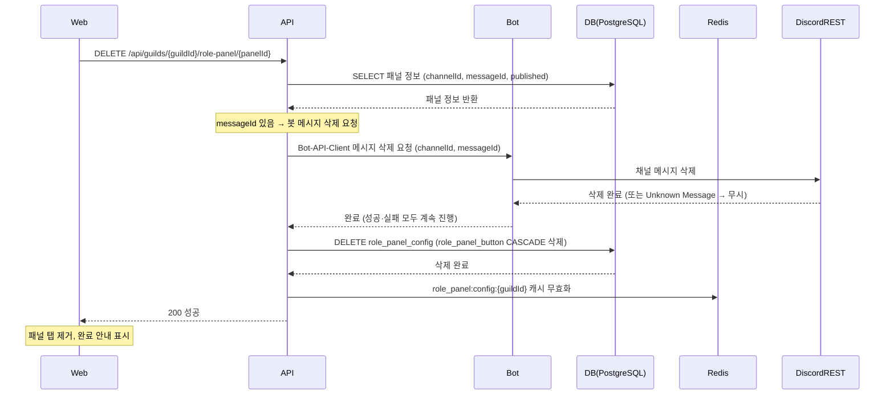

# 유스케이스 ID: UC-03

### 제목
패널 삭제

---

## 1. 개요

| 항목 | 내용 |
|------|------|
| **유스케이스 ID** | UC-03 |
| **제목** | 패널 삭제 |
| **주요 액터** | 길드 관리자 (웹 대시보드) |
| **부 액터** | Discord REST API, Bot (RolePanelBotService), PostgreSQL, Redis |
| **범위** | apps/web (삭제 UI) + apps/api (삭제 오케스트레이션) + apps/bot (Discord 메시지 삭제, 선택적) — cross-app |
| **목적** | 관리자가 역할 패널을 삭제하고, 게시된 경우 Discord 채널의 패널 메시지도 함께 제거한다 |
| **관련 Userflow** | UF-ROLE-PANEL-005 |
| **트리거** | 관리자가 웹 대시보드 패널 탭에서 삭제 버튼을 클릭하고 삭제를 확인한다 |

---

## 2. 선행 조건

1. 관리자가 웹 대시보드에 로그인되어 있다.
2. 해당 길드의 운영진(관리자) 권한을 보유하고 있다.
3. 삭제할 패널이 DB(role_panel_config)에 존재한다.

---

## 3. 참여 컴포넌트

| 컴포넌트 | 역할 |
|----------|------|
| **Web** (`apps/web`) | `/settings/guild/[guildId]/role-panel` 설정 페이지 — 패널 탭, 삭제 버튼, 삭제 확인 다이얼로그 |
| **API** (`apps/api`) | `DELETE /api/guilds/{guildId}/role-panel/{panelId}` — 삭제 오케스트레이션 (DB 조회 → 봇 메시지 삭제 요청 → DB 삭제 → Redis 무효화) |
| **Bot** (`apps/bot`, RolePanelBotService) | Discord REST API를 통해 채널 메시지 삭제 (선택적 — messageId 있을 때만) |
| **DB** (PostgreSQL) | role_panel_config, role_panel_button 테이블 — 패널 정보 조회 및 삭제 |
| **Redis** | `role_panel:config:{guildId}` 캐시 무효화 (TTL 1h) |
| **Discord REST API** | 채널 메시지 삭제 실행 |

---

## 4. 기본 플로우 (Basic Flow)

> 기본 플로우: 게시된 패널(published=true, messageId 있음) 삭제 시

### 4.1 단계별 흐름

| 단계 | 액터 | 행동 |
|------|------|------|
| 1 | 관리자 | 웹 대시보드에서 삭제할 패널 탭을 선택하고 삭제 버튼을 클릭한다 |
| 2 | Web | 삭제 확인 다이얼로그를 표시한다. 게시된 패널인 경우 "Discord 채널의 메시지도 함께 삭제됩니다." 안내 문구를 포함한다 |
| 3 | 관리자 | 삭제를 확인한다. Web이 `DELETE /api/guilds/{guildId}/role-panel/{panelId}`를 호출한다 |
| 4 | API | DB에서 패널 정보(channelId, messageId, published 여부)를 조회한다 |
| 5 | API | messageId가 존재하므로 Bot-API-Client를 경유하여 봇에 메시지 삭제 요청을 전달한다 |
| 6 | Bot | Discord REST API를 통해 해당 채널의 메시지를 삭제한다. 삭제 성공·실패 여부와 무관하게 다음 단계로 진행한다 |
| 7 | API | DB에서 role_panel_config를 삭제한다. role_panel_button은 ON DELETE CASCADE로 자동 삭제된다 |
| 8 | API | Redis 캐시(`role_panel:config:{guildId}`)를 무효화하고 성공 응답(200)을 반환한다 |
| 9 | Web | 삭제된 패널 탭을 제거하고 완료 안내를 표시한다. 패널이 없으면 빈 상태 화면으로 전환한다 |

### 4.2 시퀀스 다이어그램

---

## 5. 대안 플로우 (Alternative Flows)

### AF-01. 미게시(published=false) 패널 삭제

**진입 조건**: 삭제 대상 패널의 `published=false`이고 `messageId`가 없는 경우

| 단계 | 변경 내용 |
|------|-----------|
| 기본 플로우 4단계 이후 | `messageId`가 없으므로 봇 메시지 삭제 요청(기본 플로우 5~6단계)을 생략한다 |
| 이후 | DB 삭제 → Redis 캐시 무효화 → 성공 응답(200)으로 진행한다 |

---

## 6. 예외 플로우 (Exception Flows)

### EX-01. Discord 메시지가 이미 수동으로 삭제된 상태

**발생 조건**: `messageId`가 있으나 Discord에 해당 메시지가 존재하지 않는 경우

1. 봇의 삭제 요청이 Unknown Message 오류를 반환한다.
2. API가 내부 로그를 기록하고 오류를 무시한다.
3. DB 삭제로 계속 진행한다. 사용자에게 별도 오류를 노출하지 않는다.

### EX-02. Discord 채널 자체가 삭제된 상태

**발생 조건**: 패널이 게시된 채널이 Discord에서 삭제된 경우

1. 봇의 삭제 요청이 Unknown Channel 오류를 반환한다.
2. API가 내부 로그를 기록하고 오류를 무시한다.
3. DB 삭제로 계속 진행한다.

### EX-03. 비운영 길드 슈퍼관리자의 삭제 시도

**발생 조건**: 운영진 권한이 없는 슈퍼관리자가 비운영 길드 패널 삭제를 시도하는 경우

1. API가 GuildMembershipGuard 검증 실패로 403을 반환한다.
2. DB 삭제가 차단된다.

### EX-04. 네트워크 오류로 API 요청 실패

**발생 조건**: 웹에서 API로의 요청이 네트워크 오류로 실패하는 경우

1. Web이 오류 토스트를 표시한다.
2. 패널은 DB에 유지된다.
3. 관리자가 재시도할 수 있다.

### EX-05. 존재하지 않는 패널 삭제 시도

**발생 조건**: 유효하지 않거나 이미 삭제된 `panelId`로 삭제를 시도하는 경우

1. API가 404를 반환한다.
2. Web이 "패널을 찾을 수 없습니다." 안내를 표시한다.

---

## 7. 후행 조건 (Post-conditions)

### 7.1 성공 시

| 대상 | 상태 |
|------|------|
| **DB** | role_panel_config 레코드 삭제됨. role_panel_button 레코드 ON DELETE CASCADE로 자동 삭제됨 |
| **Redis** | `role_panel:config:{guildId}` 캐시 무효화됨 |
| **Discord** | 게시된 패널인 경우 채널 메시지 삭제됨 (이미 없으면 무시하고 성공 처리) |
| **Web** | 패널 탭 제거됨. 패널이 없으면 빈 상태 화면으로 전환됨 |
| **부작용** | 해당 패널의 버튼에 매핑된 customId(`role_panel:{panelId}:{buttonId}`)로 사용자가 버튼 클릭 시 봇이 "버튼 설정을 찾을 수 없습니다." 안내 응답을 반환함 |

### 7.2 실패 시

| 대상 | 상태 |
|------|------|
| **DB** | 기존 패널 및 버튼 레코드 유지됨 |
| **Discord** | 메시지 유지됨 |
| **Web** | 오류 토스트 표시. 패널 탭 유지됨 |

---

## 8. 비기능 요구사항

### 8.1 성능

- 삭제 API 응답 3초 이내 (Discord REST 삭제 포함)
- 미게시 패널 삭제 1초 이내 (봇 호출 없음)

### 8.2 보안

- 🔒 JwtAuthGuard + GuildMembershipGuard 적용 (DELETE 엔드포인트)
- 🔒 비운영 길드 슈퍼관리자 삭제 차단 (API 403 반환)
- 🔒 ON DELETE CASCADE — role_panel_button 자동 삭제로 고아 레코드 방지

### 8.3 가용성

- Discord 메시지 삭제 실패 (이미 삭제됨, 채널 없음 등)가 DB 삭제를 차단하지 않음
- 소프트 삭제(soft delete) 미사용 — 하드 삭제로 처리

---

## 9. UI/UX 요구사항

### 9.1 화면 구성

- 패널 탭의 더보기 메뉴 또는 삭제 아이콘 버튼
- 삭제 확인 다이얼로그에 패널 이름과 채널 안내 포함
- 게시된 패널인 경우 다이얼로그에 "Discord 채널의 메시지도 함께 삭제됩니다." 안내 문구 추가

### 9.2 사용자 경험

- 삭제는 실행 취소 불가임을 다이얼로그에 명시
- 삭제 중 로딩 인디케이터 표시
- 삭제 완료 후 인접 패널 탭 또는 빈 상태 화면으로 자동 전환

---

## 10. 테스트 시나리오

### 10.1 성공 케이스

| 번호 | 시나리오 | 입력 조건 | 기대 결과 |
|------|----------|-----------|-----------|
| S-01 | 게시된 패널 삭제 | published=true, messageId 있음 | Discord 메시지 삭제 + DB 삭제 + Redis 캐시 무효화, 200 성공 |
| S-02 | 미게시 패널 삭제 | published=false, messageId 없음 | 봇 호출 없이 DB 삭제 + Redis 캐시 무효화, 200 성공 |
| S-03 | 이미 삭제된 Discord 메시지가 있는 패널 삭제 | messageId 있으나 Discord에 메시지 없음 | Discord 오류 무시 후 DB 삭제 계속 진행, 200 성공 |

### 10.2 실패 케이스

| 번호 | 시나리오 | 입력 조건 | 기대 결과 |
|------|----------|-----------|-----------|
| F-01 | 비운영 길드 슈퍼관리자 삭제 시도 | 비운영 길드 슈퍼관리자 인증 | API 403 반환, DB 미삭제 |
| F-02 | 존재하지 않는 패널 삭제 시도 | 유효하지 않은 panelId | API 404 반환 |
| F-03 | 네트워크 오류로 API 요청 실패 | 네트워크 단절 | 웹 오류 토스트, 패널 유지 |

---

## 11. 관련 유스케이스

| 유스케이스 ID | 제목 | 관계 |
|--------------|------|------|
| UC-01 | 패널 생성 및 Discord 게시 | 선행 — 패널이 생성·게시되어야 삭제 대상이 됨 |
| UC-02 | 패널 수정 및 Discord 메시지 재동기화 | 병렬 — 삭제 대신 수정을 선택할 수 있음 |
| UC-04 | GRANT 모드 버튼 클릭 — 역할 부여 | 후속 영향 — 패널 삭제 후 버튼 클릭 시 오류 응답 반환 |
| UC-05 | TOGGLE 모드 버튼 클릭 — 역할 토글 | 후속 영향 — 패널 삭제 후 버튼 클릭 시 오류 응답 반환 |

---

## 12. 변경 이력

| 버전 | 날짜 | 작성자 | 내용 |
|------|------|--------|------|
| 1.0 | 2026-06-19 | usecase-writer | 초기 작성 |

---

## 부록

### A. 용어 정의

| 용어 | 정의 |
|------|------|
| **역할 패널 (Role Panel)** | Discord 채널에 게시되는 Embed 메시지와 역할 선택 버튼의 조합 |
| **messageId** | Discord 채널에 게시된 패널 메시지의 고유 ID |
| **ON DELETE CASCADE** | role_panel_config 삭제 시 role_panel_button이 자동 삭제되는 DB 참조 무결성 규칙 |
| **published** | 패널의 Discord 게시 상태 플래그 |
| **Bot-API-Client** | 봇(apps/bot)이 API(apps/api)를 호출할 때 사용하는 내부 HTTP 클라이언트 SDK |
| **고아 레코드** | 부모 레코드 없이 남은 자식 레코드. ON DELETE CASCADE로 방지 |

### B. 참고 자료

| 문서 | 경로 |
|------|------|
| PRD | `docs/specs/prd/role-panel.md` |
| Userflow | `docs/specs/userflow/role-panel.md` |
| DB 스키마 | `docs/specs/database/_index.md` |
| 도메인 매니페스트 | `docs/specs/feature-manifest.json` |

---
