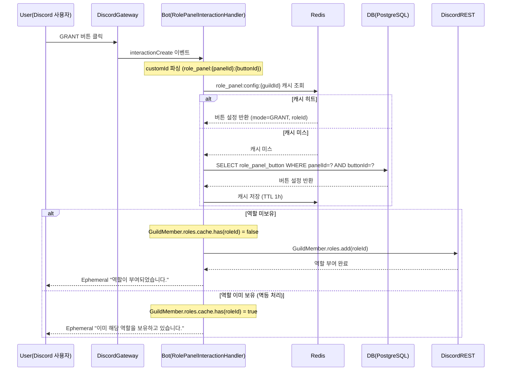

# 유스케이스 ID: UC-04

### 제목
GRANT 모드 버튼 클릭 — 역할 부여

---

## 1. 개요

### 1.1 목적

Discord 사용자가 게시된 역할 패널의 GRANT 모드 버튼을 클릭하여 역할을 부여받는 흐름을 정의한다. 역할을 이미 보유한 경우 Discord API 호출 없이 안내 응답만 반환하는 멱등 처리를 포함하며, 규칙-rules 채널을 통한 인증 게이트 시나리오도 함께 다룬다.

### 1.2 범위

- **포함**: apps/bot의 interactionCreate 핸들러, Redis 설정 캐시 조회, Discord REST API를 통한 역할 부여
- **제외**: apps/web, apps/api는 이 플로우에 직접 참여하지 않음
- **설정 조회 경로**: Redis 캐시 우선 조회 → 캐시 미스 시 DB 직접 조회 또는 Bot-API-Client 경유 후 캐시 갱신

### 1.3 액터

| 구분 | 액터 |
|------|------|
| 주 액터 | Discord 사용자 (버튼 클릭) |
| 부 액터 | Discord Gateway, Bot (RolePanelInteractionHandler), Redis, DB (PostgreSQL), Discord REST API |

---

## 2. 선행 조건

1. 역할 패널이 `published=true` 상태로 Discord 채널에 게시되어 있다.
2. 클릭한 버튼의 `mode`가 `GRANT`이다.
3. 봇이 해당 Discord 서버에서 Manage Roles 권한을 보유하고 있다.
4. 봇의 최상위 역할 position이 대상 `roleId`의 position보다 높다 (패널 저장 시점에 API 서버 측에서 이미 검증됨).

---

## 3. 참여 컴포넌트

| 컴포넌트 | 역할 | 위치 |
|----------|------|------|
| Bot — RolePanelInteractionHandler | interactionCreate 이벤트 수신, customId 파싱, 역할 부여 처리 | `apps/bot/src/event/role-panel/` |
| Redis | role_panel:config:{guildId} 캐시 (TTL 1h, 패널+버튼 설정) | 외부 인프라 |
| DB (PostgreSQL) | role_panel_button 테이블 — 캐시 미스 시 버튼 설정 조회 | 외부 인프라 |
| Discord Gateway | interactionCreate 이벤트 발행 | Discord 인프라 |
| Discord REST API | GuildMember.roles.add(roleId) — 역할 부여 실행 | Discord 인프라 |

---

## 4. 기본 플로우 (Basic Flow)

> 전제: 역할 미보유 사용자, Redis 캐시 히트 상태

### 4.1 단계별 흐름

| 단계 | 수행 주체 | 설명 |
|------|-----------|------|
| 1 | Discord 사용자 | Discord 채널의 역할 패널에서 GRANT 모드 버튼을 클릭한다. |
| 2 | Discord Gateway | interactionCreate 이벤트를 발행하고 봇이 수신한다. |
| 3 | Bot | `interaction.customId`를 파싱한다. 형식: `role_panel:{panelId}:{buttonId}`. 파싱 결과로 `panelId`와 `buttonId`를 추출한다. |
| 4 | Bot | RolePanelInteractionHandler로 인터랙션 처리가 분기된다. |
| 5 | Bot → Redis | `role_panel:config:{guildId}` 캐시를 조회한다. 캐시 히트 시 버튼 설정(`roleId`, `mode=GRANT`)을 반환받는다. 캐시 미스 시 대안 플로우 AF-02 실행. |
| 6 | Bot | 버튼 설정에서 `roleId`와 `mode=GRANT`를 확인한다. |
| 7 | Bot | `GuildMember.roles.cache`에서 `roleId` 보유 여부를 확인한다. 미보유로 확인. |
| 8 | Bot → Discord REST API | `GuildMember.roles.add(roleId)`를 호출하여 역할을 부여한다. |
| 9 | Bot → Discord 사용자 | 역할 부여 성공 시 Ephemeral 응답을 전송한다. 안내 문구: "역할이 부여되었습니다." (클릭한 사용자에게만 표시됨). |
| 10 | Bot | 내부 처리 로그를 기록한다 (선택). |

### 4.2 시퀀스 다이어그램

---

## 5. 대안 플로우 (Alternative Flows)

### AF-01: 역할 이미 보유 시 (멱등 처리)

- **진입 조건**: 단계 7에서 `GuildMember.roles.cache.has(roleId) = true` 확인.
- **흐름**:
  1. Discord REST API 호출 없이 즉시 분기한다.
  2. 봇이 Ephemeral 응답만 반환한다. 안내 문구: "이미 해당 역할을 보유하고 있습니다."
  3. DB 및 Redis 변경 없음.
- **결과**: 역할 상태 변경 없음. 사용자에게 현재 보유 상태 안내.

### AF-02: 캐시 미스 시 DB 폴백

- **진입 조건**: 단계 5에서 Redis 캐시 미스.
- **흐름**:
  1. DB에서 `panelId`와 `buttonId`에 해당하는 `role_panel_button` 레코드를 조회한다.
  2. 조회 성공 시 Redis에 버튼 설정을 저장한다 (TTL 1h).
  3. 기본 플로우 단계 6으로 복귀한다.
- **결과**: 캐시 미스 상태에서도 역할 부여 플로우 정상 진행.

### AF-03: 인증 게이트 시나리오 (UF-ROLE-PANEL-008)

- **진입 조건**: 규칙-rules 채널에 GRANT 패널이 게시되어 있으며, 버튼의 `roleId`가 정회원 역할에 매핑된 경우. 클릭 주체는 `@everyone`(미인증) 사용자.
- **흐름**:
  1. `@everyone` 상태의 사용자가 규칙-rules 채널에서 GRANT 버튼을 클릭한다.
  2. 기본 플로우 단계 1~9와 동일하게 처리된다.
  3. 정회원 역할 부여 성공 후 봇이 Ephemeral 응답을 전송한다.
  4. Discord 서버 채널 권한 상속에 의해 커뮤니티, 음성, 게임, 지원 카테고리 채널에 대한 접근 권한이 자동으로 개방된다. 이 권한 개방은 Discord 서버 채널 권한 설정에 의한 것으로 봇이 별도 처리하지 않는다.
- **결과**: 미인증 사용자가 정회원 역할을 획득하고 서버 채널 접근 권한을 얻는 온보딩 완료.

---

## 6. 예외 플로우 (Exception Flows)

| 코드 | 발생 조건 | 봇 처리 | 사용자 응답 |
|------|-----------|---------|-------------|
| EX-01 | `customId` 파싱 실패 (형식 불일치) | 즉시 종료 | Ephemeral "잘못된 요청입니다." |
| EX-02 | 버튼 설정이 DB에 없음 (패널 삭제됨) | 내부 로그 기록 후 종료 | Ephemeral "역할 버튼 설정을 찾을 수 없습니다." |
| EX-03 | 봇의 Manage Roles 권한 없거나 봇 역할이 대상 역할보다 낮음 | Discord REST API 역할 부여 실패. 내부 로그 기록 후 종료 | Ephemeral "역할을 부여할 권한이 없습니다. 서버 관리자에게 문의하세요." |
| EX-04 | 대상 역할이 삭제된 상태 (Unknown Role) | Discord REST API 실패. 내부 로그 기록 후 종료 | Ephemeral "해당 역할을 찾을 수 없습니다." |
| EX-05 | Discord 3초 응답 제한 위험 (캐시 미스 + DB 조회 등) | deferReply를 먼저 호출하여 Discord 응답 시간 연장. 처리 완료 후 followUp으로 최종 결과 전달 | (deferReply 로딩 상태 → followUp 결과) |
| EX-06 | DM (Direct Message) 컨텍스트 인터랙션 | 인터랙션 무시 또는 즉시 종료 | (무시) 또는 Ephemeral "길드 채널에서만 사용 가능합니다." |
| EX-07 | Redis 캐시 조회 실패 | DB 직접 조회로 폴백. 처리 계속 진행 | (사용자 영향 없음, 처리 정상 진행) |

---

## 7. 후행 조건 (Post-conditions)

### 7.1 성공 시

- **Discord**: 사용자에게 `roleId`에 해당하는 역할이 부여됨. Ephemeral 성공 응답이 클릭한 사용자에게만 표시됨. Discord UI에서 역할 뱃지가 즉시 반영됨.
- **DB**: 변경 없음. 역할 부여 결과는 Discord 상태에만 반영.
- **Redis**: 변경 없음. 설정 캐시는 유지되며, 역할 부여 자체는 캐시와 무관.
- **인증 게이트 시나리오 추가 조건**: 정회원 역할 부여 후 Discord 채널 권한 상속으로 커뮤니티 채널 접근 가능 상태가 됨.

### 7.2 실패 시

- **Discord**: 역할 미부여. Ephemeral 오류 응답 또는 무응답.
- **DB / Redis**: 변경 없음.

---

## 8. 비기능 요구사항

### 8.1 성능

- 인터랙션 수신부터 Ephemeral 응답까지 3초 이내 처리 (Discord 응답 시간 제한).
- Redis 캐시 히트 시 1초 이내 응답 목표.
- deferReply + followUp 패턴으로 처리 시간이 긴 경우(캐시 미스 + DB 조회)에도 Discord 3초 제한 대응 가능.

### 8.2 보안

- 🔒 Manage Roles 봇 권한 및 봇 역할 위계 검증은 패널 생성/수정 시점에 API 서버 측에서 수행. 게시 후 클릭 시 오류 최소화.
- 🔒 Ephemeral 응답으로 역할 부여 결과가 클릭한 사용자에게만 표시됨. 채널에 공개되지 않음.
- 🔒 DM 컨텍스트 차단. 길드 컨텍스트에서만 인터랙션 처리 허용.

### 8.3 가용성

- Redis 캐시 미스 또는 Redis 장애 시 DB 직접 조회로 폴백하여 서비스 중단 없음.
- 봇 재시작 시 Redis 캐시가 자동 재구성됨 (TTL 기반, 다음 버튼 클릭 시 캐시 갱신).

---

## 9. UI/UX 요구사항

### 9.1 화면 구성

- Discord 채널의 Embed 메시지 하단에 버튼이 렌더링됨.
- 버튼 스타일은 `role_panel_button.style` 필드에 따라 PRIMARY / SECONDARY / SUCCESS / DANGER 중 하나로 표시.
- 버튼 레이블과 `emoji` 필드 값이 버튼에 표시됨.

### 9.2 사용자 경험

- 버튼 클릭 시 Discord UI에서 즉시 로딩 상태 표시.
- Ephemeral 응답은 클릭한 사용자에게만 표시되어 채널 채팅을 오염시키지 않음.
- 역할 부여 완료 시 Discord UI에서 역할 뱃지가 즉시 표시됨.
- 오류 응답 역시 Ephemeral로 제공되어 다른 사용자에게 노출되지 않음.

---

## 10. 테스트 시나리오

### 10.1 성공 케이스

| 번호 | 시나리오 | 입력 조건 | 기대 결과 |
|------|----------|-----------|-----------|
| S-01 | 역할 미보유 사용자 GRANT 버튼 클릭 | 유효한 customId, 역할 미보유 | 역할 부여, Ephemeral "역할이 부여되었습니다." |
| S-02 | 역할 이미 보유 사용자 GRANT 버튼 클릭 (멱등) | 유효한 customId, 역할 이미 보유 | Discord API 호출 없음, Ephemeral "이미 해당 역할을 보유하고 있습니다." |
| S-03 | 인증 게이트 시나리오 — 미인증 사용자 정회원 역할 버튼 클릭 | @everyone 사용자, 정회원 역할 GRANT 버튼 | 정회원 역할 부여, 커뮤니티 채널 접근 가능 |
| S-04 | 캐시 미스 상태에서 GRANT 버튼 클릭 | Redis 캐시 없음, DB에 버튼 설정 있음 | DB 조회 후 캐시 갱신, 역할 부여 성공 |

### 10.2 실패 케이스

| 번호 | 시나리오 | 입력 조건 | 기대 결과 |
|------|----------|-----------|-----------|
| F-01 | 삭제된 패널의 버튼 클릭 | panelId 존재하나 DB에 패널 없음 | Ephemeral "역할 버튼 설정을 찾을 수 없습니다." 오류 응답 |
| F-02 | 봇 Manage Roles 권한 없는 상태에서 클릭 | 봇 Manage Roles 없음 | Discord API 실패, Ephemeral "역할을 부여할 권한이 없습니다. 서버 관리자에게 문의하세요." |
| F-03 | 삭제된 역할 ID로 매핑된 버튼 클릭 | roleId가 Discord에 없음 | Ephemeral "해당 역할을 찾을 수 없습니다.", 내부 로그 기록 |
| F-04 | DM에서 버튼 클릭 시도 | DM 컨텍스트 인터랙션 | 무시 또는 Ephemeral "길드 채널에서만 사용 가능합니다." |

---

## 11. 관련 유스케이스

| UC | 제목 | 관계 |
|----|------|------|
| UC-01 | 패널 생성 및 Discord 게시 | GRANT 버튼을 포함한 패널 생성 선행 조건 |
| UC-02 | 패널 수정 및 Discord 메시지 재동기화 | 버튼 설정 변경 시 캐시 무효화 연관 |
| UC-03 | 패널 삭제 | 삭제 후 이 UC의 EX-02 예외 발생 |
| UC-05 | TOGGLE 모드 버튼 클릭 — 역할 토글 | 동일 인터랙션 핸들러, 다른 mode 분기 |

---

## 12. 변경 이력

| 버전 | 날짜 | 작성자 | 내용 |
|------|------|--------|------|
| 1.0 | 2026-06-19 | usecase-writer | 초기 작성 |

---

## 부록

### A. 용어 정의

| 용어 | 정의 |
|------|------|
| GRANT 모드 | 버튼 클릭 시 역할을 부여만 하는 모드. 이미 보유한 역할이면 Discord API 호출 없이 안내 응답(멱등). |
| 멱등 (Idempotent) | 동일한 요청을 여러 번 수행해도 결과가 동일한 성질. |
| customId | Discord 버튼의 고유 식별자. `role_panel:{panelId}:{buttonId}` 형식으로 봇 인터랙션 핸들러 분기에 사용. |
| Ephemeral 응답 | 클릭한 사용자에게만 보이는 Discord 메시지 응답. 채널에 공개되지 않음. |
| deferReply | Discord 인터랙션 응답 시간을 연장하기 위해 먼저 로딩 상태를 전송하는 패턴. |
| followUp | deferReply 이후 실제 결과를 전달하는 Discord 인터랙션 후속 응답. |
| interactionCreate | Discord Gateway가 버튼 클릭 등 사용자 인터랙션 발생 시 발행하는 이벤트. |
| 인증 게이트 | 규칙-rules 채널의 GRANT 패널을 통해 미인증(@everyone) 사용자가 정회원 역할을 획득하고 서버 채널 접근 권한을 얻는 온보딩 흐름. |
| RolePanelInteractionHandler | 봇의 interactionCreate 이벤트를 수신하여 role_panel customId를 처리하는 핸들러. |

### B. 참고 자료

| 산출물 | 경로 |
|--------|------|
| PRD | `docs/specs/prd/role-panel.md` |
| Userflow | `docs/specs/userflow/role-panel.md` |
| DB 스키마 | `docs/specs/database/_index.md` |
| 도메인 매니페스트 | `docs/specs/feature-manifest.json` |

---
