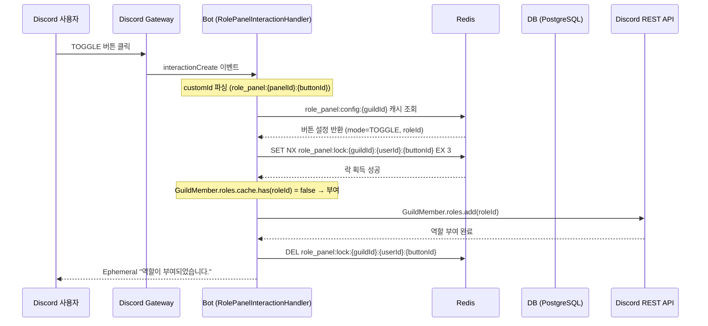
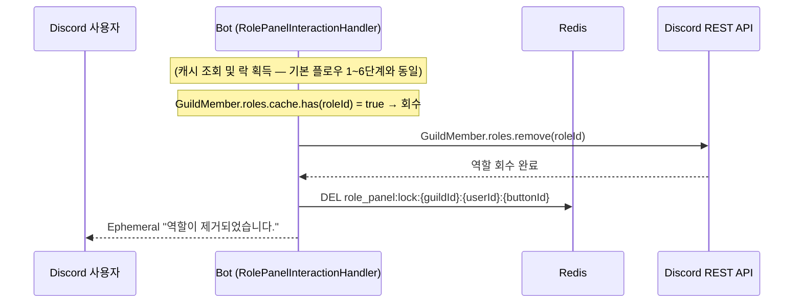
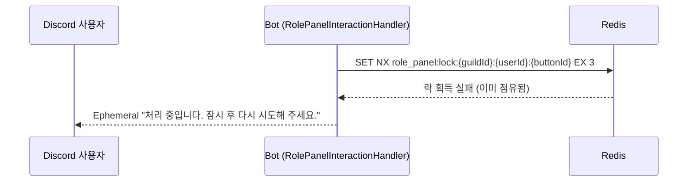

# 유스케이스 ID: UC-05

### 제목
TOGGLE 모드 버튼 클릭 — 역할 토글 (부여/회수)

---

## 1. 개요

### 1.1 목적

Discord 사용자가 역할 패널의 TOGGLE 모드 버튼을 클릭할 때, 해당 역할을 보유 중이면 회수하고 미보유이면 부여하는 양방향 역할 토글 흐름을 정의한다. 빠른 연속 클릭(레이스 컨디션)을 Redis 분산 락으로 처리하여 역할 상태 불일치를 방지한다.

### 1.2 범위

- **포함**: `apps/bot` interactionCreate 핸들러, Redis 설정 캐시 조회, Redis 분산 락 획득/해제, Discord REST API 역할 부여/회수, Ephemeral 응답 전송
- **제외**: `apps/web`, `apps/api` — 이 플로우에 직접 참여하지 않음. 패널 생성/수정/삭제 (UC-01~03 참조)

### 1.3 액터

| 구분 | 액터 | 역할 |
|------|------|------|
| 주 액터 | Discord 사용자 | TOGGLE 버튼 클릭 |
| 부 액터 | Discord Gateway | interactionCreate 이벤트 발행 |
| 부 액터 | Bot (RolePanelInteractionHandler) | 인터랙션 처리, 역할 부여/회수 |
| 부 액터 | Redis | 설정 캐시 제공, 분산 락 관리 |
| 부 액터 | DB (PostgreSQL) | 캐시 미스 시 버튼 설정 조회 |
| 부 액터 | Discord REST API | 실제 역할 부여/회수 실행 |

---

## 2. 선행 조건

1. 역할 패널이 `published=true` 상태로 Discord 채널에 게시되어 있음
2. 클릭한 버튼의 `mode`가 `TOGGLE`임
3. 봇이 해당 Discord 서버에서 Manage Roles 권한을 보유함
4. 봇의 최상위 역할 position이 대상 `roleId`의 position보다 높음
5. 봇이 정상 기동 중이며 Discord Gateway에 연결되어 있음

---

## 3. 참여 컴포넌트

| 컴포넌트 | 위치/식별자 | 역할 |
|----------|-------------|------|
| Bot — interactionCreate 핸들러 | `apps/bot/src/event/role-panel/` | Discord Gateway 이벤트 수신 및 라우팅 |
| Bot — RolePanelInteractionHandler | `apps/bot/src/event/role-panel/` | customId 파싱, 역할 토글 로직 실행 |
| Redis — 설정 캐시 | `role_panel:config:{guildId}` (TTL 1h) | 버튼 설정(roleId, mode) 캐시 제공 |
| Redis — 분산 락 | `role_panel:lock:{guildId}:{userId}:{buttonId}` (TTL 3s) | 동일 사용자 동일 버튼 동시 처리 방지 |
| DB — PostgreSQL | `role_panel_button` 테이블 | 캐시 미스 시 버튼 설정 원본 조회 |
| Discord Gateway | — | `interactionCreate` 이벤트 발행 |
| Discord REST API | — | `GuildMember.roles.add(roleId)` / `GuildMember.roles.remove(roleId)` 실행 |

---

## 4. 기본 플로우 (Basic Flow)

> 기준: 역할 미보유 사용자가 TOGGLE 버튼을 클릭하여 역할이 부여되는 정상 경로

### 4.1 단계별 흐름

| 단계 | 주체 | 행동 |
|------|------|------|
| 1 | Discord 사용자 | Discord 채널의 역할 패널에서 TOGGLE 모드 버튼을 클릭한다 |
| 2 | Discord Gateway | `interactionCreate` 이벤트를 발행하고 봇이 수신한다 |
| 3 | Bot | `interaction.customId`를 파싱한다. 형식: `role_panel:{panelId}:{buttonId}`. `panelId`와 `buttonId`를 추출한다 |
| 4 | Bot | RolePanelInteractionHandler로 인터랙션 처리를 분기한다 |
| 5 | Bot → Redis | `role_panel:config:{guildId}` 캐시를 조회한다. 캐시 히트: 버튼 설정(`roleId`, `mode=TOGGLE`) 확인. 캐시 미스: DB 조회 후 캐시 저장(TTL 1h) |
| 6 | Bot → Redis | 분산 락 획득을 시도한다. 키: `role_panel:lock:{guildId}:{userId}:{buttonId}`, TTL 3초, SET NX(원자적 획득). 락 획득 성공 시 다음 단계 진행 |
| 7 | Bot | `GuildMember.roles.cache`에서 `roleId` 보유 여부를 확인한다. 미보유(`false`) 확인 |
| 8 | Bot → Discord REST API | `GuildMember.roles.add(roleId)`를 호출하여 역할을 부여한다 |
| 9 | Bot → Redis | `DEL role_panel:lock:{guildId}:{userId}:{buttonId}` — 분산 락을 명시적으로 해제한다 |
| 10 | Bot → Discord 사용자 | Ephemeral 응답을 전송한다: "역할이 부여되었습니다." (클릭한 사용자에게만 표시됨) |
| 11 | Bot | 내부 처리 로그를 기록한다 (선택) |

**락 해제 보장 전략**

- 정상 처리 완료 시: 9단계에서 명시적 락 해제
- 역할 부여/회수 중 예외 발생 시: try-finally 패턴으로 명시적 락 해제
- 봇 비정상 종료 시: Redis TTL 3초 만료로 자동 해제 (데드락 방지)

### 4.2 시퀀스 다이어그램

#### 기본 플로우 — 역할 미보유 → 부여 (락 획득 성공)

#### 대안 플로우 — 역할 보유 → 회수

#### 예외 플로우 — 락 획득 실패 (연속 클릭, 레이스 컨디션)

---

## 5. 대안 플로우 (Alternative Flows)

### AF-01: 역할 보유 → 회수

**발생 조건**: 7단계에서 `GuildMember.roles.cache.has(roleId) = true` 확인

**변경 단계**:

| 단계 | 행동 |
|------|------|
| 7 | `GuildMember.roles.cache`에서 `roleId` 보유 여부 확인. 보유(`true`) 확인 |
| 8 | Discord REST API를 통해 `GuildMember.roles.remove(roleId)` 호출하여 역할을 회수한다 |
| 9~11 | 기본 플로우와 동일 |

**결과 응답**: Ephemeral "역할이 제거되었습니다."

### AF-02: 캐시 미스 — DB 폴백

**발생 조건**: 5단계에서 Redis `role_panel:config:{guildId}` 캐시가 없는 경우

**변경 단계**:

| 단계 | 행동 |
|------|------|
| 5-a | Redis 캐시 미스 확인 |
| 5-b | DB `role_panel_button` 테이블에서 `buttonId`로 설정 조회 |
| 5-c | 조회 결과를 Redis에 캐시 저장 (TTL 1h) |
| 5-d | 이후 기본 플로우 6단계부터 정상 진행 |

---

## 6. 예외 플로우 (Exception Flows)

### EX-01: Redis 락 획득 실패 (레이스 컨디션)

**발생 조건**: 6단계에서 `role_panel:lock:{guildId}:{userId}:{buttonId}` 키가 이미 점유됨 (동일 사용자의 동일 버튼 처리 중)

**처리**:
- 락 획득 시도 즉시 실패 응답 반환 (재시도 없음)
- Ephemeral 응답: "처리 중입니다. 잠시 후 다시 시도해 주세요."
- 첫 번째 요청 처리 완료 후 락이 해제됨 (명시적 해제 또는 TTL 3초 만료)

### EX-02: customId 파싱 실패

**발생 조건**: 3단계에서 `interaction.customId`가 `role_panel:{panelId}:{buttonId}` 형식과 일치하지 않음

**처리**:
- Ephemeral 응답: "잘못된 요청입니다."
- 락 미획득 상태이므로 별도 해제 불필요
- 플로우 종료

### EX-03: 버튼 설정이 DB에 없음 (패널 삭제됨)

**발생 조건**: 5-b단계에서 DB 조회 결과 없음 (`panelId` 또는 `buttonId` 미존재)

**처리**:
- Ephemeral 응답: "역할 버튼 설정을 찾을 수 없습니다."
- 락 미획득 상태이므로 별도 해제 불필요
- 내부 로그 기록
- 플로우 종료

### EX-04: 봇 권한 부족 또는 역할 위계 위반

**발생 조건**: 8단계에서 봇의 Manage Roles 권한이 없거나, 봇의 역할 position이 대상 `roleId`의 position보다 낮아 Discord REST API 역할 변경 실패

**처리**:
- try-finally로 Redis 락을 명시적 해제
- Ephemeral 응답: "역할을 변경할 권한이 없습니다. 서버 관리자에게 문의하세요."
- 내부 로그 기록

### EX-05: 대상 역할이 삭제된 상태 (Unknown Role)

**발생 조건**: 8단계에서 Discord REST API가 `Unknown Role` 오류 반환 (`roleId`가 Discord에 존재하지 않음)

**처리**:
- try-finally로 Redis 락을 명시적 해제
- Ephemeral 응답: "해당 역할을 찾을 수 없습니다."
- 내부 로그 기록

### EX-06: Discord 3초 응답 제한 위험

**발생 조건**: DB 조회, Redis 조작, Discord REST API 호출이 복합되어 응답 시간이 3초에 근접할 위험이 있는 경우

**처리**:
- 인터랙션 수신 직후 `deferReply`를 먼저 호출하여 Discord 응답 시간 연장
- 처리 완료 후 `followUp`으로 최종 결과 전달
- Ephemeral 유지: `deferReply({ ephemeral: true })`

### EX-07: DM 컨텍스트 인터랙션

**발생 조건**: 인터랙션이 Discord 서버(길드) 채널이 아닌 DM에서 발생

**처리**:
- 봇이 인터랙션을 무시하거나 Ephemeral 응답: "길드 채널에서만 사용 가능합니다."
- 플로우 종료

### EX-08: Discord REST API 호출 중 예외 발생

**발생 조건**: 8단계에서 네트워크 장애, Discord API 오류 등 예상치 못한 예외 발생

**처리**:
- try-finally 패턴으로 Redis 락을 명시적 해제
- 락이 해제되지 않더라도 TTL 3초 만료 시 자동 해제됨
- Ephemeral 오류 응답 전송

---

## 7. 후행 조건 (Post-conditions)

### 7.1 성공 시

**역할 부여 성공**

| 대상 | 상태 |
|------|------|
| Discord | 사용자에게 `roleId`에 해당하는 역할이 부여됨. Discord UI에서 역할 뱃지가 즉시 반영됨 |
| Bot → 사용자 | Ephemeral "역할이 부여되었습니다." 응답이 클릭한 사용자에게만 표시됨 |
| Redis | `role_panel:lock:{guildId}:{userId}:{buttonId}` 해제됨 |
| DB | 변경 없음 |

**역할 회수 성공**

| 대상 | 상태 |
|------|------|
| Discord | 사용자의 `roleId`에 해당하는 역할이 제거됨. Discord UI에서 역할 뱃지가 즉시 제거됨 |
| Bot → 사용자 | Ephemeral "역할이 제거되었습니다." 응답이 클릭한 사용자에게만 표시됨 |
| Redis | `role_panel:lock:{guildId}:{userId}:{buttonId}` 해제됨 |
| DB | 변경 없음 |

### 7.2 실패 시

| 대상 | 상태 |
|------|------|
| Discord | 역할 미변경. Ephemeral 오류 응답 또는 "처리 중" 안내 메시지가 클릭한 사용자에게 표시됨 |
| Redis | 락 해제됨 (명시적 해제 또는 TTL 3초 만료로 자동 해제) |
| DB | 변경 없음 |

---

## 8. 비기능 요구사항

### 8.1 성능

- 인터랙션 수신부터 Ephemeral 응답까지 3초 이내 완료 (Discord 인터랙션 응답 시간 제한)
- Redis 캐시 히트 기준: 락 획득 포함 1.5초 이내
- 처리 시간이 길어질 위험이 있는 경우 `deferReply` + `followUp` 패턴으로 Discord 응답 시간 연장 가능
- Redis 분산 락 TTL 3초 — 락 점유 시간의 상한선이자 데드락 방지 기준

### 8.2 보안

- 🔒 Redis 분산 락 (TTL 3s, SET NX 원자적 획득)으로 동일 사용자의 동일 버튼 동시 처리 방지
- 🔒 Manage Roles 봇 권한 + 봇 역할 위계는 패널 저장 시점 API 서버 측 검증으로 사전 차단 (UC-01 참조)
- 🔒 Ephemeral 응답으로 역할 변경 결과가 클릭한 사용자에게만 표시됨 — 타 사용자에게 노출 없음
- 🔒 DM 컨텍스트 인터랙션 차단 (EX-07)

### 8.3 가용성

- Redis 락 TTL 3초로 봇 비정상 종료 시에도 데드락 방지 — 최대 3초 후 락 자동 해제
- Redis 캐시 미스 시 DB 폴백으로 설정 조회 가능 (서비스 연속성 보장)
- 락 획득 실패는 오류가 아닌 "처리 중" 안내로 사용자에게 전달 — UX 저해 최소화

---

## 9. UI/UX 요구사항

### 9.1 화면 구성

- Discord 채널의 Embed 메시지 하단에 버튼이 렌더링됨
- TOGGLE 버튼은 현재 역할 보유 상태를 버튼 레이블/스타일로 구분하지 않음 (Discord 버튼은 클라이언트 측 상태를 유지하지 않음)
- 버튼에는 패널 설정 시 지정한 레이블과 emoji가 표시됨

### 9.2 사용자 경험

- 버튼 클릭 시 Discord UI에서 즉시 로딩 표시 (Discord 기본 동작)
- Ephemeral 응답은 클릭한 사용자에게만 표시됨 — 다른 사용자의 채팅 흐름에 영향 없음
- 역할 부여/회수 완료 시 Discord UI에서 역할 뱃지가 즉시 반영됨
- 빠른 연속 클릭 시 두 번째 클릭에 "처리 중" 안내를 제공하여 UX 혼란 최소화

---

## 10. 테스트 시나리오

### 10.1 성공 케이스

| 번호 | 시나리오 | 입력 조건 | 기대 결과 |
|------|----------|-----------|-----------|
| S-01 | 역할 미보유 사용자 TOGGLE 버튼 클릭 → 부여 | 유효한 customId, 역할 미보유 | 역할 부여, Ephemeral "역할이 부여되었습니다." |
| S-02 | 역할 보유 사용자 TOGGLE 버튼 클릭 → 회수 | 유효한 customId, 역할 이미 보유 | 역할 회수, Ephemeral "역할이 제거되었습니다." |
| S-03 | 빠른 연속 클릭 — 첫 번째 요청 처리 성공 | 동일 사용자, 동일 버튼, 50ms 간격 2회 클릭 | 첫 번째: 역할 변경 성공. 두 번째: Ephemeral "처리 중입니다. 잠시 후 다시 시도해 주세요." |
| S-04 | 캐시 미스 상태에서 TOGGLE 버튼 클릭 | Redis 캐시 없음, DB에 설정 있음 | DB 조회 후 캐시 갱신, 역할 변경 성공 |

### 10.2 실패 케이스

| 번호 | 시나리오 | 입력 조건 | 기대 결과 |
|------|----------|-----------|-----------|
| F-01 | 락 점유 상태에서 동일 버튼 재클릭 | 첫 번째 요청 처리 중, 동일 사용자 동일 버튼 재클릭 | 락 획득 실패, Ephemeral "처리 중입니다. 잠시 후 다시 시도해 주세요." |
| F-02 | 삭제된 패널의 버튼 클릭 | panelId 유효하나 DB에 패널 없음 | Ephemeral "역할 버튼 설정을 찾을 수 없습니다.", 내부 로그 기록 |
| F-03 | 봇 Manage Roles 권한 없는 상태에서 클릭 | 봇 Manage Roles 없음 | Discord REST API 실패, 락 해제, Ephemeral "역할을 변경할 권한이 없습니다. 서버 관리자에게 문의하세요." |
| F-04 | 삭제된 역할 ID로 매핑된 버튼 클릭 | roleId가 Discord에 없음 | Ephemeral "해당 역할을 찾을 수 없습니다.", 락 해제, 내부 로그 기록 |

---

## 11. 관련 유스케이스

| 유스케이스 | 관계 |
|------------|------|
| UC-01: 패널 생성 및 Discord 게시 | TOGGLE 버튼 포함 패널 생성. 봇 권한 사전 검증 포함 |
| UC-02: 패널 수정 및 Discord 메시지 재동기화 | 버튼 설정 변경 시 캐시 무효화 필요 |
| UC-03: 패널 삭제 | 패널 삭제 후 이 UC의 EX-03 예외 플로우 유발 |
| UC-04: GRANT 모드 버튼 클릭 — 역할 부여 | GRANT vs TOGGLE 처리 로직 비교. 단방향 vs 양방향 차이 |

---

## 12. 변경 이력

| 버전 | 날짜 | 작성자 | 내용 |
|------|------|--------|------|
| 1.0 | 2026-06-19 | usecase-writer | 초기 작성 |

---

## 부록

### A. 용어 정의

| 용어 | 정의 |
|------|------|
| TOGGLE 모드 | 버튼 클릭 시 역할을 보유 중이면 회수, 미보유이면 부여하는 양방향 모드 |
| 분산 락 (Distributed Lock) | 여러 요청이 동시에 동일 자원을 처리하지 못하도록 Redis의 원자적 SET NX 명령으로 구현하는 잠금 메커니즘 |
| SET NX | Redis에서 키가 없을 때만 값을 설정하는 원자적 명령. 분산 락 구현에 사용 |
| TTL (Time To Live) | Redis 키의 자동 만료 시간. 분산 락의 TTL 3초는 봇 비정상 종료 시 데드락 방지용 |
| 레이스 컨디션 (Race Condition) | 동일 사용자가 버튼을 빠르게 연속 클릭할 때 두 요청이 동시에 역할 상태를 확인하고 처리하여 상태 불일치가 발생할 수 있는 상황 |
| 데드락 (Deadlock) | 락이 해제되지 않아 이후 모든 요청이 영구 차단되는 상태. TTL로 방지 |
| customId | Discord 버튼의 고유 식별자. `role_panel:{panelId}:{buttonId}` 형식 |
| Ephemeral 응답 | 클릭한 사용자에게만 보이는 Discord 메시지 응답 |
| deferReply | Discord 인터랙션 응답 시간을 연장하기 위해 먼저 로딩 상태를 전송하는 패턴 |
| followUp | deferReply 이후 실제 결과를 전달하는 Discord 인터랙션 후속 응답 |
| interactionCreate | Discord Gateway가 버튼 클릭 등 사용자 인터랙션 발생 시 발행하는 이벤트 |

### B. 참고 자료

| 자료 | 경로 |
|------|------|
| PRD | `docs/specs/prd/role-panel.md` |
| Userflow | `docs/specs/userflow/role-panel.md` (UF-ROLE-PANEL-007) |
| DB 스키마 | `docs/specs/database/_index.md` |
| 도메인 매니페스트 | `docs/specs/feature-manifest.json` |

---
