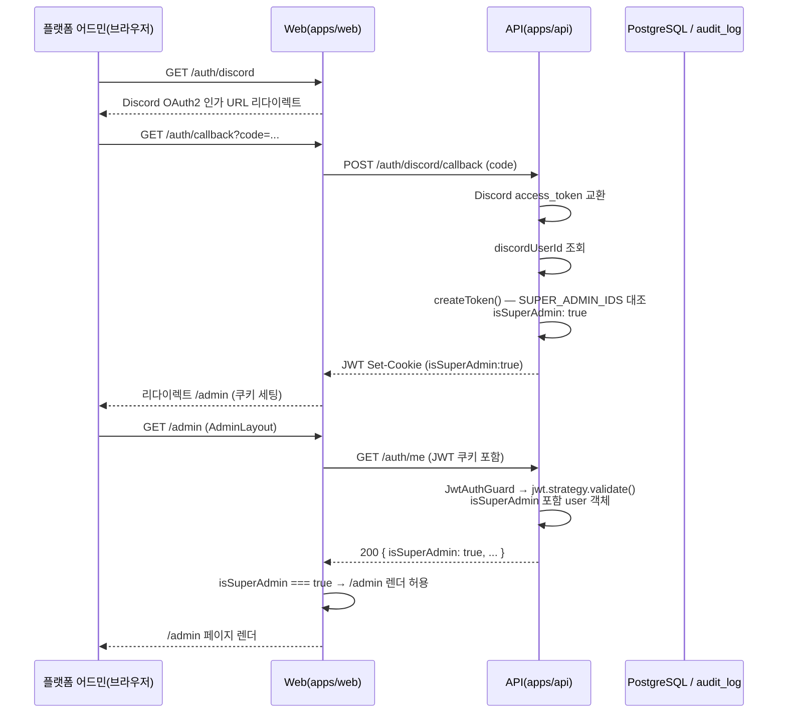

# 유스케이스 ID: UC-01

### 제목
슈퍼 관리자 로그인 — isSuperAdmin JWT 발급부터 /admin 진입까지

---

## 1. 개요

### 1.1 목적
플랫폼 어드민이 Discord OAuth2 로그인을 완료할 때, API가 `SUPER_ADMIN_IDS` 환경변수와 `discordUserId`를 대조하여 JWT payload에 `isSuperAdmin: true`를 포함시키고, 웹 클라이언트의 AdminLayout이 이를 검증하여 `/admin` 페이지 진입을 허용하기까지의 인증 end-to-end 흐름이 끊김 없이 동작함을 보장한다.

### 1.2 범위
- **포함**: Discord OAuth2 인가 시작(`/auth/discord`), 콜백 수신 후 `isSuperAdmin` 판별, JWT 발급 및 쿠키 세팅, `JwtStrategy.validate()` 통과, `/auth/me` 응답의 `isSuperAdmin` 노출, AdminLayout의 진입 허용
- **제외**: 일반 사용자(비슈퍼 어드민) 로그인 상세, 길드 대시보드 데이터 조회(UC-02), 타 길드 drill-in(UC-03). 본 UC는 isSuperAdmin 플래그가 브라우저까지 전달되는 인증 정합성에 집중한다.

### 1.3 액터
- **주요 액터**: 플랫폼 어드민 (슈퍼 관리자)
- **부 액터**:
  - Discord OAuth2 서버 (인가 코드 발급)
  - 시스템 컴포넌트: Web(apps/web), API(apps/api), PostgreSQL

---

## 2. 선행 조건

- 플랫폼 어드민이 Discord 계정을 보유하고 있다.
- 해당 Discord user ID가 API 서버의 `SUPER_ADMIN_IDS` 환경변수 값에 포함되어 있다.
- 브라우저에 유효한 JWT 세션 쿠키가 없다 (미로그인 상태).
- API 서버에 `SUPER_ADMIN_IDS` 환경변수가 설정되어 있다.

---

## 3. 참여 컴포넌트

- **Web Route — `/auth/discord`** (`apps/web/`): Discord OAuth2 인가 URL로 브라우저를 리다이렉트하는 진입점
- **Web Route — `/auth/callback`** (`apps/web/`): Discord 인가 코드를 수신하여 API `/auth/discord/callback`으로 중계
- **Web Route — `/auth/me/route.ts`** (`apps/web/app/auth/me/route.ts`): JWT 쿠키를 읽어 API `/auth/me`를 프록시, `isSuperAdmin` 포함 JwtPayload 반환
- **Web Presentation — `AdminLayout`** (`apps/web/app/admin/layout.tsx`): `/auth/me` 응답의 `isSuperAdmin` 검증 후 `/admin` 렌더 허용 또는 차단
- **API Business — `auth.service.ts createToken()`** (`apps/api/src/auth/application/auth.service.ts`): Discord 사용자 정보 수신 후 `SUPER_ADMIN_IDS`와 `discordUserId` 대조, `isSuperAdmin` 플래그 포함 JWT 발급
- **API Business — `jwt.strategy.ts validate()`** (`apps/api/src/auth/infrastructure/jwt.strategy.ts`): JWT 검증 통과 시 `isSuperAdmin`을 request user 객체에 포함
- **API Entrypoint — JwtAuthGuard**: JWT 유효성 검증 가드 (`/auth/me` 등 보호 엔드포인트)

---

## 4. 기본 플로우 (Basic Flow)

### 4.1 단계별 흐름

1. **플랫폼 어드민**: 브라우저에서 `/auth/discord` 접근 (또는 로그인 버튼 클릭)
   - 입력: HTTP GET `/auth/discord`
   - 처리: Web이 Discord OAuth2 인가 URL(client_id, redirect_uri, scope=`identify guilds`) 생성, 브라우저 리다이렉트

2. **Discord OAuth2**: 플랫폼 어드민이 Discord 로그인 및 권한 동의
   - 처리: Discord가 `code` 파라미터와 함께 `redirect_uri`(`/auth/callback`)로 리다이렉트

3. **Web (`/auth/callback`)**: 인가 코드 수신
   - 처리: 인가 코드를 포함하여 API `/auth/discord/callback` 호출

4. **API (`auth.service.ts createToken()`)**: Discord 사용자 정보 조회 및 isSuperAdmin 판별
   - 처리: Discord API로 access token 교환 → 사용자 프로필(`discordUserId`) 조회. `SUPER_ADMIN_IDS` 환경변수(쉼표 구분 ID 목록)와 `discordUserId` 대조. 일치 시 `isSuperAdmin: true`, 불일치 시 `isSuperAdmin: false`
   - 출력: `isSuperAdmin` 포함 JWT 생성, 쿠키 세팅 (HttpOnly, Secure, SameSite)

5. **Web (`/auth/callback`)**: JWT 쿠키 수신 후 리다이렉트
   - 처리: API 응답의 Set-Cookie를 브라우저에 전달, `/admin`으로 리다이렉트

6. **Web (`AdminLayout`)**: `/admin` 진입 시 isSuperAdmin 검증
   - 처리: `/auth/me` 호출 → API `JwtAuthGuard` 통과 → `jwt.strategy.ts validate()`가 `isSuperAdmin` 포함 user 객체 반환 → `/auth/me` 응답에 `isSuperAdmin: true` 포함
   - 결과: `isSuperAdmin === true` → `/admin` 페이지 렌더 허용

### 4.2 시퀀스 다이어그램

---

## 5. 대안 플로우 (Alternative Flows)

### 5.1 대안 플로우 1: 유효한 JWT 보유 시 OAuth 재인증 없이 직접 진입

**시작 조건**: 플랫폼 어드민이 이미 유효한 JWT 쿠키(isSuperAdmin=true 포함)를 브라우저에 보유하고 있음

**단계**:
1. 브라우저에서 `/admin` 직접 접근
2. AdminLayout이 `/auth/me` 호출 → JWT 검증 통과 → `isSuperAdmin: true` 확인
3. OAuth2 재인증 없이 `/admin` 페이지 바로 렌더

**결과**: 로그인 화면 거치지 않고 즉시 어드민 진입

---

## 6. 예외 플로우 (Exception Flows)

### 6.1 예외 상황 1: discordUserId가 SUPER_ADMIN_IDS 목록에 없음

**발생 조건**: `createToken()` 에서 `isSuperAdmin: false` 판별

**처리 방법**:
1. `isSuperAdmin: false` 포함 JWT 발급 (정상 JWT, 거부 아님)
2. AdminLayout이 `/auth/me` 응답의 `isSuperAdmin === false` 확인 → `/admin` 렌더 차단 (UF-SUPER-ADMIN-004 흐름)

**사용자 메시지**: `/admin` 접근 불가 안내 (권한 없음 화면)

### 6.2 예외 상황 2: SUPER_ADMIN_IDS 환경변수 미설정

**발생 조건**: API 서버에 `SUPER_ADMIN_IDS` 환경변수가 없거나 빈 문자열

**처리 방법**:
1. `createToken()`이 빈 allowlist 기준으로 판별 → 모든 사용자에 대해 `isSuperAdmin: false`
2. 어떠한 로그인 사용자도 `/admin` 진입 불가

**사용자 메시지**: 어드민 접근 불가 (운영자가 환경변수 설정 필요)

### 6.3 예외 상황 3: allowlist에서 제거 후 기존 JWT 사용 — 만료 전 접근 유지

**발생 조건**: 플랫폼 어드민이 JWT를 보유한 상태에서 `SUPER_ADMIN_IDS`에서 해당 ID 제거

**처리 방법**:
1. 기존 JWT 만료 전까지 `isSuperAdmin: true` 상태 유지 (JWT 재발급 없이)
2. JWT 만료 후 재로그인 시 최신 allowlist 기준으로 `isSuperAdmin: false` 재발급
3. 만료 전 접근 유지는 의도된 동작 (JWT 서명 기반 설계 트레이드오프)

**사용자 메시지**: 만료 후 재로그인 시 접근 차단

### 6.4 예외 상황 4: JWT 없이 /admin 직접 접근

**발생 조건**: 세션 쿠키 없이 `/admin` URL 직접 입력

**처리 방법**:
1. AdminLayout의 `/auth/me` 호출 → `JwtAuthGuard` 401 반환
2. Web이 로그인 화면으로 리다이렉트

**에러 코드**: `401 Unauthorized`

---

## 7. 후행 조건 (Post-conditions)

### 7.1 성공 시
- **JWT 상태**: `isSuperAdmin: true` 포함 JWT 발급 완료, 브라우저 쿠키 세팅
- **웹 렌더**: AdminLayout이 `/admin` 페이지 렌더 허용
- **데이터베이스 변경**: 기존 auth 흐름과 동일 (auth 관련 사용자 세션/프로필 레코드 갱신)

### 7.2 실패 시
- **JWT 상태**: `isSuperAdmin: false` 포함 JWT 발급 또는 발급 중단(OAuth 실패)
- **웹 렌더**: `/admin` 렌더 차단, 권한 없음 화면 또는 로그인 화면 표시
- **데이터베이스 변경**: 없음

---

## 8. 비기능 요구사항

### 8.1 보안
- 🔒 `isSuperAdmin` 판별은 서버사이드 `createToken()` + JWT 서명 기반 — 웹 클라이언트 플래그 조작 불가 (권한 — 사전 승인)
- 🔒 `SUPER_ADMIN_IDS` allowlist 기반 접근 제어 (권한 — 사전 승인)
- JWT는 HttpOnly 쿠키로 전달 — JavaScript에서 직접 접근 불가

### 8.2 성능
- OAuth2 콜백~JWT 발급 구간은 동기 처리이므로 Discord API 응답 속도에 종속 (통상 1초 이내)

---

## 9. UI/UX 요구사항

### 9.1 화면 구성
- 로그인 화면: Discord 로그인 버튼, 로그인 중 로딩 상태
- AdminLayout: isSuperAdmin 검증 중 로딩 상태, 검증 실패 시 접근 불가 안내

### 9.2 사용자 경험
- 유효 JWT 보유 시 로그인 화면 우회하여 `/admin` 바로 진입 (최소 마찰)
- 접근 불가 시 명확한 안내 메시지 표시

---

## 10. 테스트 시나리오

### 10.1 성공 케이스

| 테스트 케이스 ID | 입력값 | 기대 결과 |
|----------------|--------|----------|
| TC-UC01-01 | SUPER_ADMIN_IDS 등재 계정으로 Discord OAuth2 로그인 | JWT isSuperAdmin=true 발급, /admin 렌더 허용 |
| TC-UC01-02 | 유효한 JWT(isSuperAdmin=true) 보유 상태에서 /admin 직접 접근 | OAuth 재인증 없이 /admin 즉시 렌더 |

### 10.2 실패 케이스

| 테스트 케이스 ID | 입력값 | 기대 결과 |
|----------------|--------|----------|
| TC-UC01-03 | SUPER_ADMIN_IDS 미등재 계정으로 로그인 | JWT isSuperAdmin=false, /admin 차단 |
| TC-UC01-04 | SUPER_ADMIN_IDS 환경변수 미설정 상태에서 로그인 | 모든 사용자 isSuperAdmin=false, /admin 전원 차단 |
| TC-UC01-05 | allowlist 제거 후 기존 유효 JWT로 /admin 접근 | JWT 만료 전까지 접근 유지 (의도된 동작) |
| TC-UC01-06 | JWT 없이 /admin 직접 URL 접근 | 401 → 로그인 화면 리다이렉트 |

---

## 11. 관련 유스케이스

- **후행 유스케이스**: UC-02(전체 길드 목록 조회) — isSuperAdmin=true JWT를 전제로 함
- **연관 유스케이스**: UC-03(타 길드 read-only drill-in), UC-04(read-only 경계 검증) — 동일 JWT 기반

---

## 12. 변경 이력

| 버전 | 날짜 | 작성자 | 변경 내용 |
|------|------|--------|-----------|
| 1.0 | 2026-06-19 | usecase-writer | 초기 작성 |

---

## 부록

### A. 용어 정의
- **isSuperAdmin**: JWT payload에 포함되는 boolean 플래그. `true`일 때만 `/admin` 영역 접근 허용
- **SUPER_ADMIN_IDS**: API 서버 환경변수. 슈퍼 관리자로 허용할 Discord user ID 목록 (쉼표 구분)
- **allowlist**: `SUPER_ADMIN_IDS` 기반의 슈퍼 관리자 허용 목록

### B. 참고 자료
- PRD: `docs/specs/prd/super-admin.md`
- Userflow: `docs/specs/userflow/super-admin.md` (UF-SUPER-ADMIN-001, UF-SUPER-ADMIN-004)
- 코드: `apps/api/src/auth/application/auth.service.ts`, `apps/api/src/auth/infrastructure/jwt.strategy.ts`, `apps/web/app/admin/layout.tsx`, `apps/web/app/auth/me/route.ts`
