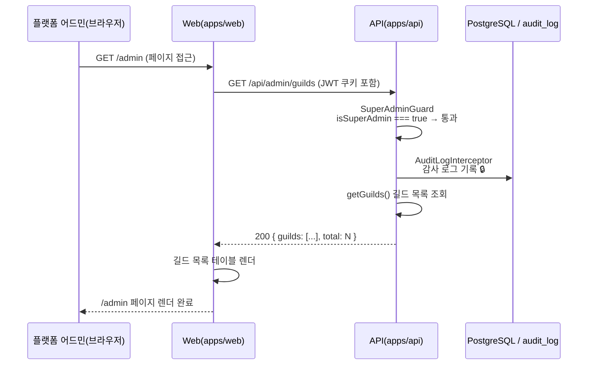

# 유스케이스 ID: UC-02

### 제목
전체 길드 목록 조회 — SuperAdminGuard 보호 아래 /api/admin/guilds 응답

---

## 1. 개요

### 1.1 목적
슈퍼 관리자가 `/admin` 페이지에 진입할 때, 웹이 `GET /api/admin/guilds`를 호출하면 API의 `SuperAdminGuard`가 JWT payload의 `isSuperAdmin`을 검증하고, 봇이 참여한 전체 길드 목록을 응답하여, 웹이 길드 목록 테이블을 렌더링하기까지의 read-only 조회 흐름이 정합하게 동작함을 보장한다. 모든 조회 요청은 감사 로그에 자동 기록된다.

### 1.2 범위
- **포함**: `SuperAdminGuard` isSuperAdmin 검증, `AdminController.getGuilds()` 실행, 전체 길드 목록 응답, 웹 길드 목록 테이블 렌더, `AuditLogInterceptor` 감사 로그 기록, 클라이언트 사이드 검색 필터링
- **제외**: 개별 길드 drill-in(UC-03), 슈퍼 관리자 로그인 인증(UC-01), mutation 시도(UC-04). 본 UC는 길드 목록 조회의 보안·응답·렌더 정합성에 집중한다.

### 1.3 액터
- **주요 액터**: 플랫폼 어드민 (슈퍼 관리자)
- **부 액터**:
  - 시스템 컴포넌트: Web(apps/web), API(apps/api), PostgreSQL / audit_log

---

## 2. 선행 조건

- UC-01 완료: 유효한 JWT(isSuperAdmin=true) 발급 및 브라우저 쿠키 세팅 완료
- 플랫폼 어드민이 `/admin` 페이지에 접근 중이다.
- API 서버에 봇 참여 길드 정보를 조회할 수 있는 데이터 소스(Discord REST API 또는 DB)가 준비되어 있다.

---

## 3. 참여 컴포넌트

- **Web Presentation — `/admin/page.tsx`** (`apps/web/app/admin/page.tsx`): 페이지 마운트 시 `GET /api/admin/guilds` 호출, 응답으로 길드 목록 테이블 렌더
- **Web — 길드 목록 테이블 컴포넌트**: 길드명, 길드 ID, 멤버 수, 봇 참여일, [열람] 링크 컬럼 표시. 검색어 입력 시 클라이언트 사이드 필터링
- **API Entrypoint — `AdminController`** (`apps/api/src/admin/presentation/admin.controller.ts`): `GET /api/admin/guilds` 엔드포인트, `SuperAdminGuard` 및 `AuditLogInterceptor` 적용
- **API Business — `SuperAdminGuard`**: JWT payload의 `isSuperAdmin` 검증, false/없음 시 403 반환
- **API Business — 길드 목록 조회 로직**: 봇이 참여한 전체 길드 목록 조회 (🟨 데이터 출처 미정 — Discord REST API 또는 DB distinct)
- **API Interceptor — `AuditLogInterceptor`**: `/api/admin/guilds` 요청을 감사 로그에 기록 🔒

---

## 4. 기본 플로우 (Basic Flow)

### 4.1 단계별 흐름

1. **플랫폼 어드민**: `/admin` 페이지 접근
   - 입력: 브라우저 내비게이션 (JWT 쿠키 포함)
   - 처리: AdminLayout isSuperAdmin 검증 통과 후 `/admin/page.tsx` 렌더 시작

2. **Web (`/admin/page.tsx`)**: `GET /api/admin/guilds` 호출
   - 처리: Next.js 프록시 또는 직접 API 호출, JWT 쿠키 포함

3. **API (`SuperAdminGuard`)**: isSuperAdmin 검증
   - 처리: JWT payload 읽기 → `isSuperAdmin === true` 확인 → 통과

4. **API (`AuditLogInterceptor`)**: 🔒 감사 로그 기록
   - 처리: `adminDiscordUserId`, 요청 경로(`/api/admin/guilds`), HTTP 메서드(GET), 타임스탬프를 audit_log에 기록 (PII — 사전 승인)

5. **API (`AdminController.getGuilds()`)**: 전체 길드 목록 조회
   - 처리: 🟨 데이터 출처 미정(Discord REST API vs DB distinct) — 두 경로 모두 동일 응답 스키마 반환
   - 출력: `{ guilds: [...], total: number }` JSON

6. **Web (`/admin/page.tsx`)**: 응답 수신 후 테이블 렌더
   - 처리: 응답 데이터로 길드 목록 테이블 컴포넌트 렌더. 각 행: 길드명, 길드 ID, 멤버 수, 봇 참여일(ISO 8601), [열람] 링크
   - 출력: 전체 길드 목록 테이블 화면

### 4.2 응답 스키마

응답 최상위 필드:
- `guilds` (배열): 길드 목록
- `total` (number): 전체 길드 수

guilds 배열 항목 필드:
- `guildId` (string): 길드 고유 ID
- `name` (string): 길드명
- `iconUrl` (string | null): 길드 아이콘 URL
- `memberCount` (number | null): 전체 멤버 수
- `botJoinedAt` (string ISO 8601 | null): 봇 참여 일시

### 4.3 시퀀스 다이어그램

---

## 5. 대안 플로우 (Alternative Flows)

### 5.1 대안 플로우 1: 검색어 입력 시 클라이언트 사이드 필터링

**시작 조건**: 플랫폼 어드민이 길드 목록 테이블 상단 검색 입력창에 검색어 입력

**단계**:
1. Web이 수신된 전체 길드 목록 배열에서 검색어와 길드명/길드 ID 일치 항목 필터링
2. API 재호출 없이 필터된 목록으로 테이블 즉시 갱신

**결과**: 네트워크 요청 없이 실시간 검색 반영

### 5.2 대안 플로우 2: 봇 참여 길드 없음 (total=0)

**시작 조건**: 봇이 어떠한 길드에도 참여하지 않은 상태

**단계**:
1. API가 `{ guilds: [], total: 0 }` 반환
2. Web이 빈 목록 상태 화면 렌더 (에러 아님)

**결과**: "참여 중인 길드가 없습니다" 또는 빈 테이블 표시

---

## 6. 예외 플로우 (Exception Flows)

### 6.1 예외 상황 1: JWT isSuperAdmin=false 또는 없음

**발생 조건**: 일반 사용자 또는 isSuperAdmin=false JWT로 `GET /api/admin/guilds` 호출

**처리 방법**:
1. `SuperAdminGuard`가 즉시 403 반환
2. Web이 403 수신 → 접근 불가 안내

**에러 코드**: `403 Forbidden`

### 6.2 예외 상황 2: JWT 없음 (미인증)

**발생 조건**: JWT 쿠키 없이 `GET /api/admin/guilds` 호출

**처리 방법**:
1. `JwtAuthGuard`가 401 반환 (SuperAdminGuard 이전)
2. Web이 로그인 화면으로 리다이렉트

**에러 코드**: `401 Unauthorized`

### 6.3 예외 상황 3: API 응답 지연 또는 오류

**발생 조건**: 길드 목록 조회 중 타임아웃 또는 내부 서버 오류

**처리 방법**:
1. Web이 로딩 상태 표시 후 오류 안내 렌더
2. 재시도 버튼 제공

**에러 코드**: `5xx`

### 6.4 예외 상황 4: memberCount null 항목 포함

**발생 조건**: 특정 길드의 멤버 수 조회 불가 (Discord API 제한 등)

**처리 방법**:
1. API가 해당 항목의 `memberCount: null` 포함하여 정상 응답
2. Web 테이블이 해당 컬럼에 "미확인" 또는 "-" 표시

### 6.5 예외 상황 5: 검색어가 어느 길드와도 불일치

**발생 조건**: 클라이언트 사이드 필터 결과가 0건

**처리 방법**:
1. 필터된 목록이 비어 있음
2. Web이 "검색 결과 없음" 표시 (에러 아님)

---

## 7. 후행 조건 (Post-conditions)

### 7.1 성공 시
- **웹 렌더**: 전체 길드 목록 테이블 렌더 완료 (길드명, 길드 ID, 멤버 수, 봇 참여일, [열람] 링크)
- **데이터베이스 변경**: audit_log 테이블(또는 구조화 로그)에 열람 이력 기록 (adminDiscordUserId, 경로, 타임스탬프) 🔒
- **읽기 전용**: 어떠한 길드 데이터도 변경되지 않음

### 7.2 실패 시
- **웹 렌더**: 오류 안내 화면 또는 접근 불가 화면
- **데이터베이스 변경**: 없음 (403/401 시 감사 로그 기록 여부 🟨 — 구현 단계에서 결정)

---

## 8. 비기능 요구사항

### 8.1 성능
- 길드 목록 API 응답 1초 이내 (봇 참여 길드 1,000개 미만 기준)
- 검색 필터링은 클라이언트 사이드 — 서버 요청 없이 즉시 반영

### 8.2 보안
- 🔒 `SuperAdminGuard`: `isSuperAdmin === true` JWT만 통과 (권한 — 사전 승인)
- 🔒 `AuditLogInterceptor`: 모든 `/api/admin/guilds` 요청 감사 로그 기록 (PII — 사전 승인)

---

## 9. UI/UX 요구사항

### 9.1 화면 구성
- 검색 입력창 (길드명/길드 ID 필터)
- 길드 목록 테이블: 길드명, 길드 ID, 멤버 수, 봇 참여일, [열람] 링크
- 로딩 상태, 빈 목록 상태, 오류 상태 각각 표시

### 9.2 사용자 경험
- [열람] 클릭 시 해당 길드 대시보드 drill-in (UC-03)

---

## 10. 테스트 시나리오

### 10.1 성공 케이스

| 테스트 케이스 ID | 입력값 | 기대 결과 |
|----------------|--------|----------|
| TC-UC02-01 | isSuperAdmin=true JWT로 GET /api/admin/guilds | 200 + 길드 배열 + audit_log 기록 |
| TC-UC02-02 | 봇 참여 길드 없는 상태에서 동일 요청 | 200 + {guilds:[], total:0}, 빈 목록 화면 |
| TC-UC02-03 | 검색어 입력 (일치하는 길드 있음) | 클라이언트 필터 결과로 테이블 즉시 갱신 |

### 10.2 실패 케이스

| 테스트 케이스 ID | 입력값 | 기대 결과 |
|----------------|--------|----------|
| TC-UC02-04 | isSuperAdmin=false JWT로 요청 | 403, 접근 불가 안내 |
| TC-UC02-05 | JWT 없이 요청 | 401, 로그인 화면 리다이렉트 |
| TC-UC02-06 | 검색어 입력 (불일치) | 결과 없음 표시 |

---

## 11. 관련 유스케이스

- **선행 유스케이스**: UC-01(슈퍼 관리자 로그인) — isSuperAdmin=true JWT 전제
- **후행 유스케이스**: UC-03(타 길드 read-only drill-in) — [열람] 클릭으로 연결

---

## 12. 변경 이력

| 버전 | 날짜 | 작성자 | 변경 내용 |
|------|------|--------|-----------|
| 1.0 | 2026-06-19 | usecase-writer | 초기 작성 |

---

## 부록

### A. 용어 정의
- **SuperAdminGuard**: API 레이어의 가드. JWT payload `isSuperAdmin === true` 여부만 검증
- **AuditLogInterceptor**: 슈퍼 관리자 요청을 감사 로그에 기록하는 NestJS 인터셉터
- **클라이언트 사이드 필터링**: API 재호출 없이 수신된 전체 목록을 Web 메모리에서 필터링

### B. 참고 자료
- PRD: `docs/specs/prd/super-admin.md`
- Userflow: `docs/specs/userflow/super-admin.md` (UF-SUPER-ADMIN-001 4단계, UF-SUPER-ADMIN-002)
- 코드: `apps/api/src/admin/presentation/admin.controller.ts`, `apps/web/app/admin/page.tsx`
