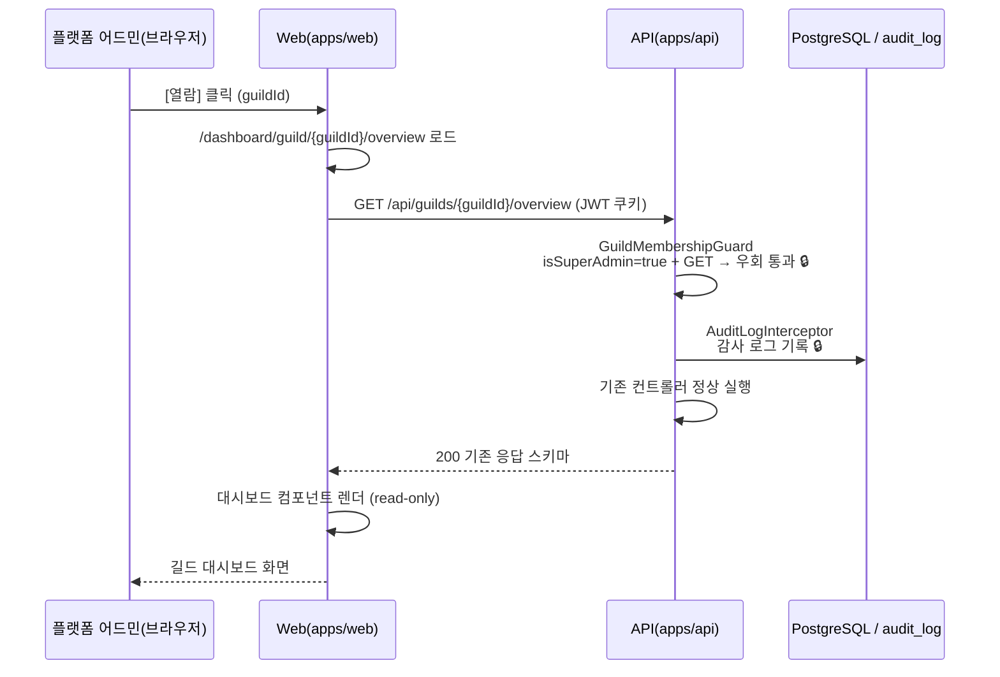

# 유스케이스 ID: UC-03

### 제목
타 길드 read-only drill-in — GuildMembershipGuard GET 우회 및 감사 로그 기록

---

## 1. 개요

### 1.1 목적
슈퍼 관리자가 길드 목록에서 [열람]을 클릭하여 특정 길드의 기존 대시보드(`/dashboard/guild/[guildId]/*`)에 진입할 때, `GuildMembershipGuard`가 `isSuperAdmin=true` + HTTP 메서드 GET 조합을 감지하여 멤버십 체크를 우회하고, 기존 대시보드 API가 정상 응답하며, 모든 GET 요청이 감사 로그에 자동 기록되는 cross-app 통합 흐름이 정합하게 동작함을 보장한다.

### 1.2 범위
- **포함**: `GuildMembershipGuard` GET 우회 로직, 기존 길드 대시보드 API 정상 응답, `AuditLogInterceptor` 감사 로그 자동 누적, 대시보드 페이지 렌더, 설정 페이지 GET 열람
- **제외**: 슈퍼 관리자 로그인(UC-01), 길드 목록 조회(UC-02), mutation 시도 차단(UC-04). 본 UC는 GET 요청에 한정한 멤버십 우회 및 감사 로그 정합성에 집중한다.

### 1.3 액터
- **주요 액터**: 플랫폼 어드민 (슈퍼 관리자)
- **부 액터**:
  - 시스템 컴포넌트: Web(apps/web), API(apps/api), PostgreSQL / audit_log

---

## 2. 선행 조건

- UC-01 완료: 유효한 JWT(isSuperAdmin=true) 발급 완료
- UC-02 완료: `/admin` 페이지에서 길드 목록 테이블 렌더 완료
- 플랫폼 어드민이 길드 목록에서 특정 길드의 [열람] 링크를 클릭하였다.

---

## 3. 참여 컴포넌트

- **Web Presentation — `/admin/guilds/[guildId]/page.tsx`** (`apps/web/app/admin/guilds/[guildId]/page.tsx`): drill-in 진입점. 기존 길드 대시보드 레이아웃으로 라우팅
- **Web Presentation — `/dashboard/guild/[guildId]/*` 페이지들** (`apps/web/app/dashboard/guild/[guildId]/`): 기존 길드 대시보드 컴포넌트들 (overview, voice, newbie, inactive-member 등)
- **API Guard — `GuildMembershipGuard`** (수정됨): `isSuperAdmin===true` + `method===GET` 조합 감지 시 멤버십 체크 우회. 그 외 조합은 기존 멤버십 체크 유지
- **API Interceptor — `AuditLogInterceptor`**: 🔒 매 GET 요청마다 감사 로그 자동 기록 (adminDiscordUserId, guildId, requestPath, httpMethod, timestamp) (PII — 사전 승인)
- **API Entrypoint — 기존 길드 대시보드 컨트롤러들** (`GET /api/guilds/:guildId/*`): 기존 코드 변경 없이 정상 응답 반환

---

## 4. 기본 플로우 (Basic Flow)

### 4.1 단계별 흐름

1. **플랫폼 어드민**: 길드 목록에서 [열람] 클릭
   - 입력: 특정 guildId의 [열람] 링크 클릭
   - 처리: Web이 `/admin/guilds/[guildId]` 또는 직접 `/dashboard/guild/[guildId]/overview`로 내비게이션

2. **Web (기존 대시보드 레이아웃)**: 각 서브페이지가 `GET /api/guilds/:guildId/*` 호출 시작
   - 처리: JWT 쿠키 포함하여 기존 API 호출 (Web 코드 변경 없음)

3. **API (`GuildMembershipGuard`)**: 🔒 멤버십 우회 판별
   - 처리: JWT 검증 → `isSuperAdmin===true` + `method===GET` 조합 확인 → 멤버십 체크 우회 → 통과 (권한 — 사전 승인)

4. **API (`AuditLogInterceptor`)**: 🔒 감사 로그 기록
   - 처리: `adminDiscordUserId`, `guildId`, `requestPath`, `httpMethod(GET)`, `timestamp`를 audit_log에 기록 (PII — 사전 승인)

5. **API (기존 컨트롤러)**: 정상 응답 반환
   - 처리: 기존 비즈니스 로직 그대로 실행 (컨트롤러 코드 변경 없음)
   - 출력: 기존 응답 스키마 JSON

6. **Web (대시보드 컴포넌트)**: 응답 데이터로 렌더
   - 처리: 기존 대시보드 UI 컴포넌트가 정상 렌더 (Web 코드 변경 없음)
   - 출력: 길드 대시보드 화면 (read-only 모드)

### 4.2 핵심 경계 조건 (Guard 분기 매트릭스)

| 액터 | HTTP 메서드 | 조건 | 결과 |
|------|------------|------|------|
| 슈퍼 관리자 (isSuperAdmin=true) | GET | — | 멤버십 체크 우회 → 통과 🔒 |
| 슈퍼 관리자 (isSuperAdmin=true) | POST / PATCH / PUT / DELETE | — | 403 (fail-closed) → UC-04 |
| 일반 사용자 | GET 또는 non-GET | 해당 길드 멤버 | 기존 멤버십 체크 통과 |
| 일반 사용자 | GET 또는 non-GET | 해당 길드 비멤버 | 403 |

### 4.3 시퀀스 다이어그램

---

## 5. 대안 플로우 (Alternative Flows)

### 5.1 대안 플로우 1: 서브페이지 직접 URL 접근

**시작 조건**: 슈퍼 관리자가 `/dashboard/guild/[guildId]/voice` 등 서브페이지 URL 직접 입력

**단계**:
1. Web이 해당 서브페이지 로드, 해당 페이지의 `GET /api/guilds/:guildId/*` 호출
2. `GuildMembershipGuard` GET 우회 동일 적용
3. 정상 응답 및 렌더

**결과**: 목록 경유 없이 직접 접근도 동일하게 동작

### 5.2 대안 플로우 2: 설정 페이지 GET 열람

**시작 조건**: 슈퍼 관리자가 `/settings/guild/[guildId]/*` 설정 페이지 GET 접근

**단계**:
1. 설정 페이지 조회 API(`GET /api/guilds/:guildId/settings/*`) 호출
2. `GuildMembershipGuard` GET 우회 적용 → 설정값 읽기 허용
3. 설정 페이지 렌더 (설정값 표시만, 저장 시도 시 UC-04)

**결과**: 설정 내용 열람 가능 (저장 불가)

---

## 6. 예외 플로우 (Exception Flows)

### 6.1 예외 상황 1: 슈퍼 관리자 + non-GET 시도

**발생 조건**: 슈퍼 관리자가 기존 대시보드에서 저장/적용 등 mutation 동작 시도

**처리 방법**:
1. `GuildMembershipGuard`: `isSuperAdmin===true` + `method!==GET` → 즉시 403
2. UC-04에서 상세 처리

**에러 코드**: `403 Forbidden`

### 6.2 예외 상황 2: 세션 만료

**발생 조건**: drill-in 중 JWT 만료

**처리 방법**:
1. API 401 반환
2. Web이 로그인 재유도

**에러 코드**: `401 Unauthorized`

### 6.3 예외 상황 3: 봇 미참여 guildId 직접 URL 입력

**발생 조건**: 슈퍼 관리자가 봇이 참여하지 않은 임의 guildId를 URL에 직접 입력

**처리 방법**:
1. `GuildMembershipGuard` 우회 통과 (isSuperAdmin=true + GET)
2. 기존 컨트롤러가 데이터 없음 / 404 반환
3. Web 페이지 오류 렌더

**에러 코드**: `404 Not Found` 또는 빈 데이터 응답

### 6.4 예외 상황 4: 감사 로그 기록 실패

**발생 조건**: `AuditLogInterceptor`가 audit_log 기록 중 오류

**처리 방법**:
- 🟨 요청 차단 여부 미정 — DB 설계(Phase 2)에서 확정. 현재 두 옵션: (a) fail-open(기록 실패 시에도 요청 허용), (b) fail-closed(기록 실패 시 요청 차단)

---

## 7. 후행 조건 (Post-conditions)

### 7.1 성공 시
- **웹 렌더**: 기존 길드 대시보드 화면이 read-only 모드로 렌더 완료
- **데이터베이스 변경**: 없음 (읽기 전용). audit_log에 각 GET 요청 이력 자동 누적 기록 🔒
- **외부 시스템**: Discord 측 변경 없음

### 7.2 실패 시
- **웹 렌더**: 오류 화면 또는 403/401 안내
- **데이터베이스 변경**: 없음

---

## 8. 비기능 요구사항

### 8.1 보안
- 🔒 `GuildMembershipGuard`: `isSuperAdmin=true` + GET 조합만 우회, 그 외 모든 조합은 기존 멤버십 체크 또는 403 (권한 — 사전 승인)
- 🔒 `AuditLogInterceptor`: 슈퍼 관리자의 모든 타 길드 GET 요청 감사 로그 기록 (PII — 사전 승인)
- 감사 로그 미기록 상태에서의 접근 허용 여부 🟨 — DB 설계 단계에서 확정

### 8.2 성능
- 기존 대시보드 API 응답 성능 그대로 유지 (Guard 우회 로직은 O(1))
- `AuditLogInterceptor` 기록은 비동기 처리 권장 (응답 지연 방지)

---

## 9. UI/UX 요구사항

### 9.1 화면 구성
- 기존 길드 대시보드 UI 그대로 표시 (Web 컴포넌트 변경 최소화)
- 🟨 read-only 모드 배너 또는 시각적 구분 표시 여부 — UX 구현 단계에서 결정

### 9.2 사용자 경험
- 슈퍼 관리자가 보는 대시보드는 기존 대시보드와 동일한 레이아웃
- 🟨 mutation 트리거 UI(저장 버튼 등) 비활성 처리 여부 — UX 구현 단계에서 결정 (UC-04와 연계)

---

## 10. 테스트 시나리오

### 10.1 성공 케이스

| 테스트 케이스 ID | 입력값 | 기대 결과 |
|----------------|--------|----------|
| TC-UC03-01 | 슈퍼 관리자 + GET /api/guilds/:guildId/voice/daily | 200 + 데이터, audit_log 기록 |
| TC-UC03-02 | 슈퍼 관리자 + /dashboard/guild/:guildId/overview 직접 URL 접근 | 정상 렌더, audit_log 기록 |
| TC-UC03-03 | 슈퍼 관리자 + GET /api/guilds/:guildId/settings/* (설정 열람) | 200 + 설정 데이터 정상 반환 |

### 10.2 실패 케이스

| 테스트 케이스 ID | 입력값 | 기대 결과 |
|----------------|--------|----------|
| TC-UC03-04 | 일반 사용자(비멤버) + GET /api/guilds/:guildId/* | 403 (멤버십 가드 차단, 우회 미적용) |
| TC-UC03-05 | 슈퍼 관리자 + POST /api/guilds/:guildId/voice-analytics/ai-insight | 403 (non-GET, fail-closed) |
| TC-UC03-06 | 봇 미참여 guildId 직접 URL 입력 후 GET | 가드 통과 + 데이터 없음/404 |

---

## 11. 관련 유스케이스

- **선행 유스케이스**: UC-02(전체 길드 목록 조회) — [열람] 클릭 진입점
- **연관 유스케이스**: UC-04(read-only 경계 검증) — 동일 Guard의 non-GET 분기
- **연관 유스케이스**: UC-01(로그인) — isSuperAdmin=true JWT 전제

---

## 12. 변경 이력

| 버전 | 날짜 | 작성자 | 변경 내용 |
|------|------|--------|-----------|
| 1.0 | 2026-06-19 | usecase-writer | 초기 작성 |

---

## 부록

### A. 용어 정의
- **GuildMembershipGuard**: 기존 사용자의 길드 멤버십을 검증하는 가드. 슈퍼 관리자 + GET 조합에서 우회 로직이 추가됨
- **drill-in**: 길드 목록에서 특정 길드의 상세 대시보드로 진입하는 행위
- **read-only 모드**: 데이터 조회(GET)만 허용하고 변경(non-GET)은 차단하는 슈퍼 관리자의 길드 접근 모드
- **fail-closed**: 예외 상황(non-GET 시도 등)에서 허용이 아닌 차단을 기본값으로 하는 설계 원칙

### B. 참고 자료
- PRD: `docs/specs/prd/super-admin.md`
- Userflow: `docs/specs/userflow/super-admin.md` (UF-SUPER-ADMIN-003)
- 코드: `apps/api/src/` (GuildMembershipGuard, AuditLogInterceptor), `apps/web/app/dashboard/guild/[guildId]/`, `apps/web/app/admin/guilds/[guildId]/page.tsx`
