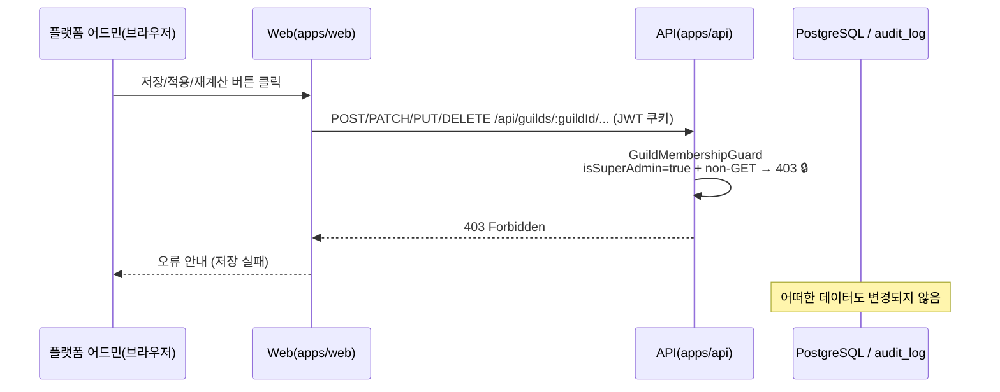

# 유스케이스 ID: UC-04

### 제목
read-only 경계 검증 — mutation 시도 시 fail-closed 403

---

## 1. 개요

### 1.1 목적
슈퍼 관리자가 기존 길드 대시보드 또는 설정 페이지에서 저장·적용·재계산 등 mutation 동작을 시도할 때, `GuildMembershipGuard`가 `isSuperAdmin===true` + non-GET 조합을 감지하여 예외 없이 403을 반환함으로써, 슈퍼 관리자의 read-only 경계가 fail-closed 방식으로 항상 유지됨을 보장한다. 어떠한 DB 데이터도 변경되지 않는다.

### 1.2 범위
- **포함**: `GuildMembershipGuard`의 `isSuperAdmin=true` + non-GET → 403 분기, 대시보드/설정 페이지 mutation 트리거 시도, AI 인사이트 생성 차단, 비활동 분류 차단
- **제외**: 슈퍼 관리자 로그인(UC-01), 길드 목록 조회(UC-02), GET 열람(UC-03). 본 UC는 슈퍼 관리자의 mutation 시도가 완전 차단됨을 검증하는 보안 경계 명세에 집중한다.

### 1.3 액터
- **주요 액터**: 플랫폼 어드민 (슈퍼 관리자) — mutation 시도 주체
- **부 액터**:
  - 시스템 컴포넌트: Web(apps/web), API(apps/api)

---

## 2. 선행 조건

- UC-03 완료: 슈퍼 관리자가 특정 길드의 기존 대시보드 또는 설정 페이지에 접근 중이다.
- 유효한 JWT(isSuperAdmin=true)를 보유하고 있다.

---

## 3. 참여 컴포넌트

- **Web Presentation — `/settings/guild/[guildId]/*` 설정 페이지들** (`apps/web/app/settings/guild/[guildId]/`): 슈퍼 관리자가 설정값을 열람하고 저장 버튼을 클릭할 수 있는 페이지
- **Web Presentation — 대시보드 내 mutation 트리거 UI**: 저장 버튼, 적용 버튼, AI 인사이트 생성 버튼, 비활동 분류 실행 버튼 등
- **API Guard — `GuildMembershipGuard`**: 🔒 `isSuperAdmin===true` + `method!==GET` 조합 → 즉시 403 반환 (fail-closed, 권한 — 사전 승인). 코드 경로에 무관하게 이 가드를 통과할 수 없음

---

## 4. 기본 플로우 (Basic Flow)

### 4.1 단계별 흐름

1. **플랫폼 어드민**: 대시보드 또는 설정 페이지에서 mutation 동작 시도
   - 입력: 저장/적용/재계산 버튼 클릭
   - 처리: Web 클라이언트가 non-GET 메서드(POST/PATCH/PUT/DELETE)로 API 호출

2. **API (`GuildMembershipGuard`)**: 🔒 fail-closed 차단
   - 처리: JWT 검증 → `isSuperAdmin===true` + `method!==GET` 조합 확인 → 즉시 403 반환 (권한 — 사전 승인)
   - 출력: `403 Forbidden`

3. **Web**: 403 수신 후 처리
   - 처리: 403 수신. 변경 저장 없음, 어떠한 상태 변경도 발생하지 않음
   - 출력: 🟨 오류 안내 표시 또는 저장 실패 토스트 (UX 구현 단계에서 결정)

### 4.2 핵심 설계 원칙: fail-closed

`GuildMembershipGuard`의 슈퍼 관리자 non-GET 차단은 예외 없는 단일 경로다.

- 슈퍼 관리자라도 non-GET은 **모든 경우** 차단
- 조회성 POST(AI 인사이트 생성 등)도 HTTP 메서드가 POST이면 차단 (LLM 비용·부작용 방지)
- 설정 저장, 데이터 삭제, 상태 변경 등 모든 mutation 동작 차단

### 4.3 차단 대상 예시

| 요청 | HTTP 메서드 | 결과 | 비고 |
|------|------------|------|------|
| 설정 저장 | PATCH | 403 | fail-closed |
| AI 인사이트 생성 | POST | 403 | LLM 비용·부작용 방지 |
| 비활동 멤버 분류 실행 | POST | 403 | 재계산 부작용 방지 |
| 고정 메시지 삭제 | DELETE | 403 | fail-closed |
| 신규 사용자 환영 메시지 수정 | PUT | 403 | fail-closed |

### 4.4 시퀀스 다이어그램

---

## 5. 대안 플로우 (Alternative Flows)

**없음** — fail-closed 단일 경로. 슈퍼 관리자 + non-GET 조합에서 허용 경로는 존재하지 않는다.

---

## 6. 예외 플로우 (Exception Flows)

### 6.1 저장 버튼이 UI에 표시되는 경우 (read-only 전용 UI 미분기 시)

**발생 조건**: 🟨 Web UI에서 슈퍼 관리자 여부와 무관하게 저장 버튼이 활성 상태로 표시

**처리 방법**:
1. 저장 버튼 클릭 → Web이 API 호출 → 403 반환
2. Web이 저장 실패 안내 표시
3. 🟨 UX 구현 단계에서 read-only 배너 또는 저장 버튼 비활성 처리 검토

**비고**: API 레벨 차단(fail-closed)은 Web UI 상태에 무관하게 항상 동작

### 6.2 설정 페이지 GET 접근 — 차단 아님

**발생 조건**: 슈퍼 관리자가 `/settings/guild/[guildId]/*` 페이지를 GET으로 열람

**처리 방법**:
1. `GuildMembershipGuard`: `isSuperAdmin=true` + `method===GET` → 우회 통과 (UC-03 흐름)
2. 설정값 읽기 정상 허용, 저장 시도 시에만 차단

**비고**: 설정 열람(GET)과 설정 저장(non-GET)이 명확히 분리됨

### 6.3 프론트엔드 GET 파라미터 방식 mutation (드문 케이스)

**발생 조건**: 일부 레거시 패턴에서 HTTP GET 메서드로 상태 변경 요청을 보내는 경우

**처리 방법**:
1. `GuildMembershipGuard`: `method===GET` → 우회 적용 (차단되지 않음)
2. 이 가드는 HTTP 메서드 기준만 판별하는 설계 (의도된 동작)

**비고**: 이 케이스는 슈퍼 관리자 콘솔 대상 API에서 발생하지 않는 것을 전제. 해당 API는 GET으로 mutation하지 않는다.

---

## 7. 후행 조건 (Post-conditions)

### 7.1 성공 (차단이 성공)
- **데이터베이스 변경**: 어떠한 DB 데이터도 변경되지 않음
- **API 응답**: 403 Forbidden 반환
- **감사 로그**: 403 시도 기록 여부 🟨 — 구현 단계에서 결정 (AuditLogInterceptor 적용 범위에 따라)

### 7.2 실패 (차단이 실패 — 버그 시나리오)
- **데이터베이스 변경**: 발생해서는 안 됨 (보안 결함)
- **즉시 대응**: 슈퍼 관리자 non-GET 허용 경로가 존재하면 설계 버그로 간주하여 즉시 수정

---

## 8. 비기능 요구사항

### 8.1 보안
- 🔒 `GuildMembershipGuard`: `isSuperAdmin===true` + non-GET → 예외 없는 403 (fail-closed, 권한 — 사전 승인)
- 어떠한 우회 경로도 허용하지 않음 — 코드 경로, 파라미터 조작, 헤더 조작에 무관하게 가드에서 차단
- 감사 로그 기록 범위에 403 시도 포함 여부 🟨 — 구현 단계에서 결정

### 8.2 성능
- Guard 차단은 O(1) 연산 — 응답 지연 없음

---

## 9. UI/UX 요구사항

### 9.1 화면 구성
- 🟨 슈퍼 관리자 접근 시 read-only 배너 표시 여부 — UX 구현 단계에서 결정
- 🟨 저장/적용 버튼 비활성(disabled) 처리 여부 — UX 구현 단계에서 결정
- 저장 실패 시 토스트/오류 메시지 표시 (API 403 수신 시 최소 안내)

### 9.2 사용자 경험
- 슈퍼 관리자가 mutation 시도 시 명확한 실패 피드백 제공 (권한 없음 안내)
- 읽기는 자유롭게 허용하되 쓰기는 모두 차단하는 일관된 경험 목표

---

## 10. 테스트 시나리오

### 10.1 성공 케이스 (차단 성공)

| 테스트 케이스 ID | 입력값 | 기대 결과 |
|----------------|--------|----------|
| TC-UC04-01 | 슈퍼 관리자 + PATCH /api/guilds/:guildId/settings/auto-channel | 403, DB 변경 없음 |
| TC-UC04-02 | 슈퍼 관리자 + POST /api/guilds/:guildId/voice-analytics/ai-insight | 403, DB 변경 없음 |
| TC-UC04-03 | 슈퍼 관리자 + DELETE /api/guilds/:guildId/newbie/welcome-message | 403, DB 변경 없음 |
| TC-UC04-04 | 슈퍼 관리자 + PUT /api/guilds/:guildId/sticky-message | 403, DB 변경 없음 |
| TC-UC04-05 | 슈퍼 관리자 + POST /api/guilds/:guildId/inactive-members/classify | 403, DB 변경 없음 |

### 10.2 검증 케이스 (정상 허용 확인)

| 테스트 케이스 ID | 입력값 | 기대 결과 |
|----------------|--------|----------|
| TC-UC04-06 | 일반 사용자(멤버) + PATCH 동일 엔드포인트 | 멤버십 체크 통과 후 정상 처리 (슈퍼 관리자 차단과 무관) |
| TC-UC04-07 | 슈퍼 관리자 + GET /api/guilds/:guildId/settings/* | 200 (차단 아님, UC-03 흐름) |

---

## 11. 관련 유스케이스

- **선행 유스케이스**: UC-03(타 길드 read-only drill-in) — 동일 Guard의 GET 허용 분기
- **동일 Guard 다른 분기**: UC-03(GET 우회), UC-04(non-GET 차단)은 `GuildMembershipGuard`의 두 핵심 경로
- **연관 유스케이스**: UC-01(로그인) — isSuperAdmin=true JWT 전제

---

## 12. 변경 이력

| 버전 | 날짜 | 작성자 | 변경 내용 |
|------|------|--------|-----------|
| 1.0 | 2026-06-19 | usecase-writer | 초기 작성 |

---

## 부록

### A. 용어 정의
- **fail-closed**: 예외적 상황에서 허용이 아닌 차단을 기본값으로 하는 보안 설계 원칙. `GuildMembershipGuard`의 슈퍼 관리자 non-GET 처리에 적용
- **mutation**: 서버 상태를 변경하는 API 호출 (POST/PATCH/PUT/DELETE)
- **read-only 경계**: 슈퍼 관리자가 타 길드에서 조회(GET)만 허용되고 변경(non-GET)은 모두 차단되는 접근 제한 범위

### B. 참고 자료
- PRD: `docs/specs/prd/super-admin.md`
- Userflow: `docs/specs/userflow/super-admin.md` (UF-SUPER-ADMIN-003-A)
- 코드: `apps/api/src/` (GuildMembershipGuard — `isSuperAdmin + non-GET → 403` 분기), `apps/web/app/settings/guild/[guildId]/`
