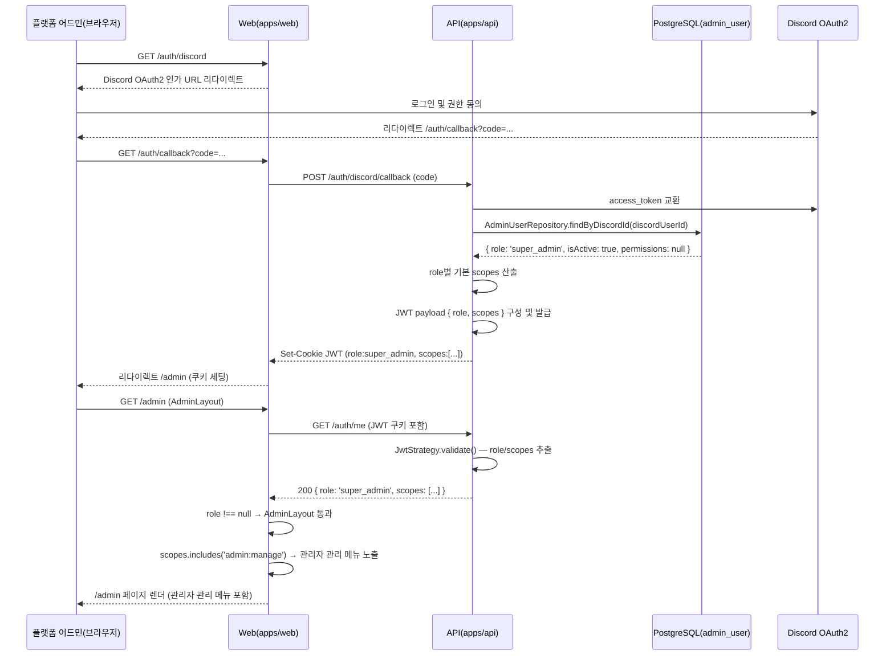

# 유스케이스 ID: UC-05

### 제목
DB 기반 권한 토큰 발급 통합 — Discord OAuth 로그인부터 role/scopes JWT 발급 및 콘솔 메뉴 분기까지

---

## 1. 개요

### 1.1 목적

Discord OAuth2 로그인이 완료될 때 `AuthService.createToken()`이 `admin_user` 테이블을 조회하여 사용자의 `role`과 `scopes`를 결정하고, 해당 값을 JWT payload에 포함하여 발급하며, 웹의 `/auth/me`가 이를 노출하여 어드민 콘솔 메뉴가 role/scope에 따라 올바르게 분기됨을 보장한다. `admin_user`에 등록되지 않은 사용자는 `role: null`, `scopes: []`를 받아 `/admin` 접근이 불가함을 검증한다.

### 1.2 범위

- **포함**: Discord OAuth2 콜백 처리, `createToken()` 내 `admin_user` DB 조회, `role`/`scopes` 산출 로직(4가지 경우), JWT payload 구성, 쿠키 세팅, `/auth/me` role/scopes 노출, AdminLayout의 `role` null 여부 게이트, `admin:manage` scope 유무에 따른 관리자 관리 메뉴 분기
- **제외**: 관리자 추가/삭제(UC-06), 길드 목록 조회(UC-02), drill-in(UC-03)

### 1.3 액터

- **주요 액터**: 플랫폼 어드민 (`super_admin` 또는 `bot_operator`로 등록된 사용자)
- **부 액터 — 인증 비등록 사용자**: `admin_user` 미등록 일반 사용자
- **부 액터 — 시스템**: Web(`apps/web`), API(`apps/api`), PostgreSQL(`admin_user` 테이블), Discord OAuth2 서버

---

## 2. 선행 조건

- `admin_user` 테이블이 존재하고 `SeedInitialSuperAdmin` 마이그레이션이 적용되어 있다.
- 로그인을 시도하는 사용자의 Discord 계정이 활성화 상태이다.
- API 서버가 Discord OAuth2 클라이언트 자격증명(`DISCORD_CLIENT_ID`, `DISCORD_CLIENT_SECRET`)을 보유하고 있다.
- 브라우저에 유효한 JWT 세션 쿠키가 없다 (미로그인 상태).

---

## 3. 참여 컴포넌트

- **Web Route — `/auth/discord`** (`apps/web/app/auth/discord/route.ts`): Discord OAuth2 인가 URL 생성 및 리다이렉트
- **Web Route — `/auth/callback`** (`apps/web/app/auth/callback/route.ts`): 인가 코드 수신, API 콜백 중계, JWT 쿠키 세팅
- **Web Route — `/auth/me`** (`apps/web/app/auth/me/route.ts`): JWT 쿠키를 읽어 `role`, `scopes` 포함 JwtPayload 반환
- **Web Presentation — `AdminLayout`** (`apps/web/app/admin/layout.tsx`): `role` null 여부 게이트, `admin:manage` scope 유무에 따른 메뉴 분기
- **API Business — `AuthService.createToken()`** (`apps/api/src/auth/application/auth.service.ts`): `admin_user` 테이블 조회 → `role`/`scopes` 산출 → JWT 발급
- **API Persistence — `AdminUserRepository`** (`apps/api/src/super-admin/infrastructure/admin-user.repository.ts`): `discordUserId` 기준 `admin_user` 레코드 조회
- **API Infrastructure — `JwtStrategy.validate()`** (`apps/api/src/auth/infrastructure/jwt.strategy.ts`): JWT 검증, `role`/`scopes` request user 객체 전달
- **DB — `admin_user` 테이블**: `discordUserId`, `role`, `permissions`, `isActive` 컬럼 보유

---

## 4. 기본 플로우 (Basic Flow)

> 전제: 사용자가 `admin_user` 테이블에 `isActive=true`로 등록된 `super_admin`

### 4.1 단계별 흐름

1. **플랫폼 어드민**: 브라우저에서 `/auth/discord` 접근
   - Web이 Discord OAuth2 인가 URL(`scope=identify guilds`) 생성, 브라우저 리다이렉트

2. **Discord OAuth2**: 사용자 로그인 및 권한 동의
   - Discord가 `code` 파라미터와 함께 `/auth/callback`으로 리다이렉트

3. **Web (`/auth/callback`)**: 인가 코드를 API `/auth/discord/callback`으로 중계

4. **API (`createToken()`)**: `admin_user` DB 조회 및 role/scopes 산출
   - Discord access token 교환 → `discordUserId` 획득
   - `AdminUserRepository.findByDiscordId(discordUserId)` 호출
   - 레코드 존재 + `isActive=true` → `role: 'super_admin'`, `permissions` 컬럼 없으면 role별 기본 scopes 산출
   - 기본 scopes (`super_admin`): `['guild:view', 'admin:manage', 'guild:manage', 'billing:manage', 'churn:view', 'usage:view', 'onboarding:view', 'notification:manage', 'feature-flag:manage']`
   - JWT payload: `{ sub, username, avatar, guilds, role: 'super_admin', scopes: [...] }` 구성
   - JWT 발급, HttpOnly 쿠키 세팅

5. **Web (`/auth/callback`)**: Set-Cookie 브라우저 전달, `/admin` 리다이렉트

6. **Web (`AdminLayout`)**: `/admin` 진입 시 `/auth/me` 호출
   - JWT 쿠키 포함 요청 → `JwtStrategy.validate()` 통과
   - `/auth/me` 응답: `{ role: 'super_admin', scopes: [...] }` 포함
   - `role !== null` 확인 → AdminLayout 통과, 어드민 UI 렌더
   - `scopes.includes('admin:manage')` → 관리자 관리 메뉴 노출

### 4.2 시퀀스 다이어그램

---

## 5. 대안 플로우 (Alternative Flows)

### 5.1 대안 플로우 1: bot_operator로 등록된 사용자 로그인

**시작 조건**: `admin_user` 테이블에 `role='bot_operator'`, `isActive=true`로 등록된 사용자

**단계**:
1. 1~5단계 기본 플로우와 동일
2. `createToken()`이 `role: 'bot_operator'`, scopes: `['guild:view', 'guild:manage', 'billing:manage', 'churn:view', 'usage:view', 'onboarding:view', 'notification:manage', 'feature-flag:manage']` (`admin:manage` 제외) 산출
3. AdminLayout: `role !== null` → 통과
4. `scopes.includes('admin:manage') === false` → 관리자 관리 메뉴 미노출(또는 비활성)

**결과**: `/admin` 진입 가능, 관리자 관리 메뉴 없음

### 5.2 대안 플로우 2: admin_user 미등록 일반 사용자 로그인

**시작 조건**: `admin_user` 테이블에 해당 `discordUserId` 레코드 없음

**단계**:
1. `AdminUserRepository.findByDiscordId(discordUserId)` → null 반환
2. `createToken()`이 `role: null`, `scopes: []` 산출
3. JWT payload에 `role: null`, `scopes: []` 포함, 정상 발급
4. AdminLayout이 `role === null` 감지 → 즉시 차단 (403 또는 `/` 리다이렉트)

**결과**: `/admin` 접근 불가

### 5.3 대안 플로우 3: permissions 컬럼 오버라이드 존재 시

**시작 조건**: `admin_user` 레코드의 `permissions` 컬럼이 null이 아닌 배열로 세팅됨 (커스텀 scope 세트)

**단계**:
1. `createToken()`이 `permissions` 컬럼 값을 role 기본 scopes 대신 `scopes`로 사용
2. 이후 흐름은 기본 플로우 동일

**결과**: 커스텀 scope 세트가 JWT에 포함됨

### 5.4 대안 플로우 4: 유효한 JWT 보유 시 재인증 없이 직접 진입

**시작 조건**: 브라우저에 유효 JWT 쿠키(role/scopes 포함)가 이미 존재

**단계**:
1. `/admin` 직접 접근
2. AdminLayout이 `/auth/me` 호출 → JWT 검증 통과 → `role`, `scopes` 확인
3. OAuth2 재인증 없이 즉시 렌더

**결과**: 로그인 화면 우회, 즉시 콘솔 진입

---

## 6. 예외 플로우 (Exception Flows)

### 6.1 예외 상황 1: admin_user 레코드 존재하나 isActive=false

**발생 조건**: 비활성화 처리된 관리자가 로그인 시도

**처리 방법**:
1. `AdminUserRepository.findByDiscordId()` → 레코드 반환, `isActive=false` 확인
2. `createToken()`이 `role: null`, `scopes: []` 산출 (비활성 처리)
3. JWT 발급 (`role: null`)
4. AdminLayout이 `role === null` 감지 → `/admin` 차단

**결과**: 비활성화된 관리자는 `/admin` 접근 불가

**🔒 보안 노트**: `isActive=false` 처리는 DB 즉시 반영이나 기존 JWT가 만료되기 전(TTL 1~2h)에는 기존 role/scopes로 접근 유지. 재로그인 시 차단 적용.

### 6.2 예외 상황 2: admin_user 테이블 조회 실패 (DB 장애)

**발생 조건**: `AdminUserRepository.findByDiscordId()` 호출 중 DB 연결 오류

**처리 방법**:
1. 예외 propagation → `createToken()` 오류 반환
2. Web `/auth/callback`이 API 오류 수신 → 로그인 실패 처리
3. 사용자에게 오류 안내 (재시도 유도)

**결과**: 로그인 불가 (fail-safe — 불확실한 권한 상태로 JWT 발급하지 않음)

### 6.3 예외 상황 3: 세션 없이 /admin 직접 접근

**발생 조건**: JWT 쿠키 없이 `/admin` URL 직접 입력

**처리 방법**:
1. AdminLayout의 `/auth/me` 호출 → 401 반환
2. Web이 로그인 화면으로 리다이렉트

**에러 코드**: `401 Unauthorized`

---

## 7. 후행 조건 (Post-conditions)

### 7.1 성공 시 (관리자 로그인)

- JWT에 `role: 'super_admin'|'bot_operator'`, `scopes: [...]` 포함 발급
- 브라우저 HttpOnly 쿠키 세팅
- AdminLayout이 `/admin` 렌더 허용
- `super_admin`: 관리자 관리 메뉴 포함 전체 UI 노출
- `bot_operator`: 관리자 관리 메뉴 미노출, 나머지 어드민 기능 접근 가능
- 데이터베이스 변경: 없음 (`admin_user` 테이블 조회만, 변경 없음)

### 7.2 성공 시 (비관리자 로그인)

- JWT에 `role: null`, `scopes: []` 포함 발급
- AdminLayout이 `/admin` 렌더 차단

### 7.3 실패 시

- OAuth2 인증 실패 또는 DB 장애 시 JWT 미발급
- 사용자에게 오류 안내

---

## 8. 비기능 요구사항

### 8.1 보안

- 🔒 `role`/`scopes` 판별은 서버사이드 `createToken()` + `admin_user` DB 조회 기반 — 클라이언트 조작 불가 (권한 — 사전 승인)
- 🔒 웹 클라이언트의 `role`/`scopes`는 UI 분기 전용 — 실제 권한 결정은 API 가드(`SuperAdminGuard`, `RequireScopeGuard`)가 담당 (권한 — 사전 승인)
- JWT는 HttpOnly 쿠키 전달 — XSS로 직접 접근 불가

### 8.2 성능

- `admin_user` 테이블 조회는 로그인 시 1회 — 이후 매 요청마다 DB 조회 없음 (JWT baked-in)
- `discordUserId` UNIQUE 인덱스로 단건 조회, 응답 지연 무시 가능 수준

### 8.3 가용성

- `admin_user` 조회 실패 시 fail-safe: JWT 미발급(로그인 실패). 불확실한 권한 상태로 JWT를 발급하지 않는다.

---

## 9. 통합 검증 포인트

| 검증 항목 | 방법 | 기대값 |
|-----------|------|--------|
| super_admin 로그인 시 JWT role 확인 | `/auth/me` 응답 검사 | `role: 'super_admin'`, scopes 9개 포함 |
| bot_operator 로그인 시 JWT scopes 확인 | `/auth/me` 응답 검사 | `role: 'bot_operator'`, `admin:manage` 미포함 |
| 미등록 사용자 로그인 시 role null 확인 | `/auth/me` 응답 검사 | `role: null`, `scopes: []` |
| isActive=false 관리자 로그인 시 role null 확인 | `isActive=false` 레코드 후 로그인 | `role: null`, `scopes: []` |
| /admin 진입 — role null 사용자 차단 | AdminLayout 거동 | 403 또는 `/` 리다이렉트 |
| super_admin 메뉴 분기 — 관리자 관리 메뉴 노출 | UI 검사 | 관리자 관리 메뉴 노출 |
| bot_operator 메뉴 분기 — 관리자 관리 메뉴 미노출 | UI 검사 | 관리자 관리 메뉴 없음 |
| permissions 컬럼 오버라이드 시 custom scopes 반영 | DB 직접 세팅 후 로그인 | JWT scopes = permissions 컬럼 값 |

---

## 10. 테스트 시나리오

### 10.1 성공 케이스

| 테스트 케이스 ID | 입력값 | 기대 결과 |
|----------------|--------|----------|
| TC-UC05-01 | `admin_user`에 `role='super_admin'`, `isActive=true`로 등록된 계정 로그인 | JWT `role: 'super_admin'`, scopes 9개 포함, `/admin` 진입 허용, 관리자 관리 메뉴 노출 |
| TC-UC05-02 | `admin_user`에 `role='bot_operator'`, `isActive=true`로 등록된 계정 로그인 | JWT `role: 'bot_operator'`, `admin:manage` 미포함, `/admin` 진입 허용, 관리자 관리 메뉴 미노출 |
| TC-UC05-03 | 유효 JWT(role/scopes 포함) 보유 상태에서 `/admin` 직접 접근 | OAuth 재인증 없이 즉시 렌더 |
| TC-UC05-04 | `permissions` 컬럼에 커스텀 scope 배열이 세팅된 계정 로그인 | JWT scopes = permissions 컬럼 값 |

### 10.2 실패 케이스

| 테스트 케이스 ID | 입력값 | 기대 결과 |
|----------------|--------|----------|
| TC-UC05-05 | `admin_user` 미등록 계정 로그인 | JWT `role: null`, `scopes: []`, `/admin` 차단 |
| TC-UC05-06 | `isActive=false`인 계정 로그인 | JWT `role: null`, `scopes: []`, `/admin` 차단 |
| TC-UC05-07 | JWT 없이 `/admin` 직접 접근 | 401 → 로그인 화면 리다이렉트 |

---

## 11. 관련 유스케이스

- **선행**: 없음 (최초 진입점)
- **후행**: UC-06(관리자 추가 → 권한 반영), UC-07(scope 기반 접근제어), UC-08(부트스트랩)
- **연관 (구버전)**: UC-01(isSuperAdmin JWT 발급 — 환경변수 기반. 본 UC로 대체됨)

---

## 12. 변경 이력

| 버전 | 날짜 | 작성자 | 변경 내용 |
|------|------|--------|-----------|
| 1.0 | 2026-06-19 | usecase-writer | 초기 작성 — DB 기반 role/scopes 전환 통합 시나리오 |

---

## 부록

### A. 용어 정의

- **role**: `admin_user.role` 컬럼 값 (`'super_admin'` | `'bot_operator'` | `null`). JWT payload에 baked-in
- **scopes**: role별 기본 permission scope 배열. JWT payload에 포함. 매 요청 DB 조회 없이 가드가 JWT 기준으로 검사
- **isActive**: `admin_user.isActive` 컬럼. `false` 시 로그인 시 `role: null` 처리
- **permissions 오버라이드**: `admin_user.permissions` 컬럼 (text[] nullable). null이 아닌 경우 role 기본 scopes 대신 사용

### B. 참고 자료

- PRD: `docs/specs/prd/super-admin.md` (F-SUPER-ADMIN-001, F-SUPER-ADMIN-007)
- PRD: `docs/specs/prd/auth.md` (F-AUTH-001, F-AUTH-002)
- Userflow: `docs/specs/userflow/super-admin.md` (UF-SUPER-ADMIN-001, UF-SUPER-ADMIN-004)
- 확정 설계: `docs/plans/auth-admin-db-role-review.md` (§2 확정 결정, §4 To-Be 권한 모델)
