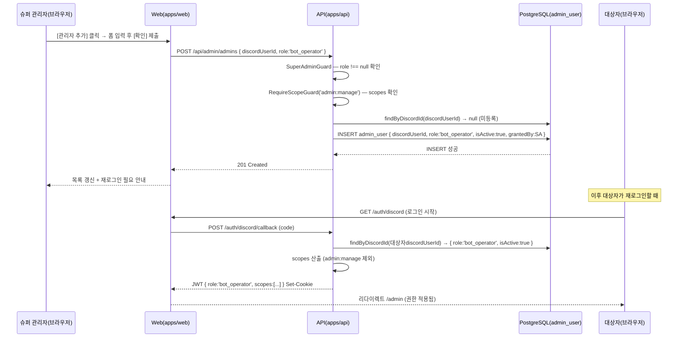

# 유스케이스 ID: UC-06

### 제목
관리자 추가 → 권한 반영 통합 — web 콘솔 관리자 추가부터 대상자 재로그인 시 새 role/scopes 반영까지

---

## 1. 개요

### 1.1 목적

`super_admin`이 `/admin/admins` 콘솔에서 새 관리자를 추가할 때, web이 `POST /api/admin/admins`를 호출하여 `admin_user` 테이블에 레코드가 INSERT되고, 이후 대상자가 **재로그인 시**(현재 토큰 만료 또는 명시적 재로그인) 새 `role`/`scopes`가 JWT에 반영되는 전 구간 흐름이 올바르게 동작함을 보장한다. 권한 변경이 즉시 반영되지 않는 지연 특성(JWT baked-in 설계)이 통합 검증에 포함된다.

### 1.2 범위

- **포함**: `super_admin`의 `/admin/admins` 접근 및 [관리자 추가] 폼 제출, `POST /api/admin/admins` 호출, `RequireScopeGuard('admin:manage')` 검증, `admin_user` INSERT, 추가 성공 후 목록 갱신, 대상자 재로그인 시 새 role/scopes 반영 검증
- **제외**: 역할 변경(UC-07에서 scope 접근제어로 다룸), 비활성화(UC-06 외 별도 흐름), 길드 목록 조회

### 1.3 액터

- **주요 액터**: 슈퍼 관리자(`super_admin`) — 관리자 추가 실행자
- **부 액터 — 대상자**: 새로 추가되는 Discord 사용자
- **부 액터 — 시스템**: Web(`apps/web`), API(`apps/api`), PostgreSQL(`admin_user` 테이블)

---

## 2. 선행 조건

- UC-05 기본 플로우 완료: 슈퍼 관리자가 `role: 'super_admin'`, `scopes: [..., 'admin:manage', ...]` 포함 JWT로 인증된 상태
- 슈퍼 관리자가 `/admin/admins` 페이지에 접근 중이다.
- 추가하려는 대상자의 Discord user ID를 알고 있다.
- 대상자는 현재 `admin_user` 테이블에 미등록(`isActive=true` 레코드 없음) 상태이다.

---

## 3. 참여 컴포넌트

- **Web Presentation — `/admin/admins/page.tsx`** (`apps/web/app/admin/admins/page.tsx`): 관리자 관리 콘솔 UI — [관리자 추가] 버튼, 입력 폼/모달, 목록 테이블
- **Web API Client — `admin-api.ts`** (`apps/web/app/lib/admin-api.ts`): `POST /api/admin/admins` 호출 함수
- **Web Route — Admin API Proxy** (`apps/web/app/api/admin/[...path]/route.ts`): 웹 → API 프록시
- **API Entrypoint — `AdminUserController`** (`apps/api/src/super-admin/presentation/admin-user.controller.ts`): `POST /api/admin/admins` 엔드포인트
- **API Guard — `SuperAdminGuard`** (`apps/api/src/super-admin/guards/super-admin.guard.ts`): JWT `role` null 여부 검증
- **API Guard — `RequireScopeGuard`** (`apps/api/src/super-admin/guards/require-scope.guard.ts`): `admin:manage` scope 포함 여부 검증
- **API Business — `AdminUserService`** (`apps/api/src/super-admin/application/admin-user.service.ts`): UNIQUE 제약 검사, INSERT 로직
- **API Persistence — `AdminUserRepository`** (`apps/api/src/super-admin/infrastructure/admin-user.repository.ts`): `admin_user` 테이블 INSERT/조회
- **DB — `admin_user` 테이블**: `discordUserId` UNIQUE 제약, `role`, `isActive`, `grantedBy` 컬럼

---

## 4. 기본 플로우 (Basic Flow)

### 4.1 단계별 흐름

1. **슈퍼 관리자**: `/admin/admins` 페이지에서 [관리자 추가] 버튼 클릭
   - 입력 폼/모달 노출 (Discord user ID 입력 필드, 역할 선택 `super_admin`/`bot_operator`)

2. **슈퍼 관리자**: Discord user ID 입력 + 역할 선택 후 [확인] 제출
   - Web 클라이언트 사이드 검증: Discord ID 빈값 여부 확인

3. **Web (`admin-api.ts`)**: `POST /api/admin/admins` 호출
   - 요청 body: `{ "discordUserId": "<대상자 ID>", "role": "bot_operator" }`
   - JWT 쿠키 포함

4. **API (`AdminUserController` → Guards)**:
   - `SuperAdminGuard`: JWT `role !== null` 확인 (통과)
   - `RequireScopeGuard('admin:manage')`: JWT `scopes` 배열에 `admin:manage` 포함 확인 (통과)

5. **API (`AdminUserService`)**: 비즈니스 로직 실행
   - `AdminUserRepository.findByDiscordId(discordUserId)` — 기존 레코드 존재 여부 확인
   - 기존 `isActive=true` 레코드 없음 → INSERT 진행
   - `admin_user` 테이블 INSERT: `{ discordUserId, role: 'bot_operator', isActive: true, grantedBy: 요청자discordUserId }`

6. **API**: `201 Created` 응답 반환

7. **Web (`/admin/admins`)**: 성공 응답 수신
   - 관리자 목록 재조회 또는 낙관적 업데이트로 신규 행 반영
   - 화면에 "추가 성공. 대상자는 재로그인 후 권한이 적용됩니다" 안내 표시

8. **[지연 반영 검증 단계]** 대상자가 이후 재로그인 시:
   - `createToken()` 내 `AdminUserRepository.findByDiscordId()` → 신규 레코드 확인 (`isActive=true`, `role: 'bot_operator'`)
   - JWT payload: `{ role: 'bot_operator', scopes: [...] }` 포함 발급
   - 대상자 브라우저: `/admin` 접근 가능, 관리자 관리 메뉴 미노출

### 4.2 시퀀스 다이어그램

---

## 5. 대안 플로우 (Alternative Flows)

### 5.1 대안 플로우 1: super_admin 역할로 추가

**시작 조건**: 슈퍼 관리자가 새 관리자를 `super_admin` 역할로 추가 선택

**단계**: 기본 플로우 동일, INSERT 시 `role: 'super_admin'`
대상자 재로그인 시: `scopes`에 `admin:manage` 포함, 관리자 관리 메뉴 노출

**결과**: 대상자가 재로그인 후 `/admin/admins` 접근 및 관리자 관리 가능

### 5.2 대안 플로우 2: 이미 isActive=false인 레코드가 존재하는 경우

**시작 조건**: 이전에 비활성화된 대상자를 재추가 시도

**단계**:
1. `AdminUserService`가 `findByDiscordId()` → `isActive=false` 레코드 발견
2. 서버 비즈니스 로직에 따라 재활성화 처리 (`isActive=true`, `role` 업데이트, `grantedBy` 갱신)

**결과**: 재활성화 성공, 목록에 반영. 대상자 재로그인 시 새 role 적용

---

## 6. 예외 플로우 (Exception Flows)

### 6.1 예외 상황 1: 이미 isActive=true인 관리자 Discord ID 중복 추가

**발생 조건**: 이미 활성 상태인 관리자 ID를 다시 추가 시도

**처리 방법**:
1. `AdminUserService`가 `findByDiscordId()` → `isActive=true` 레코드 발견
2. UNIQUE 제약 또는 비즈니스 로직 오류 반환 (409 Conflict 또는 400)
3. Web 화면에 "이미 등록된 관리자입니다" 안내

**결과**: INSERT 없음, 기존 상태 유지

### 6.2 예외 상황 2: Discord ID 빈값으로 제출

**발생 조건**: 클라이언트 검증 통과 실패

**처리 방법**:
1. Web 클라이언트 사이드 유효성 검사에서 차단 (API 호출 전)
2. 입력 필드 오류 안내 표시

**결과**: API 호출 없음

### 6.3 예외 상황 3: bot_operator 역할 보유자가 추가 시도

**발생 조건**: `admin:manage` scope 없는 사용자가 `POST /api/admin/admins` 호출

**처리 방법**:
1. `RequireScopeGuard('admin:manage')` — JWT `scopes` 배열에 `admin:manage` 없음 확인
2. 403 반환

**결과**: 관리자 추가 불가, Web에 권한 오류 안내

### 6.4 예외 상황 4: 네트워크 오류 또는 DB 장애

**발생 조건**: `POST /api/admin/admins` 호출 중 오류

**처리 방법**:
1. Web이 오류 응답 수신
2. 화면에 오류 안내, 재시도 가능
3. 낙관적 업데이트를 사용한 경우 롤백

**결과**: `admin_user` 테이블 변경 없음

### 6.5 예외 상황 5: 추가 직후 대상자가 현재 토큰으로 즉시 접근 시도

**발생 조건**: 대상자가 `admin_user` INSERT 직후 재로그인 없이 기존 토큰(role: null)으로 `/admin` 접근

**처리 방법**:
1. JWT payload에 `role: null` 그대로 유지 (DB INSERT가 기존 JWT에 소급 적용되지 않음)
2. AdminLayout이 `role === null` 감지 → `/admin` 차단

**결과**: 재로그인 전까지 접근 불가 (의도된 동작 — JWT baked-in 설계 트레이드오프)

---

## 7. 후행 조건 (Post-conditions)

### 7.1 성공 시

- `admin_user` 테이블에 신규 레코드 INSERT (`discordUserId`, `role`, `isActive=true`, `grantedBy=요청자discordUserId`)
- `/admin/admins` 목록에 신규 관리자 행 반영
- 대상자가 **재로그인 후** 새 role/scopes JWT 발급 → 해당 role에 따른 `/admin` 접근 가능

### 7.2 실패 시 (중복, 권한 오류, 네트워크 오류)

- `admin_user` 테이블 변경 없음
- Web 화면에 오류 안내

---

## 8. 비기능 요구사항

### 8.1 보안

- 🔒 관리자 추가는 `RequireScopeGuard('admin:manage')` 서버사이드 검증으로만 허용 — 클라이언트 우회 불가 (권한 — 사전 승인)
- 🔒 `grantedBy` 컬럼에 요청자 `discordUserId` 기록 — 감사 목적 (권한 — 사전 승인)
- 권한 변경의 **재로그인 후 반영** 특성은 설계 결정(JWT baked-in). 재로그인 필요 안내를 UI에 표시한다.

### 8.2 정합성

- `discordUserId` UNIQUE 제약으로 중복 INSERT 방지
- `grantedBy`에 요청자 식별자를 반드시 기록 (audit trail)

---

## 9. 통합 검증 포인트

| 검증 항목 | 방법 | 기대값 |
|-----------|------|--------|
| super_admin이 POST /api/admin/admins 호출 시 INSERT 성공 | DB 조회 | `admin_user` 신규 레코드 존재, `isActive=true` |
| grantedBy 컬럼에 요청자 discordUserId 기록 여부 | DB 조회 | 요청자 discordUserId 일치 |
| bot_operator가 POST /api/admin/admins 호출 시 403 | HTTP 응답 검사 | 403 Forbidden |
| 중복 discordUserId로 POST 시 오류 반환 | HTTP 응답 검사 | 409 또는 400 |
| 추가 직후 대상자의 기존 JWT로 /admin 접근 시 차단 | /admin 접근 시도 | 차단 (role: null 그대로) |
| 대상자 재로그인 후 /auth/me 응답에 새 role 반영 | /auth/me 응답 검사 | `role: 'bot_operator'`, scopes 포함 |
| 대상자 재로그인 후 /admin 접근 성공 | /admin 접근 시도 | 진입 허용 |

---

## 10. 테스트 시나리오

### 10.1 성공 케이스

| 테스트 케이스 ID | 입력값 | 기대 결과 |
|----------------|--------|----------|
| TC-UC06-01 | super_admin이 미등록 Discord ID + bot_operator 역할로 추가 | `admin_user` INSERT 성공, 목록 반영, 재로그인 안내 |
| TC-UC06-02 | 추가된 대상자가 재로그인 | JWT `role: 'bot_operator'`, 적절한 scopes 포함, /admin 진입 허용 |
| TC-UC06-03 | isActive=false인 기존 레코드 대상 재추가 | 재활성화 처리 후 목록 반영 |

### 10.2 실패 케이스

| 테스트 케이스 ID | 입력값 | 기대 결과 |
|----------------|--------|----------|
| TC-UC06-04 | bot_operator 역할 보유자가 관리자 추가 시도 | 403 Forbidden |
| TC-UC06-05 | isActive=true인 관리자 Discord ID 중복 추가 | 409 또는 400, INSERT 없음 |
| TC-UC06-06 | 빈 Discord ID로 폼 제출 | 클라이언트 검증 오류, API 호출 없음 |
| TC-UC06-07 | 추가 직후 대상자가 기존 JWT(role: null)로 /admin 접근 | 차단 (재로그인 전 권한 미반영) |

---

## 11. 관련 유스케이스

- **선행**: UC-05(DB 기반 권한 토큰 발급) — 슈퍼 관리자가 `admin:manage` scope를 보유한 JWT로 인증된 상태가 전제
- **후행**: UC-05 반복 흐름 — 대상자 재로그인 시 UC-05의 createToken() 흐름이 재실행되며 새 role 반영
- **연관**: UC-07(scope 기반 접근제어 — bot_operator의 admin:manage 부재 검증)

---

## 12. 변경 이력

| 버전 | 날짜 | 작성자 | 변경 내용 |
|------|------|--------|-----------|
| 1.0 | 2026-06-19 | usecase-writer | 초기 작성 — 관리자 추가 및 재로그인 후 권한 반영 통합 시나리오 |

---

## 부록

### A. 용어 정의

- **재로그인 후 반영**: 권한 변경(추가/역할변경/비활성화)이 현재 발급된 JWT에 소급 적용되지 않고, 대상자가 재로그인하거나 토큰이 만료된 후 새로 발급된 JWT에 반영되는 특성. JWT baked-in 설계의 의도된 트레이드오프.
- **grantedBy**: 관리자를 추가한 사람의 discordUserId. 감사 목적으로 기록.

### B. 참고 자료

- PRD: `docs/specs/prd/super-admin.md` (F-SUPER-ADMIN-008, F-SUPER-ADMIN-009)
- Userflow: `docs/specs/userflow/super-admin.md` (UF-SUPER-ADMIN-005, UF-SUPER-ADMIN-006)
- 확정 설계: `docs/plans/auth-admin-db-role-review.md` (§2 결정 1: JWT 유지 + DB as source)
