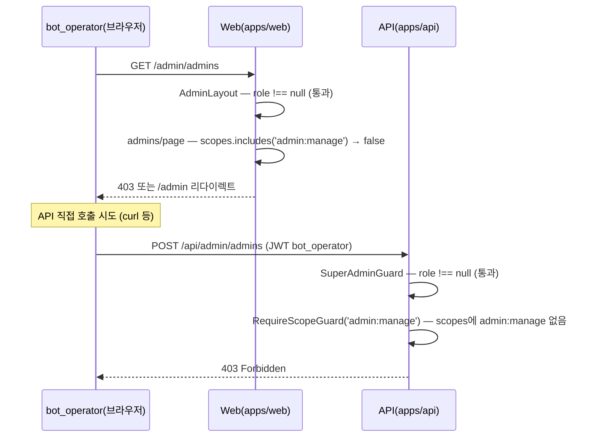

# 유스케이스 ID: UC-07

### 제목
scope 기반 접근제어 통합 — bot_operator의 admin:manage 엔드포인트 차단 및 super_admin 통과 검증

---

## 1. 개요

### 1.1 목적

`RequireScopeGuard`가 JWT `scopes[]` 배열을 기준으로 엔드포인트 접근을 제어함을 검증한다. `bot_operator` 토큰으로 `admin:manage` scope가 필요한 엔드포인트(`/api/admin/admins` CRUD)를 호출 시 403이 반환되고, `super_admin` 토큰으로는 통과됨을 보장한다. 동시에 `guild:view` scope가 필요한 엔드포인트는 두 역할 모두 통과함을 검증한다.

### 1.2 범위

- **포함**: `RequireScopeGuard` 동작 검증(`admin:manage` 필요 엔드포인트 — `bot_operator` 차단 / `super_admin` 통과), `guild:view` 필요 엔드포인트 — 두 역할 모두 통과, `SuperAdminGuard` 선행 체크(role null → 403), web 레이아웃 레벨의 `admin:manage` scope 미보유 시 `/admin/admins` 접근 차단
- **제외**: 길드 drill-in(UC-03/UC-08), 관리자 추가 상세 비즈니스 로직(UC-06)

### 1.3 액터

- **주요 액터 A**: `bot_operator` 역할 보유자 — `admin:manage` 차단 검증 주체
- **주요 액터 B**: `super_admin` 역할 보유자 — `admin:manage` 통과 검증 주체
- **부 액터**: 미등록 사용자(`role: null`) — `SuperAdminGuard` 차단 검증
- **부 액터 — 시스템**: Web(`apps/web`), API(`apps/api`)

---

## 2. 선행 조건

- `bot_operator` 역할 보유자가 UC-05 기본 플로우 완료: `role: 'bot_operator'`, `scopes: [...(admin:manage 제외)]` 포함 JWT 보유
- `super_admin` 역할 보유자가 UC-05 기본 플로우 완료: `role: 'super_admin'`, `scopes: [..., 'admin:manage', ...]` 포함 JWT 보유
- API 서버의 `admin-user.controller.ts` 엔드포인트에 `@RequireScope('admin:manage')` 데코레이터가 적용되어 있다.
- `GET /api/admin/guilds` 엔드포인트에 `@RequireScope('guild:view')` 데코레이터가 적용되어 있다.

---

## 3. 참여 컴포넌트

- **API Guard — `SuperAdminGuard`** (`apps/api/src/super-admin/guards/super-admin.guard.ts`): JWT `role` null 여부 검증 (DB 조회 없음)
- **API Guard — `RequireScopeGuard`** (`apps/api/src/super-admin/guards/require-scope.guard.ts`): `@RequireScope(...)` 데코레이터 기반 scope 검증
- **API Entrypoint — `AdminUserController`** (`apps/api/src/super-admin/presentation/admin-user.controller.ts`): `GET|POST|PATCH|DELETE /api/admin/admins` — `@RequireScope('admin:manage')`
- **API Entrypoint — `AdminController`** (`apps/api/src/super-admin/presentation/admin.controller.ts`): `GET /api/admin/guilds` — `@RequireScope('guild:view')`
- **Web Presentation — `AdminLayout`** (`apps/web/app/admin/layout.tsx`): `role` null 게이트
- **Web Presentation — `/admin/admins/page.tsx`** (`apps/web/app/admin/admins/page.tsx`): `admin:manage` scope 미보유 시 접근 차단

---

## 4. 기본 플로우 (Basic Flow)

> 전제: `bot_operator`가 `admin:manage` scope 필요 엔드포인트에 접근 시도 → 차단 검증

### 4.1 단계별 흐름 — bot_operator의 /admin/admins 접근 시도

1. **bot_operator (브라우저)**: `/admin/admins` URL에 직접 접근 (또는 UI 우회 시도)
   - AdminLayout: `role !== null` 확인 → 통과 (`bot_operator`는 AdminLayout 통과)

2. **Web (`/admin/admins/page.tsx`)**: JWT `scopes[]`에 `admin:manage` 포함 여부 확인
   - `scopes.includes('admin:manage') === false` 감지
   - 웹 레이아웃 레벨에서 즉시 차단 → 403 페이지 표시 또는 `/admin` 리다이렉트

3. **[API 직접 호출 시 이중 방어]** `bot_operator`가 `POST /api/admin/admins`를 직접 호출
   - `SuperAdminGuard`: `role !== null` 확인 → 통과
   - `RequireScopeGuard('admin:manage')`: JWT `scopes`에 `admin:manage` 없음 확인 → 403 반환

4. **결과**: `admin:manage` 관련 모든 엔드포인트 차단. 웹 + API 이중 방어 확인.

### 4.2 시퀀스 다이어그램 — scope 기반 이중 방어

---

## 5. 대안 플로우 (Alternative Flows)

### 5.1 대안 플로우 1: super_admin의 admin:manage 엔드포인트 통과

**시작 조건**: `super_admin`이 `POST /api/admin/admins` 호출

**단계**:
1. `SuperAdminGuard`: `role !== null` 확인 → 통과
2. `RequireScopeGuard('admin:manage')`: JWT `scopes`에 `admin:manage` 포함 확인 → 통과
3. `AdminUserService` 비즈니스 로직 실행

**결과**: 201 Created, 관리자 추가 성공

### 5.2 대안 플로우 2: 두 역할 모두 guild:view 엔드포인트 통과

**시작 조건**: `bot_operator` 또는 `super_admin`이 `GET /api/admin/guilds` 호출

**단계**:
1. `SuperAdminGuard`: `role !== null` 확인 → 통과
2. `RequireScopeGuard('guild:view')`: JWT `scopes`에 `guild:view` 포함 확인 → 두 역할 모두 통과
3. 길드 목록 응답 반환

**결과**: 200 OK, 전체 길드 목록 반환. 두 역할 동일 결과.

### 5.3 대안 플로우 3: role null 사용자의 /api/admin/* 직접 호출

**시작 조건**: `admin_user` 미등록 사용자(`role: null`)가 `/api/admin/admins` 직접 호출

**단계**:
1. `SuperAdminGuard`: JWT `role === null` 감지 → 즉시 403 반환 (`RequireScopeGuard` 도달하지 않음)

**결과**: 403 Forbidden. `SuperAdminGuard`가 1차 방어선 역할.

### 5.4 대안 플로우 4: bot_operator의 역할 변경 및 비활성화 엔드포인트 차단

**시작 조건**: `bot_operator`가 `PATCH /api/admin/admins/:discordUserId` 또는 `DELETE /api/admin/admins/:discordUserId` 호출

**단계**:
1. `SuperAdminGuard` 통과
2. `RequireScopeGuard('admin:manage')` → scopes에 `admin:manage` 없음 → 403

**결과**: 역할 변경 및 비활성화 모두 차단

---

## 6. 예외 플로우 (Exception Flows)

### 6.1 예외 상황 1: JWT scopes 조작 시도 (클라이언트 위변조)

**발생 조건**: 클라이언트가 JWT payload의 `scopes` 배열을 임의 수정하여 `admin:manage`를 추가하는 시도

**처리 방법**:
1. JWT 서명 검증 실패 → `JwtAuthGuard`가 401 반환
2. `RequireScopeGuard`에 도달하지 않음

**결과**: 401 Unauthorized. JWT 서명 기반으로 클라이언트 조작 불가.

### 6.2 예외 상황 2: @RequireScope 데코레이터 미적용 엔드포인트 호출

**발생 조건**: `AdminUserController`의 특정 메서드에 `@RequireScope` 데코레이터가 누락된 경우

**처리 방법**:
1. `RequireScopeGuard`가 required scope를 찾지 못하면 가드 로직에 따라 통과 또는 차단
2. 이는 구현 결함 — 엔드포인트 신규 추가 시 `@RequireScope` 적용 여부 코드 리뷰에서 반드시 확인

**결과**: 보안 설계 취지에 맞지 않는 동작 발생 가능 → 통합 검증 TC에서 반드시 확인

### 6.3 예외 상황 3: 역할 변경 직후 bot_operator → super_admin 상승이 기존 토큰에 미반영

**발생 조건**: `bot_operator`의 role이 `super_admin`으로 변경된 직후 기존 JWT로 `/admin/admins` 접근

**처리 방법**:
1. 기존 JWT에는 여전히 `role: 'bot_operator'`, `scopes: [... (admin:manage 제외)]` 포함
2. 재로그인 전까지 `RequireScopeGuard`에서 403 반환

**결과**: 재로그인 전 권한 상승 미반영 (JWT baked-in 의도된 동작). 화면 안내 필요.

---

## 7. 후행 조건 (Post-conditions)

### 7.1 성공 검증 시 (bot_operator 차단)

- `bot_operator`의 `admin:manage` 엔드포인트 호출: 403 반환, DB 변경 없음
- 웹: `/admin/admins` 접근 차단, `/admin` 리다이렉트 또는 403 페이지

### 7.2 성공 검증 시 (super_admin 통과)

- `super_admin`의 `admin:manage` 엔드포인트 호출: 가드 통과, 비즈니스 로직 실행
- 두 역할의 `guild:view` 엔드포인트 호출: 모두 통과

---

## 8. 비기능 요구사항

### 8.1 보안

- 🔒 scope 검증은 JWT 서명 기반 — 클라이언트 scopes 조작 불가 (권한 — 사전 승인)
- 🔒 웹 레이아웃의 scope 체크는 UX 전용. 실제 권한 결정은 API `RequireScopeGuard`가 담당 — 이중 방어 구조 (권한 — 사전 승인)
- `SuperAdminGuard`(role null 체크) → `RequireScopeGuard`(scope 체크) 순서로 가드 체인 구성. 순서 역전 시 불필요한 scope 조회 발생.

### 8.2 확장성

- 신규 엔드포인트 추가 시 `@RequireScope(...)` 데코레이터 명시 필수. 누락은 통합 검증 TC로 감지.
- 향후 `billing:manage`, `churn:view` 등 scope 추가 시 동일 패턴 재사용.

---

## 9. 통합 검증 포인트

| 검증 항목 | 방법 | 기대값 |
|-----------|------|--------|
| bot_operator 토큰으로 POST /api/admin/admins 호출 | HTTP 응답 검사 | 403 Forbidden |
| bot_operator 토큰으로 PATCH /api/admin/admins/:id 호출 | HTTP 응답 검사 | 403 Forbidden |
| bot_operator 토큰으로 DELETE /api/admin/admins/:id 호출 | HTTP 응답 검사 | 403 Forbidden |
| bot_operator 토큰으로 GET /api/admin/admins 호출 | HTTP 응답 검사 | 403 Forbidden |
| super_admin 토큰으로 POST /api/admin/admins 호출 | HTTP 응답 검사 | 201 Created (비즈니스 로직 정상 실행) |
| bot_operator 토큰으로 GET /api/admin/guilds 호출 | HTTP 응답 검사 | 200 OK (guild:view 보유) |
| super_admin 토큰으로 GET /api/admin/guilds 호출 | HTTP 응답 검사 | 200 OK |
| role null 토큰으로 /api/admin/* 호출 | HTTP 응답 검사 | 403 Forbidden (SuperAdminGuard) |
| bot_operator 브라우저에서 /admin/admins 직접 접근 | UI 거동 검사 | 차단 (403 또는 /admin 리다이렉트) |
| JWT scopes 조작 후 호출 시도 | HTTP 응답 검사 | 401 Unauthorized |

---

## 10. 테스트 시나리오

### 10.1 성공 케이스 (의도된 통과)

| 테스트 케이스 ID | 입력값 | 기대 결과 |
|----------------|--------|----------|
| TC-UC07-01 | super_admin 토큰으로 POST /api/admin/admins | 201, 가드 통과 |
| TC-UC07-02 | bot_operator 토큰으로 GET /api/admin/guilds | 200, guild:view 통과 |
| TC-UC07-03 | super_admin 토큰으로 GET /api/admin/guilds | 200, guild:view 통과 |

### 10.2 차단 케이스 (의도된 차단 = 성공 검증)

| 테스트 케이스 ID | 입력값 | 기대 결과 |
|----------------|--------|----------|
| TC-UC07-04 | bot_operator 토큰으로 POST /api/admin/admins | 403 Forbidden |
| TC-UC07-05 | bot_operator 토큰으로 GET /api/admin/admins | 403 Forbidden |
| TC-UC07-06 | bot_operator 토큰으로 PATCH /api/admin/admins/:id | 403 Forbidden |
| TC-UC07-07 | bot_operator 토큰으로 DELETE /api/admin/admins/:id | 403 Forbidden |
| TC-UC07-08 | role null 토큰으로 GET /api/admin/guilds | 403 (SuperAdminGuard) |
| TC-UC07-09 | JWT 서명 위변조 후 /api/admin/admins 호출 | 401 Unauthorized |
| TC-UC07-10 | bot_operator 브라우저에서 /admin/admins 직접 URL 접근 | 차단 (403 or 리다이렉트) |

---

## 11. 관련 유스케이스

- **선행**: UC-05(DB 기반 권한 토큰 발급) — bot_operator/super_admin JWT 발급이 전제
- **연관**: UC-06(관리자 추가 — super_admin 통과, bot_operator 차단의 실사용 시나리오)
- **연관**: UC-08(부트스트랩 — SeedInitialSuperAdmin이 선행해야 super_admin이 존재)

---

## 12. 변경 이력

| 버전 | 날짜 | 작성자 | 변경 내용 |
|------|------|--------|-----------|
| 1.0 | 2026-06-19 | usecase-writer | 초기 작성 — scope 기반 이중 방어 통합 검증 시나리오 |

---

## 부록

### A. 용어 정의

- **RequireScopeGuard**: `@RequireScope(...)` 데코레이터로 선언된 required scope를 JWT `scopes[]` 배열에서 검사하는 NestJS 가드. scope 미포함 시 403.
- **SuperAdminGuard**: JWT `role` null 여부만 검사하는 1차 방어 가드. DB 조회 없음. role null → 즉시 403.
- **이중 방어**: 웹 레이아웃 scope 체크(UX) + API RequireScopeGuard(권한 결정) 두 레이어로 방어. API 레이어가 최종 권한 결정.

### B. 참고 자료

- PRD: `docs/specs/prd/super-admin.md` (F-SUPER-ADMIN-003, F-SUPER-ADMIN-003-B)
- Userflow: `docs/specs/userflow/super-admin.md` (UF-SUPER-ADMIN-005, UF-SUPER-ADMIN-007, UF-SUPER-ADMIN-008)
- 확정 설계: `docs/plans/auth-admin-db-role-review.md` (§4.2 role→scope 기본 매핑, §4.3 JWT payload 변화)
