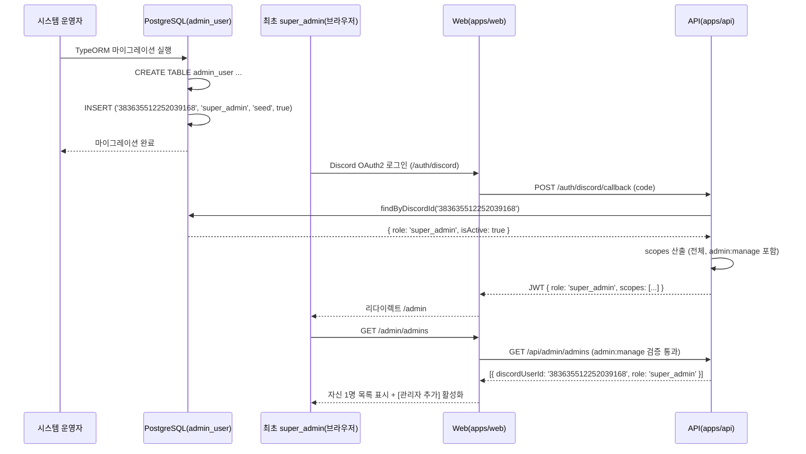

# 유스케이스 ID: UC-08

### 제목
부트스트랩 통합 — SeedInitialSuperAdmin 마이그레이션으로 최초 super_admin 생성 및 관리자 추가 가능 상태 진입

---

## 1. 개요

### 1.1 목적

`SeedInitialSuperAdmin` 마이그레이션이 `admin_user` 테이블에 최초 `super_admin` 1명을 삽입하고, 해당 Discord user ID로 로그인 시 `role: 'super_admin'`이 JWT에 반영되어 다른 관리자를 추가할 수 있는 상태가 됨을 보장한다. 동시에 마이그레이션 이전 상태(`admin_user` 테이블 미존재 또는 레코드 없음)에서 모든 사용자가 `role: null`로 처리되는 fail-safe 동작을 검증한다.

### 1.2 범위

- **포함**: `admin_user` 테이블 생성 마이그레이션, `SeedInitialSuperAdmin` seed 마이그레이션 실행, 시드 대상 Discord ID(`383635512252039168`)로 로그인 시 `role: 'super_admin'` JWT 발급, `/admin/admins`에서 다른 관리자 추가 가능 상태 진입 검증
- **제외**: 마이그레이션 이후의 일반적인 관리자 추가 상세 흐름(UC-06), 길드 열람(UC-03)

### 1.3 액터

- **주요 액터**: 시스템 운영자 (마이그레이션 실행 주체)
- **부 액터 — 최초 super_admin**: `discordUserId='383635512252039168'`으로 시드된 사용자
- **부 액터 — 시스템**: PostgreSQL(`admin_user` 테이블), API(`apps/api`), Web(`apps/web`)

---

## 2. 선행 조건

- PostgreSQL DB가 가동 중이다.
- `admin_user` 테이블이 존재하지 않거나 비어있다 (초기 배포 상태).
- TypeORM 마이그레이션 실행 환경이 구성되어 있다.
- `SUPER_ADMIN_IDS` 환경변수가 제거(또는 미설정) 상태이다.

---

## 3. 참여 컴포넌트

- **DB — 마이그레이션 파일**: `admin_user` 테이블 생성 마이그레이션 + `SeedInitialSuperAdmin` seed 마이그레이션 (`apps/api/src/migrations/`)
- **DB — `admin_user` 테이블**: 부트스트랩 후 최초 레코드 보유
- **API Business — `AuthService.createToken()`** (`apps/api/src/auth/application/auth.service.ts`): 로그인 시 `admin_user` 조회 → `role`/`scopes` 산출
- **API Persistence — `AdminUserRepository`** (`apps/api/src/super-admin/infrastructure/admin-user.repository.ts`): `discordUserId` 기준 조회
- **Web Presentation — `AdminLayout`** (`apps/web/app/admin/layout.tsx`): 최초 super_admin의 `/admin` 진입 허용
- **Web Presentation — `/admin/admins/page.tsx`** (`apps/web/app/admin/admins/page.tsx`): 최초 super_admin의 다른 관리자 추가 가능

---

## 4. 기본 플로우 (Basic Flow)

### 4.1 단계별 흐름

1. **시스템 운영자**: TypeORM 마이그레이션 실행
   - `admin_user` 테이블 생성 마이그레이션 적용
   - `SeedInitialSuperAdmin` 마이그레이션 적용:
     ```
     INSERT INTO admin_user (discordUserId, role, grantedBy, isActive)
     VALUES ('383635512252039168', 'super_admin', 'seed', true)
     ```

2. **마이그레이션 완료**: `admin_user` 테이블에 1개 레코드 존재 확인

3. **최초 super_admin (`383635512252039168`)**: Discord OAuth2 로그인
   - UC-05 기본 플로우 실행
   - `createToken()` 내 `AdminUserRepository.findByDiscordId('383635512252039168')` → 시드 레코드 반환
   - `role: 'super_admin'`, 전체 scopes 산출 (including `admin:manage`)
   - JWT 발급

4. **최초 super_admin**: `/admin` 진입
   - AdminLayout: `role !== null` → 통과
   - `scopes.includes('admin:manage')` → 관리자 관리 메뉴 노출

5. **최초 super_admin**: `/admin/admins`에서 다른 관리자 추가 가능 상태 진입
   - `GET /api/admin/admins` 호출 → 자기 자신 1명만 목록에 표시
   - [관리자 추가] 버튼 활성화 → UC-06 흐름으로 다른 관리자 추가 가능

### 4.2 시퀀스 다이어그램



---

## 5. 대안 플로우 (Alternative Flows)

### 5.1 대안 플로우 1: 마이그레이션 실행 전 기존 사용자 로그인

**시작 조건**: `admin_user` 테이블 미존재 또는 비어있는 상태에서 임의 사용자 로그인

**단계**:
1. `AdminUserRepository.findByDiscordId()` → null 반환 (테이블 없거나 레코드 없음)
2. `createToken()`이 `role: null`, `scopes: []` 산출
3. AdminLayout이 `role === null` 감지 → `/admin` 차단

**결과**: 마이그레이션 전 모든 사용자 `role: null`. 어드민 접근 불가 (fail-safe).

### 5.2 대안 플로우 2: 환경별 시드 Discord ID 분리 적용

**시작 조건**: 프로덕션과 개발 환경의 최초 super_admin Discord ID가 다른 경우

**단계**:
1. 마이그레이션이 환경변수 `BOOTSTRAP_SUPER_ADMIN_ID`를 1회 읽어 seed 대상 결정
2. 해당 ID가 `admin_user`에 INSERT됨
3. 이후 흐름은 기본 플로우 동일

**결과**: 환경별 다른 Discord ID로 초기 super_admin 설정 가능

### 5.3 대안 플로우 3: 이미 admin_user 테이블이 존재하는 경우 (재실행)

**시작 조건**: 마이그레이션 재실행 시도 (이미 테이블 및 시드 레코드 존재)

**단계**:
1. TypeORM 마이그레이션 중복 실행 방지 메커니즘에 의해 이미 적용된 마이그레이션 건너뜀
2. `admin_user` 테이블 및 기존 레코드 유지

**결과**: 멱등성 보장 — 중복 실행 시 데이터 손실 없음

---

## 6. 예외 플로우 (Exception Flows)

### 6.1 예외 상황 1: SeedInitialSuperAdmin 마이그레이션 실패

**발생 조건**: DB 연결 오류, 권한 부족, 마이그레이션 SQL 오류 등

**처리 방법**:
1. TypeORM 마이그레이션 오류 종료
2. 테이블 생성은 되었으나 seed INSERT 실패 시 `admin_user` 테이블이 비어있는 상태
3. 이 상태에서 로그인 시 모든 사용자 `role: null` (대안 플로우 1과 동일)

**결과**: 마이그레이션 재실행 또는 수동 INSERT 필요. 서비스 운영에 영향 없음 (어드민 기능만 비활성).

### 6.2 예외 상황 2: 최초 super_admin이 자기 자신을 비활성화 시도

**발생 조건**: `admin_user`에 자기 자신 1명만 있는 상태에서 비활성화 시도

**처리 방법**:
1. `AdminUserService.deactivate()` — 자기 자신 비활성화 시도 감지 → 오류 반환
2. 추가로 최소 1명 `super_admin` 유지 제약 → 오류 반환
3. `isActive=true` 레코드 유지

**결과**: 비활성화 차단. 어드민 기능 잠금 방지.

### 6.3 예외 상황 3: SUPER_ADMIN_IDS 환경변수가 잔류한 경우

**발생 조건**: DB 전환 후 `.env`에 `SUPER_ADMIN_IDS`가 제거되지 않고 남아있는 경우

**처리 방법**:
1. `createToken()`이 환경변수 기반 로직을 더 이상 사용하지 않으므로 해당 환경변수는 무시됨
2. `admin_user` DB 조회만 실행

**결과**: `SUPER_ADMIN_IDS` 잔류는 동작에 영향 없음. 혼란 방지를 위해 `.env.example`에서 제거 권장.

---

## 7. 후행 조건 (Post-conditions)

### 7.1 성공 시

- `admin_user` 테이블 존재, 레코드 1개 (`discordUserId='383635512252039168'`, `role='super_admin'`, `grantedBy='seed'`, `isActive=true`)
- 해당 Discord ID로 로그인 시 `role: 'super_admin'`, 전체 scopes JWT 발급
- `/admin/admins`에서 다른 관리자 추가 가능

### 7.2 실패 시

- `admin_user` 테이블 미생성 또는 레코드 없음
- 모든 사용자 `role: null` → 어드민 접근 불가 (fail-safe)
- 운영자가 마이그레이션 재실행 또는 수동 복구 필요

---

## 8. 비기능 요구사항

### 8.1 보안

- 🔒 최초 super_admin seed는 마이그레이션으로 1회 실행 — 환경변수 기반 런타임 override 제거 (권한 — 사전 승인)
- `grantedBy='seed'` 기록으로 자동 삽입된 레코드임을 감사 이력에 명시

### 8.2 멱등성

- `SeedInitialSuperAdmin` 마이그레이션은 멱등성을 보장해야 함 (중복 실행 시 오류 없음)
- `ON CONFLICT DO NOTHING` 또는 TypeORM 마이그레이션 중복 실행 방지 메커니즘 활용

### 8.3 fail-safe

- 마이그레이션 미실행 또는 실패 시 모든 사용자 `role: null` → 어드민 기능 전면 비활성. 잘못된 권한이 부여되는 방향으로 실패하지 않음.

---

## 9. 통합 검증 포인트

| 검증 항목 | 방법 | 기대값 |
|-----------|------|--------|
| 마이그레이션 후 admin_user 레코드 존재 확인 | DB 조회 | 1개 레코드, discordUserId='383635512252039168', role='super_admin', isActive=true |
| grantedBy 컬럼 값 확인 | DB 조회 | grantedBy='seed' |
| 시드 Discord ID로 로그인 시 JWT role 확인 | /auth/me 응답 | role: 'super_admin', scopes 9개 포함 |
| 로그인 후 /admin/admins 접근 성공 | UI 검사 | 자신 1명 목록 + [관리자 추가] 활성화 |
| 마이그레이션 전 임의 사용자 로그인 시 role null | /auth/me 응답 | role: null, scopes: [] |
| 마이그레이션 멱등성 — 재실행 시 오류 없음 | 마이그레이션 재실행 | 오류 없음, 기존 데이터 유지 |
| 자기 자신 비활성화 시도 차단 | API 응답 | 오류 반환, isActive=true 유지 |

---

## 10. 테스트 시나리오

### 10.1 성공 케이스

| 테스트 케이스 ID | 입력값 | 기대 결과 |
|----------------|--------|----------|
| TC-UC08-01 | 깨끗한 DB에 마이그레이션 실행 | admin_user 테이블 + 시드 레코드 생성 |
| TC-UC08-02 | 시드 Discord ID('383635512252039168')로 로그인 | role: 'super_admin', /admin/admins 접근 가능, 관리자 추가 가능 |
| TC-UC08-03 | 마이그레이션 재실행 | 오류 없음, 기존 레코드 유지 |

### 10.2 실패 케이스

| 테스트 케이스 ID | 입력값 | 기대 결과 |
|----------------|--------|----------|
| TC-UC08-04 | 마이그레이션 미실행 상태에서 임의 사용자 로그인 | role: null, /admin 차단 |
| TC-UC08-05 | 자기 자신 비활성화 시도 (1명만 있는 상태) | 오류 반환, 비활성화 차단 |

---

## 11. 관련 유스케이스

- **후행**: UC-05(DB 기반 권한 토큰 발급) — 부트스트랩 후 최초 super_admin이 UC-05 흐름으로 로그인
- **후행**: UC-06(관리자 추가) — 최초 super_admin이 UC-06 흐름으로 다른 관리자 추가
- **후행**: UC-07(scope 기반 접근제어) — 최초 super_admin의 admin:manage 통과 검증

---

## 12. 변경 이력

| 버전 | 날짜 | 작성자 | 변경 내용 |
|------|------|--------|-----------|
| 1.0 | 2026-06-19 | usecase-writer | 초기 작성 — SeedInitialSuperAdmin 마이그레이션 부트스트랩 통합 시나리오 |

---

## 부록

### A. 용어 정의

- **SeedInitialSuperAdmin**: `admin_user` 테이블에 최초 슈퍼 관리자를 삽입하는 TypeORM seed 마이그레이션. `grantedBy='seed'`로 구분.
- **부트스트랩**: 아무것도 없는 초기 상태에서 서비스가 동작 가능한 상태로 전환하는 초기화 과정. 본 UC에서는 `admin_user` 테이블 생성 + 최초 레코드 삽입을 의미.
- **fail-safe**: 마이그레이션 미실행 또는 실패 시 어드민 기능이 전면 비활성화되는 방향으로 안전하게 실패하는 특성.

### B. 참고 자료

- PRD: `docs/specs/prd/super-admin.md` (F-SUPER-ADMIN-001, F-SUPER-ADMIN-007)
- 확정 설계: `docs/plans/auth-admin-db-role-review.md` (§2 결정 2: seed 마이그레이션, §4.4 부트스트랩 seed)
